# Критерии приёмки интеграции сайта с 1С

## Общая схема обмена данными

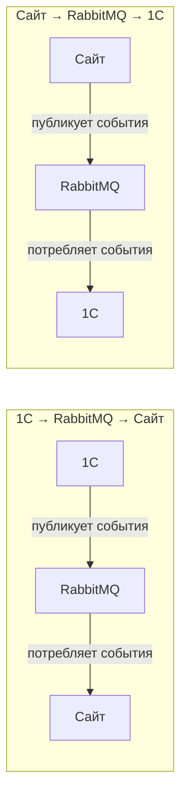

| Направление | Типы событий |
|---|---|
| **1С → Сайт** | Партнёры, цены, скидки, курсы валют, остатки, изменения заказов/возвратов, реализации, баланс |
| **Сайт → 1С** | Создание заказов, создание возвратов |

---

## Инфраструктура RabbitMQ

### Архитектура обмена

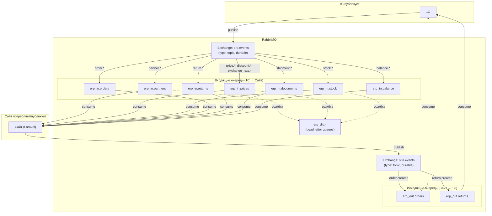

### Входящие очереди (1С → Сайт)

| Очередь | Routing keys | События | Обоснование выделения |
|---|---|---|---|
| `erp_in.partners` | `partner.*` | `partner.created`, `partner.deleted` | Критическая операция — активация/деактивация пользователей, нельзя блокировать другими событиями |
| `erp_in.prices` | `price.*`, `discount.*`, `exchange_rate.*` | `price.updated`, `discount.created`, `discount.updated`, `discount.deleted`, `exchange_rate.updated` | Ценообразование — логически связанные события; должны обрабатываться согласованно |
| `erp_in.stock` | `stock.*` | `stock.updated` | Самая высокочастотная очередь — остатки меняются при каждом движении товара; нужны отдельные воркеры и возможность масштабирования |
| `erp_in.orders` | `order.*` | `order.updated`, `order.deleted` | Обновления заказов из 1С — пользователь ждёт актуальный статус |
| `erp_in.returns` | `return.*` | `return.updated`, `return.deleted` | Обновления возвратов из 1С |
| `erp_in.documents` | `shipment.*` | `shipment.created`, `shipment.updated`, `shipment.deleted` | Документооборот — реализации, не требуют мгновенной обработки |
| `erp_in.balance` | `balance.*` | `balance.updated` | Баланс контрагентов — низкочастотная, но важная информация |

### Исходящие очереди (Сайт → 1С)

| Очередь | Routing key | Описание |
|---|---|---|
| `erp_out.orders` | `order.created` | Новые заказы с сайта |
| `erp_out.returns` | `return.created` | Новые возвраты с сайта |

### Dead Letter Queues

У каждой входящей очереди есть свой DLQ для сообщений, не обработанных после всех попыток:

| Основная очередь | DLQ |
|---|---|
| `erp_in.partners` | `erp_dlq.partners` |
| `erp_in.prices` | `erp_dlq.prices` |
| `erp_in.stock` | `erp_dlq.stock` |
| `erp_in.orders` | `erp_dlq.orders` |
| `erp_in.returns` | `erp_dlq.returns` |
| `erp_in.documents` | `erp_dlq.documents` |
| `erp_in.balance` | `erp_dlq.balance` |

> [!NOTE]
> Все очереди — `durable` (переживают перезапуск RabbitMQ). Exchange тип — `topic` (маршрутизация по routing key с поддержкой wildcard `*`).

### Параметры воркеров

| Очередь | Воркеров | Tries | Backoff | Обоснование |
|---|---|---|---|---|
| `erp_in.partners` | 1 | 5 | 30 сек | Критично, но редко — больше попыток, длиннее пауза |
| `erp_in.prices` | 1–2 | 3 | 10 сек | Среднечастотная, важна согласованность цен |
| `erp_in.stock` | 2–4 | 3 | 5 сек | Самая частая, нужна скорость обработки |
| `erp_in.orders` | 1–2 | 5 | 15 сек | Пользователь ждёт обновления — больше попыток |
| `erp_in.returns` | 1 | 3 | 15 сек | Низкочастотная |
| `erp_in.documents` | 1 | 3 | 30 сек | Нет срочности |
| `erp_in.balance` | 1 | 3 | 30 сек | Низкочастотная, нет срочности |
| `erp_out.orders` | 1 | 5 | 10 сек | Исходящие — критично доставить |
| `erp_out.returns` | 1 | 5 | 10 сек | Исходящие — критично доставить |

Каждый воркер перезапускается через **3600 сек** для предотвращения утечек памяти.

### Формат конверта сообщения

Все сообщения передаются как **raw JSON** (не Laravel Job payload). Обязательные мета-поля:

```json
{
  "event": "partner.created",
  "timestamp": "2026-02-16T10:30:00+03:00",
  "message_id": "msg-550e8400-e29b-41d4-...",
  "...": "остальные поля зависят от типа события"
}
```

| Поле | Тип | Описание |
|---|---|---|
| `event` | `string` | Тип события, используется для маршрутизации |
| `timestamp` | `ISO 8601` | Время формирования события на стороне отправителя |
| `message_id` | `string` | Уникальный идентификатор сообщения (для идемпотентности) |

### Требования к идемпотентности

> [!IMPORTANT]
> Все обработчики входящих событий должны быть **идемпотентными**: повторная обработка одного и того же сообщения (по `message_id`) не должна приводить к дублированию данных. Это критично, так как RabbitMQ гарантирует доставку «хотя бы один раз» (at-least-once delivery).

---

## US-01: Активация и деактивация пользователей

**Как** сайт,
**я хочу** получать из 1С события о создании и удалении партнёров,
**чтобы** автоматически активировать и деактивировать учётные записи пользователей.

### Схема обмена

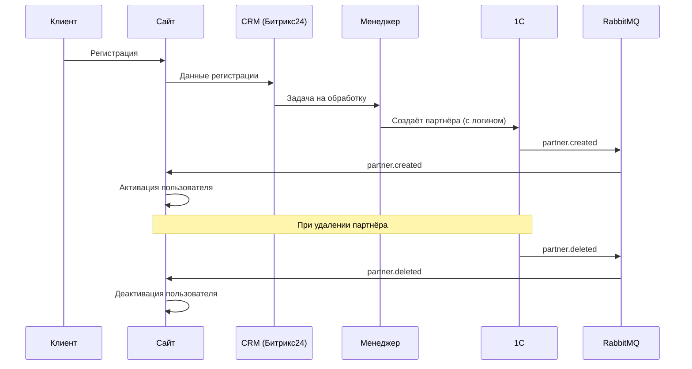

### Формат сообщений

**`partner.created`** (1С → Сайт)
```json
{
  "event": "partner.created",
  "uuid": "550e8400-e29b-41d4-a716-446655440000",
  "login": "client@example.com"
}
```

**`partner.deleted`** (1С → Сайт)
```json
{
  "event": "partner.deleted",
  "uuid": "550e8400-e29b-41d4-a716-446655440000"
}
```

### Критерии приёмки

- [ ] При регистрации клиента на сайте в CRM (Битрикс24) автоматически создаётся задача для менеджера.
- [ ] Сайт принимает из шины RabbitMQ событие `partner.created`, находит пользователя по реквизиту «Логин», переводит его в статус «Активен» и сохраняет UUID партнёра.
- [ ] Сайт принимает из шины RabbitMQ событие `partner.deleted` и переводит соответствующего пользователя в статус «Не активен».

> [!IMPORTANT]
> В карточке партнёра в 1С обязательно должен быть заполнен дополнительный реквизит «Логин», соответствующий учётной записи клиента на сайте.

---

## US-02: Синхронизация базовых цен

**Как** сайт,
**я хочу** получать из 1С события об изменении базовых цен,
**чтобы** отображать пользователям актуальную стоимость товаров.

### Схема обмена

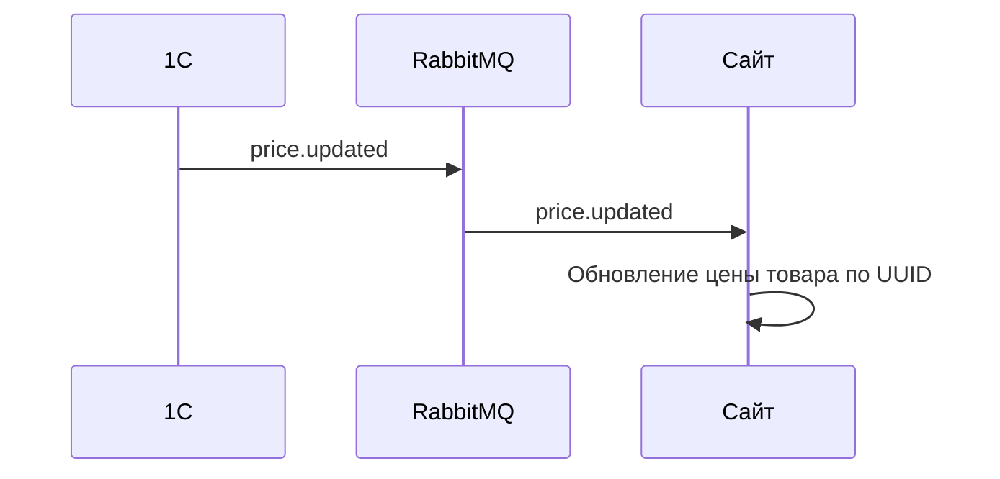

### Формат сообщений

**`price.updated`** (1С → Сайт)
```json
{
  "event": "price.updated",
  "product_uuid": "a1b2c3d4-...",
  "price": 15000.00
}
```

### Критерии приёмки

- [ ] Товары в 1С и на сайте связаны через единый UUID.
- [ ] Сайт принимает из шины RabbitMQ событие `price.updated`.
- [ ] Сайт находит товар по UUID и обновляет его базовую цену.
- [ ] Если товар с указанным UUID не найден, событие игнорируется без ошибки.

---

## US-03: Синхронизация скидок

**Как** сайт,
**я хочу** получать из 1С данные о скидках,
**чтобы** формировать персональные цены в карточках товаров.

### Схема обмена

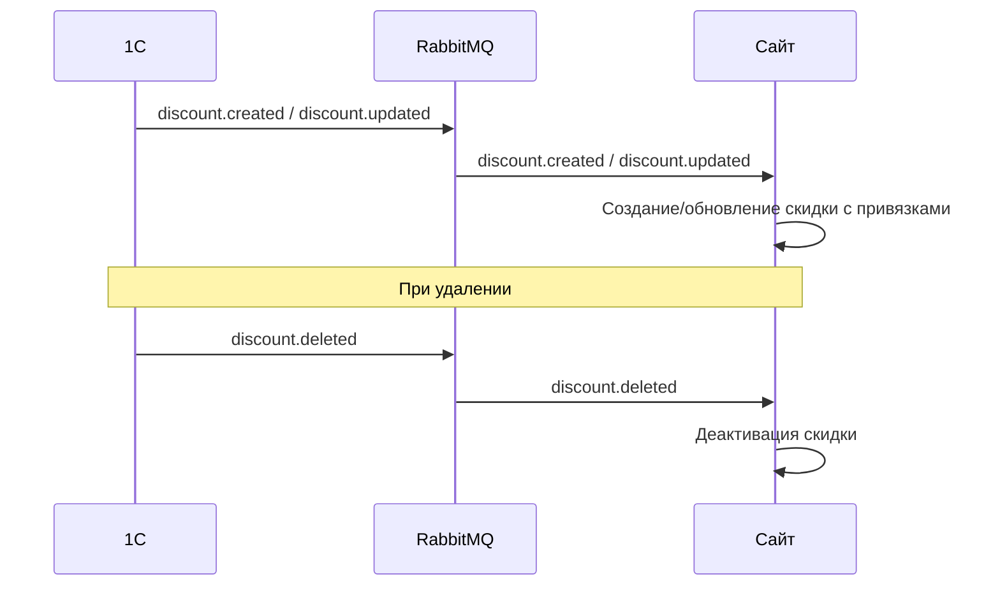

### Формат сообщений

**`discount.created` / `discount.updated`** (1С → Сайт)
```json
{
  "event": "discount.created",
  "uuid": "d1e2f3a4-...",
  "type": "agreement | promotion",
  "value": 10.00,
  "starts_at": "2026-01-01T00:00:00",
  "ends_at": "2026-03-31T23:59:59",
  "product_uuids": ["a1b2c3d4-...", "e5f6a7b8-..."],
  "partner_uuids": ["p1a2b3c4-...", "p5d6e7f8-..."]
}
```

**`discount.deleted`** (1С → Сайт)
```json
{
  "event": "discount.deleted",
  "uuid": "d1e2f3a4-..."
}
```

### Критерии приёмки

- [ ] Сайт принимает из шины RabbitMQ события `discount.created`, `discount.updated`, `discount.deleted`.
- [ ] Сайт создаёт или обновляет скидку вместе с привязанными товарами и партнёрами.
- [ ] При удалении скидки в 1С сайт деактивирует соответствующую скидку.
- [ ] Персональные цены с учётом скидок корректно отображаются в карточке товара.

> [!NOTE]
> Название сущности скидки в 1С требует уточнения.

---

## US-04: Синхронизация курсов валют

**Как** сайт,
**я хочу** получать курсы валют из 1С,
**чтобы** ценообразование полностью совпадало с данными 1С.

### Схема обмена

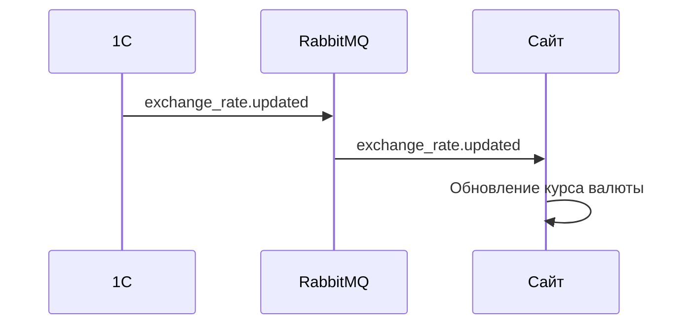

### Формат сообщений

**`exchange_rate.updated`** (1С → Сайт)
```json
{
  "event": "exchange_rate.updated",
  "currency_code": "KZT",
  "rate": 5.45,
  "base_currency_code": "RUB",
  "date": "2026-02-16"
}
```

> [!NOTE]
> Базовая валюта всегда `RUB`. Возможные значения `currency_code`: `KZT`, `BYN`.

### Критерии приёмки

- [ ] Все цены на товары хранятся в базовой валюте.
- [ ] Сайт принимает из шины RabbitMQ событие `exchange_rate.updated` и обновляет курс в своей базе данных.
- [ ] Сайт не обновляет курсы валют самостоятельно из сторонних источников.
- [ ] Единственным источником курсов валют является 1С.

---

## US-05: Синхронизация остатков

**Как** сайт,
**я хочу** получать из 1С данные об изменении свободных остатков,
**чтобы** показывать пользователям актуальное наличие товаров в их регионе.

### Схема обмена

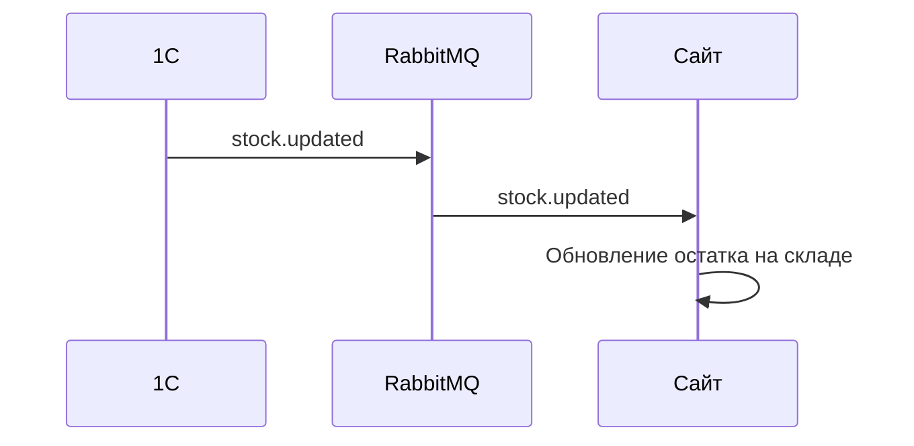

### Формат сообщений

**`stock.updated`** (1С → Сайт)
```json
{
  "event": "stock.updated",
  "product_uuid": "a1b2c3d4-...",
  "warehouse_uuid": "w1a2b3c4-...",
  "quantity": 42
}
```

### Критерии приёмки

- [ ] Склады заводятся в админке сайта вручную с привязкой к UUID склада из 1С.
- [ ] Сайт принимает из шины RabbitMQ событие `stock.updated` (при резервировании, перемещении, списании, оприходовании, приёмке).
- [ ] Сайт обновляет остаток товара на указанном складе.
- [ ] Пользователь привязан к региону; регион определяет две группы складов:
  - **Склады для заказа** — суммарный остаток отображается как «в наличии».
  - **Склады для предзаказа** — суммарный остаток отображается как «на предзаказе».

---

## US-06: Управление контрагентами

**Как** сайт,
**я хочу** предоставить пользователю возможность создавать контрагентов,
**чтобы** он мог указывать их при оформлении заказа.

### Схема обмена

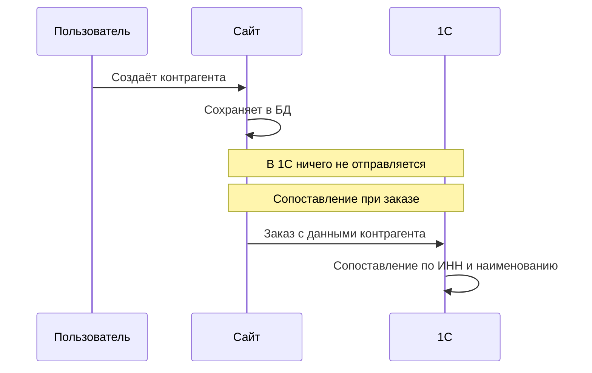

### Критерии приёмки

- [ ] Пользователь создаёт и редактирует контрагентов в личном кабинете.
- [ ] При действиях с контрагентом на сайте в 1С ничего не отправляется.
- [ ] Контрагенты, заведённые в 1С, на сайт не подгружаются.
- [ ] Сопоставление контрагента в 1С происходит по ИНН при получении заказа.
- [ ] Если при получении заказа 1С не нашла контрагента по ИНН, переданному в данных заказа, — 1С самостоятельно создаёт и заполняет нового контрагента с этим ИНН.
- [ ] Для оформления заказа пользователь обязан выбрать контрагента.

---

## US-07: Оформление и синхронизация заказов

**Как** сайт,
**я хочу** формировать заказы из корзины и обмениваться данными о заказах с 1С,
**чтобы** пользователь видел актуальный статус и состав своего заказа.

### Схема обмена

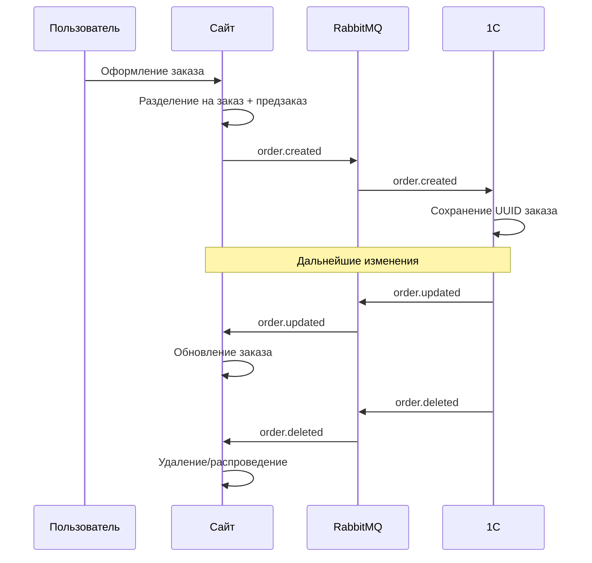

### Формат сообщений

**`order.created`** (Сайт → 1С)
```json
{
  "event": "order.created",
  "uuid": "o1a2b3c4-...",
  "number": "ORD-2026-0001",
  "date": "2026-02-16T10:30:00",
  "status": "new",
  "type": "order | preorder",
  "partner_uuid": "p1a2b3c4-...",
  "contractor": {
    "country": "KZ",
    "name": "Компания",
    "legal_name": "ТОО «Компания»",
    "tax_id": "1234567890",
    "registration_number": "12345-1234-ТОО",
    "tax_code": "620101",
    "okpo_code": "12345678",
    "legal_address": "г. Алматы, ул. Абая, 10, офис 5",
    "actual_address": "г. Алматы, ул. Абая, 10",
    "phone": "+77001234567",
    "email": "info@company.kz",
    "latitude": 43.2380000,
    "longitude": 76.9450000,
    "bank_accounts": [
      {
        "bank_name": "АО «Казкоммерцбанк»",
        "bank_bik": "KZKOKZKX",
        "correspondent_account": "30101810400000000225",
        "account_number": "KZ123456789012345678",
        "is_primary": true
      }
    ]
  },
  "delivery_address": "г. Алматы, ул. Абая, 10",
  "currency_code": "KZT",
  "exchange_rate": 5.45,
  "rate_coefficient": 1.0,
  "items": [
    {
      "product_uuid": "a1b2c3d4-...",
      "quantity": 5,
      "price": 3000.00
    }
  ]
}
```

**`order.updated`** (1С → Сайт)
```json
{
  "event": "order.updated",
  "uuid": "o1a2b3c4-...",
  "status": "confirmed",
  "items": [
    {
      "product_uuid": "a1b2c3d4-...",
      "quantity": 4,
      "price": 3000.00
    }
  ]
}
```

**`order.deleted`** (1С → Сайт)
```json
{
  "event": "order.deleted",
  "uuid": "o1a2b3c4-..."
}
```

### Критерии приёмки

#### Создание заказа
- [ ] При оформлении корзина разделяется на два заказа:
  - **Основной заказ** — товары с основных складов (наличие).
  - **Предзаказ** — товары с предварительных складов (может отсутствовать).
- [ ] Каждый заказ содержит: номер, дату, начальный статус, контрагента, адрес доставки и позиции.
- [ ] Заказ фиксируется в валюте пользователя с сохранением курса конверсии и поправочного коэффициента.
- [ ] После отправки заказа пользователь изменять его не может.

#### Отправка в 1С
- [ ] При создании заказ получает UUID на сайте и отправляется в 1С через шину RabbitMQ (`order.created`).
- [ ] 1С обязана сохранить UUID заказа с сайта.

#### Получение изменений из 1С
- [ ] Сайт принимает из шины RabbitMQ события `order.updated` и `order.deleted`.
- [ ] Обрабатываются: изменение статуса, изменение позиций (добавление, удаление, изменение количества или цены), удаление и распроведение.
- [ ] Пользователь видит все изменения заказа в личном кабинете.

#### Фиксация валюты
- [ ] Заказ отображается в валюте пользователя по курсу на момент оформления.
- [ ] Стоимость заказа не пересчитывается при изменении курса валюты.

> [!IMPORTANT]
> Пример: заказ оформлен 1 января на 1 000 тенге. Даже если к 1 мая курс базовой валюты изменился, пользователь по-прежнему должен видеть 1 000 тенге.

---

## US-08: Оформление и синхронизация возвратов

**Как** сайт,
**я хочу** позволить пользователю создать возврат и обмениваться данными о возвратах с 1С,
**чтобы** пользователь мог вернуть товар и отслеживать статус возврата.

### Схема обмена

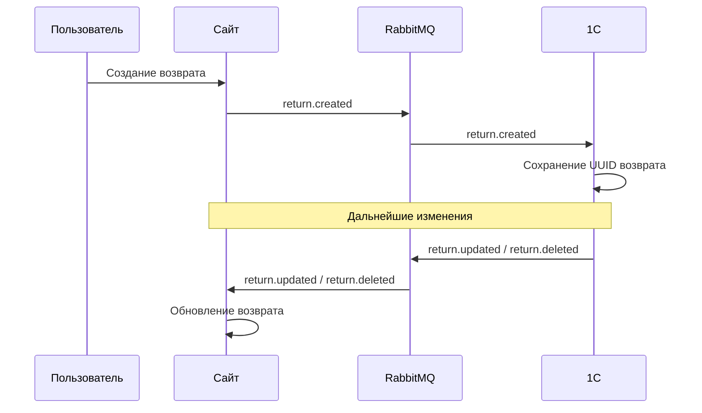

### Формат сообщений

**`return.created`** (Сайт → 1С)
```json
{
  "event": "return.created",
  "uuid": "r1a2b3c4-...",
  "order_uuid": "o1a2b3c4-...",
  "partner_uuid": "p1a2b3c4-...",
  "items": [
    {
      "product_uuid": "a1b2c3d4-...",
      "quantity": 2,
      "reason": "Брак"
    }
  ]
}
```

**`return.updated`** (1С → Сайт)
```json
{
  "event": "return.updated",
  "uuid": "r1a2b3c4-...",
  "status": "approved"
}
```

**`return.deleted`** (1С → Сайт)
```json
{
  "event": "return.deleted",
  "uuid": "r1a2b3c4-..."
}
```

### Критерии приёмки

- [ ] Пользователь оформляет возврат на основании ранее сделанного заказа.
- [ ] Каждая позиция возврата содержит: ссылку на исходный заказ, причину возврата, количество возвращаемого товара.
- [ ] При создании возврат получает UUID на сайте и отправляется в 1С через RabbitMQ (`return.created`).
- [ ] 1С сохраняет UUID возврата с сайта.
- [ ] Сайт принимает из шины RabbitMQ события `return.updated` и `return.deleted`.
- [ ] Пользователь видит актуальный статус возврата в личном кабинете.

---

## US-09: Отображение реализаций

**Как** сайт,
**я хочу** получать из 1С данные о реализациях,
**чтобы** пользователь мог просматривать отгрузки по своему контрагенту.

### Схема обмена

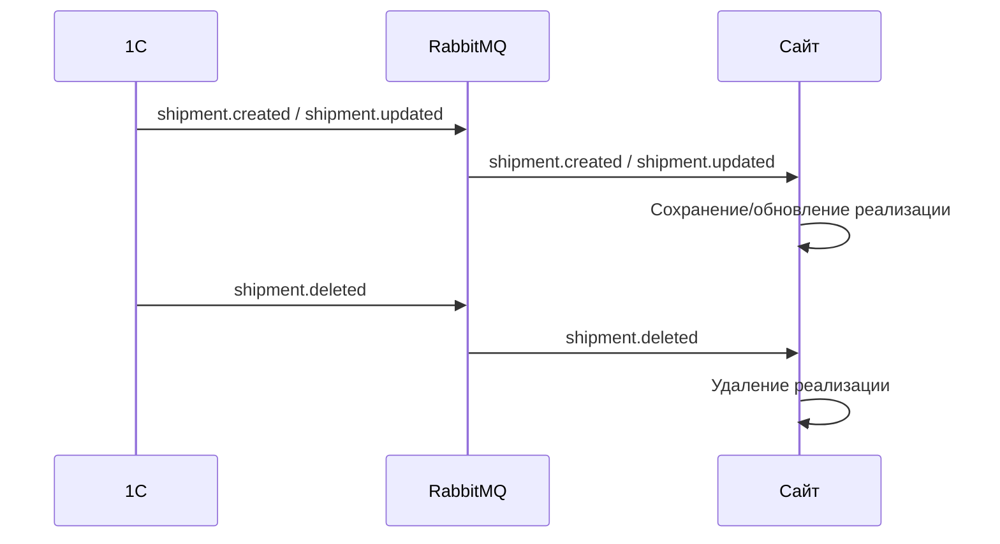

### Формат сообщений

**`shipment.created` / `shipment.updated`** (1С → Сайт)
```json
{
  "event": "shipment.created",
  "uuid": "s1a2b3c4-...",
  "contractor_inn": "1234567890",
  "date": "2026-02-16",
  "status": "completed",
  "currency_code": "KZT",
  "items": [
    {
      "product_uuid": "a1b2c3d4-...",
      "quantity": 10,
      "price": 3000.00
    }
  ]
}
```

**`shipment.deleted`** (1С → Сайт)
```json
{
  "event": "shipment.deleted",
  "uuid": "s1a2b3c4-..."
}
```

### Критерии приёмки

- [ ] Сайт принимает из шины RabbitMQ события `shipment.created`, `shipment.updated`, `shipment.deleted`.
- [ ] Реализация содержит: контрагента, дату, статус, валюту и позиции.
- [ ] Сайт сохраняет реализацию в своей базе данных.
- [ ] Пользователь видит реализации своего контрагента в личном кабинете.

---

## US-10: Отображение баланса

**Как** сайт,
**я хочу** получать из 1С готовый баланс по контрагенту,
**чтобы** пользователь мог контролировать свою задолженность.

### Схема обмена

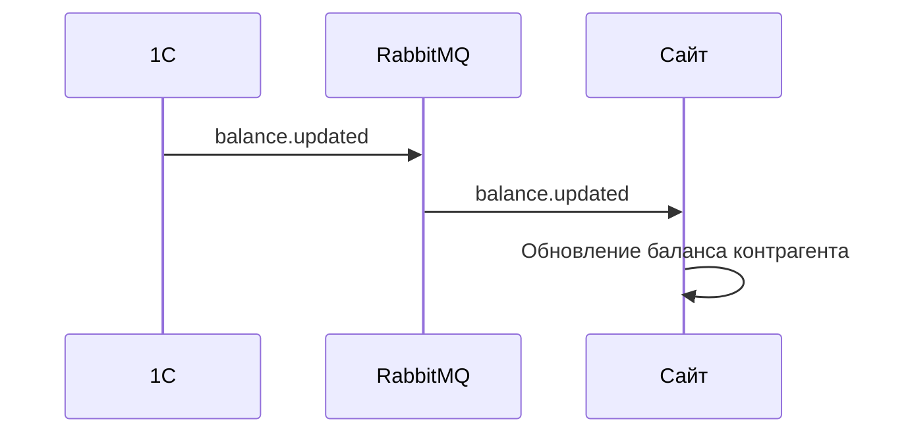

### Формат сообщений

**`balance.updated`** (1С → Сайт)
```json
{
  "event": "balance.updated",
  "partner_uuid": "p1a2b3c4-...",
  "current_balance": -125000.00,
  "overdue_debt": 50000.00,
  "updated_at": "2026-02-16T10:00:00"
}
```

### Критерии приёмки

- [ ] Сайт не рассчитывает баланс самостоятельно — расчёт выполняется на стороне 1С.
- [ ] Сайт принимает из шины RabbitMQ событие `balance.updated`.
- [ ] Баланс включает: текущий баланс, просроченную задолженность, дату последнего обновления.
- [ ] Баланс отображается пользователю в личном кабинете.
- [ ] Реализация аналогична действующему механизму на sex-opt.ru.
