# Критерии приёмки интеграции сайта с 1С

> **Версия:** 2.0 (обновлено по итогам встречи ~10-11 февраля 2026)
> **Изменения:** добавлены US-11, US-12, US-13; обновлены US-01, US-03, US-04, US-05, US-06, US-07, US-09, US-10

> [!NOTE]
> В этом документе изменения по сравнению с v1 обозначены:
> - 🆕 — новый раздел/критерий
> - ✏️ — изменение существующего
> - ~~зачёркнутый текст~~ — удалено или отложено
> - `(v2)` — рядом с изменённым полем в JSON

---

## Общая схема обмена данными

```
Сайт → RabbitMQ → 1С   (публикует → потребляет)
1С → RabbitMQ → Сайт    (публикует → потребляет)
```

| Направление | Типы событий |
|---|---|
| **1С → Сайт** | Партнёры, цены, скидки, курсы валют, остатки, изменения заказов/возвратов, реализации, баланс, **🆕 каталог (категории, атрибуты)**, **🆕 сегменты номенклатуры**, **🆕 сегменты партнёров** |
| **Сайт → 1С** | Создание заказов, создание возвратов |

---

## Инфраструктура RabbitMQ

### Архитектура обмена

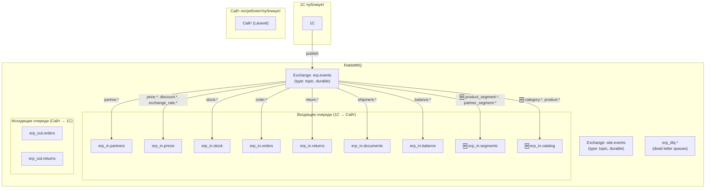

### Входящие очереди (1С → Сайт)

| Очередь | Routing keys | События | Обоснование выделения |
|---|---|---|---|
| `erp_in.partners` | `partner.*` | `partner.created`, `partner.deleted` | Критическая операция — активация/деактивация пользователей |
| `erp_in.prices` | `price.*`, `discount.*`, `exchange_rate.*` | `price.updated`, `discount.created/updated/deleted`, `exchange_rate.updated` | Ценообразование — логически связанные события |
| `erp_in.stock` | `stock.*` | `stock.updated` | Самая высокочастотная очередь |
| `erp_in.orders` | `order.*` | `order.updated`, `order.deleted` | Обновления заказов из 1С |
| `erp_in.returns` | `return.*` | `return.updated`, `return.deleted` | Обновления возвратов из 1С |
| `erp_in.documents` | `shipment.*` | `shipment.created/updated/deleted` | Документооборот — реализации |
| `erp_in.balance` | `balance.*` | `balance.updated` | Баланс контрагентов |
| `erp_in.segments` 🆕 | `product_segment.*`, `partner_segment.*` | `product_segment.created/updated/deleted`, `partner_segment.created/updated/deleted` | Сегменты для расчёта скидок |
| `erp_in.catalog` 🆕 | `category.*`, `product.*` | `category.created/updated`, `product.created/updated` | Каталог и номенклатура из 1С |

### Исходящие очереди (Сайт → 1С)

| Очередь | Routing key | Описание |
|---|---|---|
| `erp_out.orders` | `order.created` | Новые заказы с сайта |
| `erp_out.returns` | `return.created` | Новые возвраты с сайта |
| `erp_out.partners` 🆕 | `partner.created` | ✏️ Новые партнёры с сайта (направление изменено) |

### Dead Letter Queues

У каждой входящей очереди есть свой DLQ для сообщений, не обработанных после всех попыток.

### Параметры воркеров

| Очередь | Воркеров | Tries | Backoff | Обоснование |
|---|---|---|---|---|
| `erp_in.partners` | 1 | 5 | 30 сек | Критично, но редко |
| `erp_in.prices` | 1–2 | 3 | 10 сек | Среднечастотная |
| `erp_in.stock` | 2–4 | 3 | 5 сек | Самая частая |
| `erp_in.orders` | 1–2 | 5 | 15 сек | Пользователь ждёт обновления |
| `erp_in.returns` | 1 | 3 | 15 сек | Низкочастотная |
| `erp_in.documents` | 1 | 3 | 30 сек | Нет срочности |
| `erp_in.balance` | 1 | 3 | 30 сек | Низкочастотная |
| `erp_in.segments` 🆕 | 1 | 3 | 15 сек | Редко меняется |
| `erp_in.catalog` 🆕 | 1 | 3 | 15 сек | Редко меняется |
| `erp_out.orders` | 1 | 5 | 10 сек | Исходящие — критично доставить |
| `erp_out.returns` | 1 | 5 | 10 сек | Исходящие — критично доставить |
| `erp_out.partners` 🆕 | 1 | 5 | 30 сек | Исходящие — критично доставить |

### Формат конверта сообщения

Все сообщения передаются как **raw JSON**. Обязательные мета-поля:

```json
{
  "event": "partner.created",
  "timestamp": "2026-02-16T10:30:00+03:00",
  "message_id": "msg-550e8400-e29b-41d4-...",
  "...": "остальные поля зависят от типа события"
}
```

### Требования к идемпотентности

> [!IMPORTANT]
> Все обработчики входящих событий должны быть **идемпотентными**: повторная обработка одного и того же сообщения (по `message_id`) не должна приводить к дублированию данных.

---

## US-01: Активация и деактивация пользователей

**Как** сайт,
**я хочу** получать из 1С события о создании и удалении партнёров,
**чтобы** автоматически активировать и деактивировать учётные записи пользователей.

### ✏️ Схема обмена (изменена в v2)

> [!IMPORTANT]
> **v2 ИЗМЕНЕНИЕ:** Схема принципиально переработана. `partner.created` теперь публикует **Сайт → 1С** (ранее было 1С → Сайт). Активация пользователя происходит через webhook Битрикс24, а не через RabbitMQ.

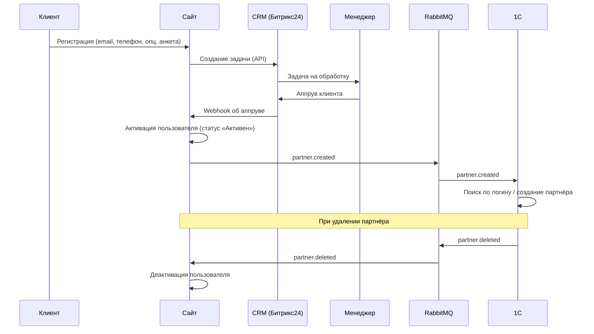

### Формат сообщений

**`partner.created`** ✏️ (Сайт → 1С через RabbitMQ; **направление изменено в v2**)
```json
{
  "event": "partner.created",
  "uuid": "550e8400-e29b-41d4-a716-446655440000",
  "login": "client@example.com",
  "name": "Иванов Иван Иванович",       // (v2) новое поле
  "phone": "+77001234567",               // (v2) новое поле
  "email": "client@example.com"          // (v2) новое поле
}
```

**`partner.deleted`** (1С → Сайт — без изменений)
```json
{
  "event": "partner.deleted",
  "uuid": "550e8400-e29b-41d4-a716-446655440000"
}
```

### Критерии приёмки

- [ ] При регистрации клиента на сайте в CRM (Битрикс24) автоматически создаётся задача для менеджера.
- [ ] 🆕 Сайт ловит webhook из Битрикс24 при аппруве заявки и переводит пользователя в статус «Активен».
- [ ] ✏️ Сайт публикует в RabbitMQ событие `partner.created` с данными партнёра (uuid, login, name, phone, email).
- [ ] ✏️ 1С принимает событие `partner.created`, находит партнёра по реквизиту «Логин»; если не найден — создаёт нового.
- [ ] Сайт принимает из шины RabbitMQ событие `partner.deleted` и переводит пользователя в статус «Не активен».
- [ ] 🆕 Анкета при регистрации — опциональная (может быть пропущена).
- [ ] 🆕 В первой версии: один пользователь = одна компания (мультипользовательство — в следующем скопе).

> [!WARNING]
> **Партнёр в 1С** = физическое лицо (контактное лицо). **Контрагент** = юридическое лицо (компания). Необходимо согласовать точную структуру сущностей с разработчиком 1С.

---

## US-02: Синхронизация базовых цен

**Как** сайт,
**я хочу** получать из 1С события об изменении базовых цен,
**чтобы** отображать пользователям актуальную стоимость товаров.

### Схема обмена

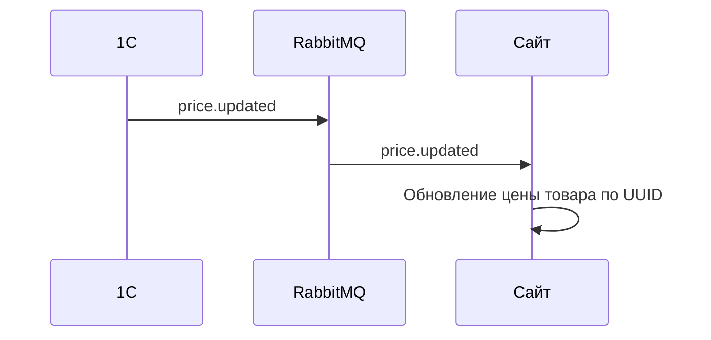

### Формат сообщений

**`price.updated`** (1С → Сайт)
```json
{
  "event": "price.updated",
  "product_uuid": "a1b2c3d4-...",
  "price": 15000.00
}
```

### Критерии приёмки

- [ ] Товары в 1С и на сайте связаны через единый UUID.
- [ ] Сайт принимает из шины RabbitMQ событие `price.updated`.
- [ ] Сайт находит товар по UUID и обновляет его базовую цену.
- [ ] Если товар с указанным UUID не найден, событие игнорируется без ошибки.
- [x] 🆕 Изменение базовой цены на сайте **недоступно** для обычных пользователей; изменение доступно только через форму товара в админке. _(Примечание: в системе существует единственный уровень доступа в админку — admin, который является суперадмином. Разграничения ролей внутри админки нет, критерий считается выполненным по архитектуре.)_
- [ ] 🆕 Сайт не отправляет обновления цен в 1С.

---

## US-03: Синхронизация скидок

**Как** сайт,
**я хочу** получать из 1С данные о скидках,
**чтобы** формировать персональные цены в карточках товаров.

### Схема обмена

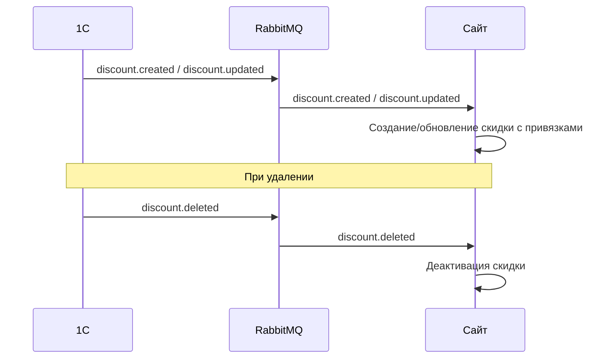

### Формат сообщений

**`discount.created` / `discount.updated`** (1С → Сайт)
```json
{
  "event": "discount.created",
  "uuid": "d1e2f3a4-...",
  "type": "agreement | promotion",
  "value": 10.00,
  "starts_at": "2026-01-01T00:00:00",
  "ends_at": "2026-03-31T23:59:59",
  "product_uuids": ["a1b2c3d4-..."],
  "partner_uuids": ["p1a2b3c4-..."],
  "product_segment_uuids": ["seg-prod-001"],  // (v2) новое поле
  "partner_segment_uuids": ["seg-part-001"]   // (v2) новое поле
}
```

> [!NOTE]
> Поля `product_segment_uuids` и `partner_segment_uuids` — альтернатива перечислению UUID поштучно. Если заполнены сегменты, сайт разворачивает их в конкретные товары/партнёров по данным из US-11 и US-12.

**`discount.deleted`** (1С → Сайт)
```json
{
  "event": "discount.deleted",
  "uuid": "d1e2f3a4-..."
}
```

### Критерии приёмки

- [x] Сайт принимает из шины RabbitMQ события `discount.created`, `discount.updated`, `discount.deleted`.
- [x] Сайт создаёт или обновляет скидку вместе с привязанными товарами и партнёрами.
- [x] При удалении скидки в 1С сайт деактивирует соответствующую скидку.
- [x] Персональные цены с учётом скидок корректно отображаются в карточке товара.
- [x] 🆕 Тип `agreement` — типовое соглашение; `promotion` — временная акция.
- [x] 🆕 Если по акции скидка больше, чем по соглашению — применяется акция.
- [x] 🆕 Поддержка индивидуальных соглашений (скидка для отдельного партнёра на конкретные товары).

---

## US-04: Синхронизация курсов валют

**Как** сайт,
**я хочу** получать курсы валют из 1С,
**чтобы** ценообразование полностью совпадало с данными 1С.

### Схема обмена

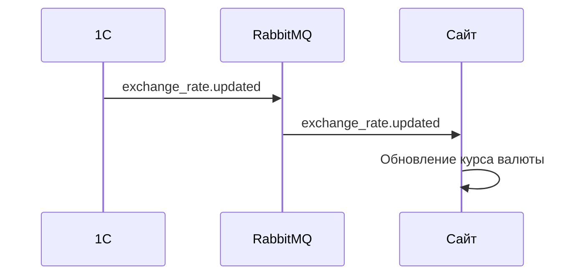

### ✏️ Формат сообщений (изменён в v2)

**`exchange_rate.updated`** (1С → Сайт)
```json
{
  "event": "exchange_rate.updated",
  "currency_code": "KZT",
  "official_rate": 5.40,        // (v2) новое поле — курс нацбанка
  "rate_coefficient": 1.01,     // (v2) новое поле — поправочный коэффициент
  "rate": 5.45,                 // итоговый курс = official_rate × rate_coefficient
  "base_currency_code": "RUB",
  "date": "2026-02-16"
}
```

| Поле | Тип | Описание |
|---|---|---|
| `official_rate` | number | Курс нацбанка |
| `rate_coefficient` | number | Поправочный коэффициент (устанавливается вручную в 1С) |
| `rate` | number | Итоговый курс для сайта (= official_rate × rate_coefficient) |

> [!NOTE]
> Базовая валюта всегда `RUB`. Возможные значения `currency_code`: `KZT`, `BYN`. Коэффициент нужен для компенсации потерь на конвертации в кризисные периоды.

### Критерии приёмки

- [ ] Все цены на товары хранятся в базовой валюте (`RUB`).
- [ ] Сайт принимает из шины RabbitMQ событие `exchange_rate.updated` и обновляет курс в своей базе данных.
- [ ] ✏️ Сайт сохраняет официальный курс, поправочный коэффициент и итоговый курс.
- [ ] Сайт **не** обновляет курсы валют самостоятельно из сторонних источников.
- [ ] Единственным источником курсов валют является 1С.
- [ ] 🆕 При повторном обновлении курса запись перезаписывается (без хранения истории).

---

## US-05: Синхронизация остатков

**Как** сайт,
**я хочу** получать из 1С данные об изменении свободных остатков,
**чтобы** показывать пользователям актуальное наличие товаров в их регионе.

### Схема обмена

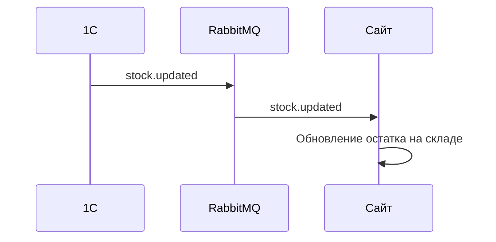

### Формат сообщений

**`stock.updated`** (1С → Сайт)
```json
{
  "event": "stock.updated",
  "product_uuid": "a1b2c3d4-...",
  "warehouse_uuid": "w1a2b3c4-...",
  "quantity": 42
}
```

### Критерии приёмки

- [ ] Склады заводятся в админке сайта вручную с привязкой к UUID склада из 1С.
- [ ] Сайт принимает из шины RabbitMQ событие `stock.updated`.
- [ ] Сайт обновляет остаток товара на указанном складе.
- [ ] Пользователь привязан к региону; регион определяет группы складов:
  - **Склады для заказа** — суммарный остаток на основных складах региона пользователя отображается как «в наличии».
  - **Склады для предзаказа** — суммарный остаток на складах предзаказа региона пользователя отображается как «на предзаказе».
- [ ] 🆕 1С отправляет остатки по всем организациям (включая Елисеев, Пикадо) в разрезе складов.
- [ ] 🆕 Сайт агрегирует остатки по регионам пользователя.
- [ ] 🆕 Зарезервированный в 1С товар уменьшает доступный остаток (1С просто отправляет свободный остаток по скаладам).
- [ ] 🆕 Клиент **не может** заказать больше, чем есть свободных остатков на доступных ему складах (в том числе на доступных складах предзаказа)

---

## US-06: Управление контрагентами

**Как** сайт,
**я хочу** предоставить пользователю возможность создавать контрагентов,
**чтобы** он мог указывать их при оформлении заказа.

### Схема обмена

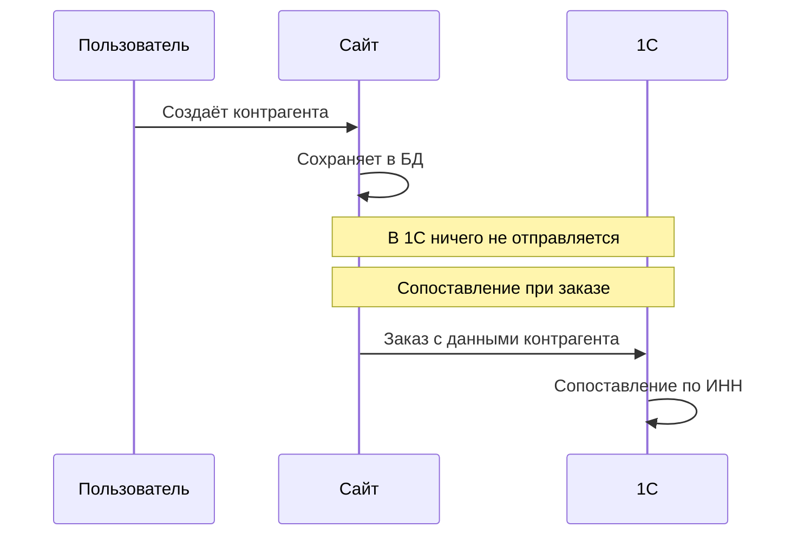

### Критерии приёмки

- [ ] Пользователь создаёт и редактирует контрагентов в личном кабинете.
- [ ] При действиях с контрагентом на сайте в 1С **ничего не отправляется**.
- [ ] Контрагенты, заведённые в 1С, на сайт **не подгружаются**.
- [ ] ✏️ Сопоставление контрагента в 1С происходит **по ИНН** при получении заказа.
- [ ] Если при получении заказа 1С не нашла контрагента по ИНН — 1С самостоятельно создаёт нового контрагента.
- [ ] Для оформления заказа пользователь обязан выбрать контрагента.
- [ ] 🆕 **Для запуска:** существующие ~150 партнёров предзаполняются в админке сайта вручную (или импортом).

---

## US-07: Оформление и синхронизация заказов

**Как** сайт,
**я хочу** формировать заказы из корзины и обмениваться данными о заказах с 1С,
**чтобы** пользователь видел актуальный статус и состав своего заказа.

### Схема обмена

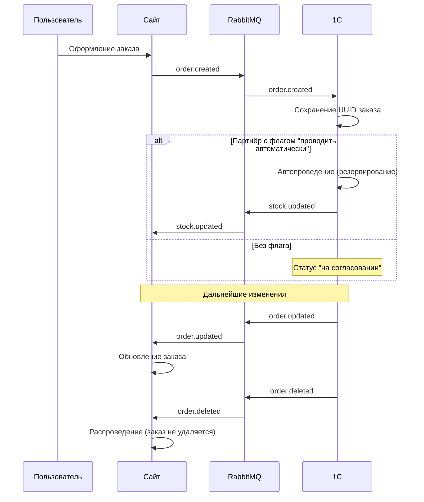

### Формат сообщений

**`order.created`** (Сайт → 1С)
```json
{
  "event": "order.created",
  "uuid": "o1a2b3c4-...",
  "number": "ORD-2026-0001",
  "date": "2026-02-16T10:30:00",
  "type": "order | preorder",
  "status": "new",
  "partner_uuid": "p1a2b3c4-...",
  "warehouse_uuids": ["w1a2b3c4-...", "w2b3c4d5-..."],  // (v2.1) массив UUID складов региона пользователя
  "contractor": {
    "country": "KZ",
    "name": "Компания",
    "legal_name": "ТОО «Компания»",
    "tax_id": "1234567890",
    "registration_number": "12345-1234-ТОО",
    "tax_code": "620101",
    "okpo_code": "12345678",
    "legal_address": "г. Алматы, ул. Абая, 10, офис 5",
    "actual_address": "г. Алматы, ул. Абая, 10",
    "phone": "+77001234567",
    "email": "info@company.kz",
    "latitude": 43.238,
    "longitude": 76.945,
    "bank_accounts": [
      {
        "bank_name": "АО «Казкоммерцбанк»",
        "bank_bik": "KZKOKZKX",
        "correspondent_account": "30101810400000000225",
        "account_number": "KZ123456789012345678",
        "is_primary": true
      }
    ]
  },
  "delivery_address": "г. Алматы, ул. Абая, 10",
  "currency_code": "KZT",
  "exchange_rate": 5.45,
  "rate_coefficient": 1.0,
  "items": [
    {
      "product_uuid": "a1b2c3d4-...",
      "quantity": 5,
      "price": 3000.00
    }
  ]
}
```


**`order.updated`** (1С → Сайт)
```json
{
  "event": "order.updated",
  "uuid": "o1a2b3c4-...",
  "status": "confirmed",
  "items": [
    {
      "product_uuid": "a1b2c3d4-...",
      "quantity": 4,
      "price": 3000.00
    }
  ]
}
```

**`order.deleted`** (1С → Сайт)
```json
{
  "event": "order.deleted",
  "uuid": "o1a2b3c4-..."
}
```

### Критерии приёмки

#### Создание заказа
- [ ] При оформлении корзины разделяется на два заказа (основной + предзаказ).
- [ ] 🆕 Каждый заказ содержит: номер, дату, начальный статус, контрагента, адрес доставки, **массив UUID складов (`warehouse_uuids`)** и позиции. 1С сама выбирает склад для обеспечения.
- [ ] Заказ фиксируется в валюте пользователя с сохранением курса конверсии и поправочного коэффициента.
- [ ] После отправки заказа пользователь изменять его **не может**.

#### 🆕 Автоматическое резервирование
- [ ] В 1С у партнёра есть флаг «проводить автоматически».
- [ ] Для партнёров с этим флагом заказ автоматически проводится (резервируется) при получении.
- [ ] Для остальных партнёров заказ остаётся в статусе «на согласовании» до ручного подтверждения менеджером.
- [ ] При резервировании 1С обновляет остатки → новые остатки отправляются на сайт.

#### Отправка в 1С
- [ ] При создании заказ получает UUID на сайте и отправляется в 1С через RabbitMQ (`order.created`).
- [ ] 1С обязана сохранить UUID заказа с сайта.

#### Получение изменений из 1С
- [ ] Сайт принимает из шины RabbitMQ события `order.updated` и `order.deleted`.
- [ ] Обрабатываются: изменение статуса, изменение позиций, удаление и распроведение.
- [ ] Пользователь видит все изменения заказа в личном кабинете.

#### 🆕 Сворачивание заказов
- [ ] Заказы на сайте **никогда не удаляются и не сворачиваются** — они остаются как лог действий клиента.
- [ ] 1С может сворачивать несколько заказов в один мастер-заказ, но сайт его не получает.
- [ ] Связь между заказами и реализацией осуществляется через `order_uuid` в items реализации (US-09).

#### Фиксация валюты
- [ ] Заказ отображается в валюте пользователя по курсу на момент оформления.
- [ ] Стоимость заказа не пересчитывается при изменении курса валюты.

---

## US-08: Оформление и синхронизация возвратов

> [!WARNING]
> **✏️ v2: Отложено на следующий скоп.**

_(Исходное описание сохранено для справки. Реализация не планируется в текущем скопе.)_

**Как** сайт,
**я хочу** позволить пользователю создать возврат и обмениваться данными о возвратах с 1С,
**чтобы** пользователь мог вернуть товар и отслеживать статус возврата.

---

## US-09: Отображение реализаций

**Как** сайт,
**я хочу** получать из 1С данные о реализациях,
**чтобы** пользователь мог просматривать отгрузки по своему контрагенту.

### Схема обмена

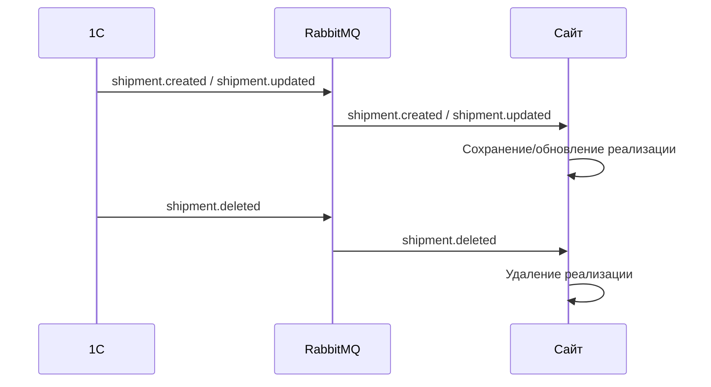

### ✏️ Формат сообщений (изменён в v2)

**`shipment.created` / `shipment.updated`** (1С → Сайт)
```json
{
  "event": "shipment.created",
  "uuid": "s1a2b3c4-...",
  "contractor_inn": "1234567890",
  "date": "2026-02-16",
  "status": "completed",
  "currency_code": "KZT",
  "items": [
    {
      "product_uuid": "a1b2c3d4-...",
      "order_uuid": "o1a2b3c4-...",
      "quantity": 10,
      "price": 3000.00,
      "auto_discount_percent": 2.00,    // (v2) переименовано из automated_discount
      "manual_discount_percent": 17.00, // (v2) переименовано из manual_discount
      "total": 24300.00,                // (v2) переименовано
      "vat_rate": 22                    // (v2) переименовано из vat
    }
  ]
}
```

> [!NOTE]
> Поля `tracking_number` и `transport_company` **удалены в v2**.

**`shipment.deleted`** (1С → Сайт)
```json
{
  "event": "shipment.deleted",
  "uuid": "s1a2b3c4-..."
}
```

### Критерии приёмки

- [ ] Сайт принимает из шины RabbitMQ события `shipment.created`, `shipment.updated`, `shipment.deleted`.
- [ ] ✏️ Реализация содержит: контрагента (ИНН), дату, статус, валюту и позиции.
- [ ] ✏️ Каждая позиция содержит: товар, ссылку на исходный заказ (`order_uuid`), количество, базовую цену, **% автоматической скидки**, **% ручной скидки**, **итоговую сумму**, **ставку НДС**.
- [ ] 🆕 Одна реализация может быть создана по **нескольким заказам** (стандартная функция 1С).
- [ ] ✏️ Сайт сохраняет реализацию и **связывает её с заказами клиента через `order_uuid`**.
- [ ] Пользователь видит реализации своего контрагента в личном кабинете.
- [ ] 🆕 Расчёт задолженности ведётся **по реализациям**, а не по заказам.

> [!WARNING]
> Реализация может отличаться от заказа по составу и ценам (менеджер может добавить позиции или применить дополнительные скидки). Это нормальная бизнес-практика.

---

## US-10: Отображение баланса

**Как** сайт,
**я хочу** получать из 1С готовый баланс по контрагенту,
**чтобы** пользователь мог контролировать свою задолженность.

### Схема обмена

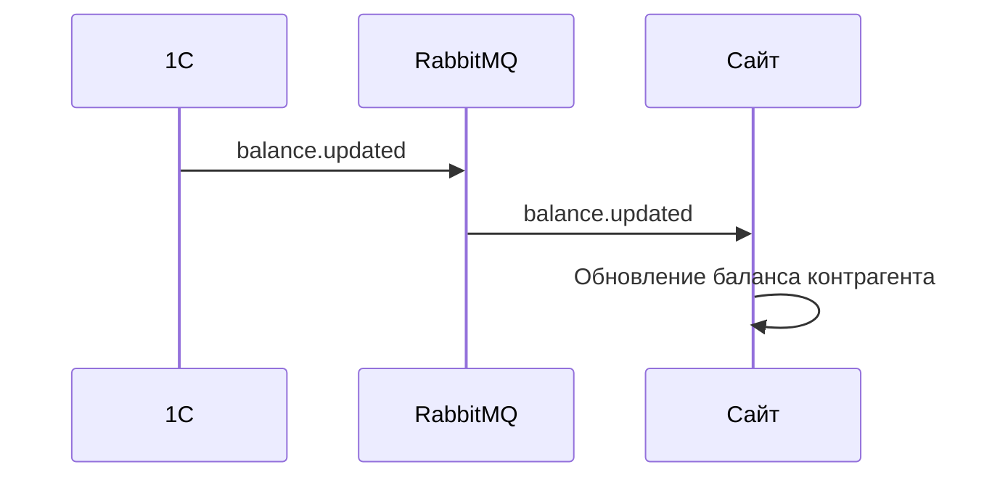

### ✏️ Формат сообщений (изменён в v2)

**`balance.updated`** (1С → Сайт)
```json
{
  "event": "balance.updated",
  "partner_uuid": "p1a2b3c4-...",
  "contractors": [                        // (v2) переименовано из data[]
    {
      "contractor_uuid": "c1a2b3c4-...",
      "contractor_inn": "1234567890",     // (v2) новое поле
      "current_balance": -125000.00,
      "overdue_debt": 50000.00,           // (v2) теперь скалярное, а не массив
      "overdue_details": [               // (v2) новый массив с детализацией
        {
          "shipment_uuid": "s1a2b3c4-...",
          "amount": 30000.00,            // (v2) замена overdue_debt + overdue_days
          "due_date": "2026-01-15"       // (v2) замена overdue_date
        },
        {
          "shipment_uuid": "s2b3c4d5-...",
          "amount": 20000.00,
          "due_date": "2026-02-01"
        }
      ]
    }
  ],
  "updated_at": "2026-02-16T10:00:00"   // (v2) перенесено на корневой уровень
}
```

### Критерии приёмки

- [ ] Сайт не рассчитывает баланс самостоятельно — расчёт выполняется на стороне 1С.
- [ ] Сайт принимает из шины RabbitMQ событие `balance.updated`.
- [ ] 🆕 Баланс передаётся **по контрагентам** (массив): у одного партнёра может быть несколько контрагентов.
- [ ] ✏️ Каждый контрагент содержит: текущий баланс, просроченную задолженность, **детализацию просрочки по реализациям** (UUID реализации, сумма, дата оплаты).
- [ ] Баланс отображается пользователю в личном кабинете.

---

## 🆕 US-11: Синхронизация сегментов номенклатуры

**Как** сайт,
**я хочу** получать из 1С сегменты номенклатуры,
**чтобы** использовать их для расчёта скидок и фильтрации товаров.

### Схема обмена

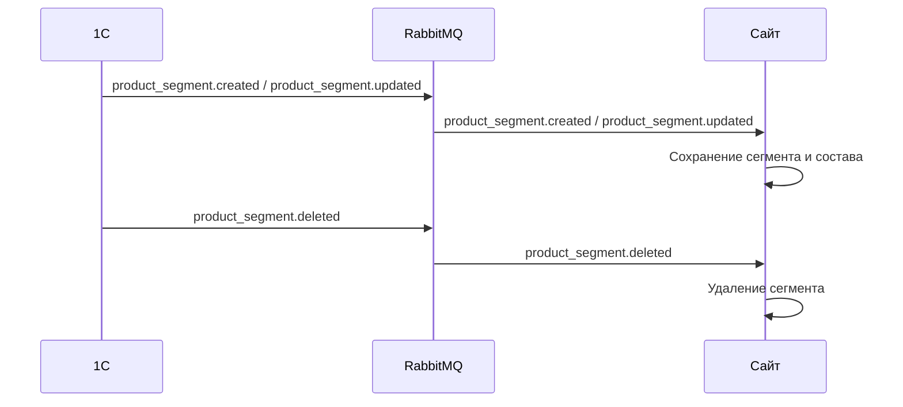

### Формат сообщений

**`product_segment.created` / `product_segment.updated`** (1С → Сайт)
```json
{
  "event": "product_segment.created",
  "uuid": "seg-prod-001",
  "name": "Лубриканты",
  "product_uuids": ["a1b2c3d4-...", "e5f6a7b8-..."]
}
```

**`product_segment.deleted`** (1С → Сайт)
```json
{
  "event": "product_segment.deleted",
  "uuid": "seg-prod-001"
}
```

### Критерии приёмки

- [ ] Сайт принимает события `product_segment.created`, `product_segment.updated`, `product_segment.deleted`.
- [ ] Один товар может входить в несколько сегментов (many-to-many).
- [ ] Сайт хранит сегменты и их состав в своей базе данных.
- [ ] При получении скидки с привязкой к сегменту — сайт разворачивает сегмент в конкретные товары.

---

## 🆕 US-12: Синхронизация сегментов партнёров

**Как** сайт,
**я хочу** получать из 1С сегменты партнёров,
**чтобы** использовать их для расчёта персональных скидок.

### Схема обмена

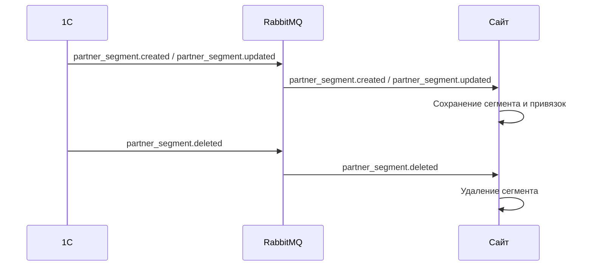

### Формат сообщений

**`partner_segment.created` / `partner_segment.updated`** (1С → Сайт)
```json
{
  "event": "partner_segment.created",
  "uuid": "seg-part-001",
  "name": "Уровень Голд",
  "partner_uuids": ["p1a2b3c4-...", "p5d6e7f8-..."]
}
```

**`partner_segment.deleted`** (1С → Сайт)
```json
{
  "event": "partner_segment.deleted",
  "uuid": "seg-part-001"
}
```

### Критерии приёмки

- [ ] Сайт принимает события `partner_segment.created`, `partner_segment.updated`, `partner_segment.deleted`.
- [ ] Сайт хранит сегменты и привязки партнёров.
- [ ] При получении скидки с привязкой к сегменту партнёров — сайт разворачивает сегмент в конкретных партнёров.

---

## 🆕 US-13: Синхронизация каталога товаров

**Как** сайт,
**я хочу** получать из 1С структуру каталога (виды номенклатуры, атрибуты),
**чтобы** категории, бренды и характеристики товаров на сайте соответствовали данным в 1С.

### Схема обмена

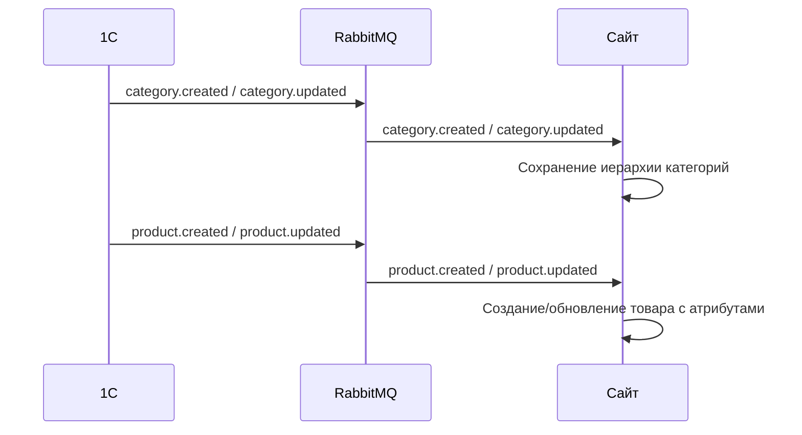

### Формат сообщений

**`category.created` / `category.updated`** (1С → Сайт)
```json
{
  "event": "category.created",
  "uuid": "cat-001",
  "parent_uuid": null,
  "name": "Бельё и одежда",
  "is_group": true
}
```

**`product.created` / `product.updated`** (1С → Сайт)
```json
{
  "event": "product.created",
  "uuid": "a1b2c3d4-...",
  "name": "Вибро-яйцо XYZ",
  "code": "0T-123213",
  "sku": "AAS-123213",
  "category_uuid": "cat-003",
  "brand": "BrandName",
  "description": "Описание товара",
  "barcodes": [
    "4600000000001",
    "4600000000002"
  ],
  "model" : { // nullable
    "uuid": "model-uuid",
    "name": "Модель товара",
  }
  "attributes": {
    "weight": "150г",
    "color": "розовый",
    "material": "силикон",
    "size": "S",
    "barcode": "4600000000001",
    "unit": "шт"
  }
}
```

> [!NOTE]
> Формат сообщения для номенклатуры будет уточнён после получения примера JSON от разработчика 1С.

### Критерии приёмки

- [ ] 1С отправляет иерархию видов номенклатуры (категорий) через RabbitMQ.
- [ ] Каждая категория содержит UUID, UUID родителя и наименование. Пустой `parent_uuid` = корневой элемент.
- [ ] 1С отправляет номенклатуру со всеми атрибутами (вес, цвет, размер, штрих-код, единица измерения и т.д.).
- [ ] Сайт сохраняет структуру каталога и привязывает товары к категориям.
- [ ] При появлении новых товаров/категорий в 1С — они автоматически появляются на сайте.
