# Критерии приёмки интеграции сайта с 1С

> **Версия:** 5.0 (обновлено по итогам реализации 21 марта 2026)
> **Предыдущая версия:** v4 (обновлено по итогам реализации 20 марта 2026)
>
> **Изменения v5:**
> - ✏️ v5 US-04, US-07, US-09: коды валют в исходящих сообщениях — ISO alpha-3 (`"RUB"`, `"KZT"`, `"BYN"`) через поле `Наименование` справочника `Валюты`; числовые коды (643, 398, 933) больше не используются
> - ✏️ v5 US-04: поиск валюты при входящем заказе/возврате — по `Наименование` (не по `Код`)
> - ✏️ v5 US-06: `contractor.created` обогащён полями `tax_code` (КПП), `okpo_code` (ОКПО), `country` (ISO alpha-2), `bank_accounts` (массив банковских счетов)
> - ✏️ v5 US-06: закрыт открытый вопрос #3 — `bank_accounts` включены в формат `contractor.created`
> - ✏️ v5 US-07: комментарий к заказу клиента с сайта обогащён данными из JSON — партнёр, контрагент (ИНН + наименование), валюта, адрес доставки, комментарий покупателя
> - ✏️ v5 US-07/US-08: 1С **не присваивает** UUID из входящих сообщений (`uuid` из JSON игнорируется при создании партнёра / заказа / возврата); UUID генерирует платформа 1С
> - ✏️ v5 US-11/US-12: публикация сегментов при `created`/`updated` — **отложенная**, через фоновое задание (решает проблему пустого состава сегмента при первой записи); `deleted` — по-прежнему синхронно
> - ✏️ v5 US-13: настройка `Модель` изменена с типа `Строка (UUID)` на прямую ссылку `ПВХ.ДополнительныеРеквизитыИСведения`; форма `НастройкиОбменаPecado` обновлена
> - 🔧 v5: рефакторинг кода — паттерн `Если ЗначениеЗаполнено() → присвоение` заменён на `ЗаполнитьЗначенияСвойств()` с предварительно заполненной структурой
>
> **Изменения v4:**
> - ✏️ v4 US-01: добавлен поток `partner.created` от 1С → Сайт (первоначальная выгрузка партнёров с паролем)
> - ✏️ v4 US-06: контрагенты теперь выгружаются из 1С → Сайт через `contractor.created`
> - ✏️ v4 US-13: `brand` — объект `{uuid, name}` из «Марка»; `model` — из настраиваемого доп. реквизита
> - ✏️ v4 US-13: `attributes` в `product.updated` — мерж по `property_uuid` (не полная замена)
> - 🆕 v4: раздел «Первоначальная выгрузка» (Initial Data Load) — пре-запускный чеклист
> - 🆕 v4: раздел «Открытые вопросы»
> - 🔧 v4: настройки обмена (организация, вид цен, коэффициенты) перенесены в `Константы.НастройкиОбменаPecado`
>
> **Изменения v3:**
> - ✏️ v3 US-07: добавлен поток `order.created` от 1С → Сайт (менеджер создаёт заказ в 1С вручную)
> - ✏️ v3 US-09: разделены события `shipment.created` (первое проведение) и `shipment.updated` (перепроведение)
> - ✏️ v3 US-13: формат атрибутов товара изменён на массив структур с `property_uuid`/`value_uuid`
> - ✏️ v3 US-13: `product.updated` — частичное обновление (только изменённые поля)
> - 🆕 v3: JSON-шаблоны вынесены в `docs/rmq-templates/`

> [!NOTE]
> Обозначения изменений:
> - 🆕 — новый раздел/критерий
> - ✏️ — изменение существующего
> - ~~зачёркнутый текст~~ — удалено или отложено
> - `(v2)` / `(v3)` / `(v4)` / `(v5)` — рядом с изменённым полем в JSON

---

## JSON-шаблоны сообщений

Все шаблоны хранятся в директории `docs/rmq-templates/`:

| Направление | Директория |
|---|---|
| **1С → Сайт** | `docs/rmq-templates/erp-to-site/` |
| **Сайт → 1С** | `docs/rmq-templates/site-to-erp/` |

| Файл шаблона | Событие | Направление |
|---|---|---|
| `erp-to-site/partner.created.json` | `partner.created` (выгрузка из 1С) | 🆕 v4 1С → Сайт |
| `erp-to-site/partner.deleted.json` | `partner.deleted` | 1С → Сайт |
| `erp-to-site/contractor.created.json` | `contractor.created` | 🆕 v4 1С → Сайт |
| `erp-to-site/price.updated.json` | `price.updated` | 1С → Сайт |
| `erp-to-site/discount.created.json` | `discount.created` | 1С → Сайт |
| `erp-to-site/discount.updated.json` | `discount.updated` | 1С → Сайт |
| `erp-to-site/discount.deleted.json` | `discount.deleted` | 1С → Сайт |
| `erp-to-site/exchange_rate.updated.json` | `exchange_rate.updated` | 1С → Сайт |
| `erp-to-site/stock.updated.json` | `stock.updated` | 1С → Сайт |
| `erp-to-site/order.created.json` | `order.created` (от 1С) | 🆕 v3 1С → Сайт |
| `erp-to-site/order.updated.json` | `order.updated` | 1С → Сайт |
| `erp-to-site/order.deleted.json` | `order.deleted` | 1С → Сайт |
| `erp-to-site/return.updated.json` | `return.updated` | 1С → Сайт |
| `erp-to-site/return.deleted.json` | `return.deleted` | 1С → Сайт |
| `erp-to-site/shipment.created.json` | `shipment.created` | 1С → Сайт |
| `erp-to-site/shipment.updated.json` | `shipment.updated` | 1С → Сайт |
| `erp-to-site/shipment.deleted.json` | `shipment.deleted` | 1С → Сайт |
| `erp-to-site/balance.updated.json` | `balance.updated` | 1С → Сайт |
| `erp-to-site/product_segment.created.json` | `product_segment.created` | 1С → Сайт |
| `erp-to-site/product_segment.deleted.json` | `product_segment.deleted` | 1С → Сайт |
| `erp-to-site/partner_segment.created.json` | `partner_segment.created` | 1С → Сайт |
| `erp-to-site/partner_segment.deleted.json` | `partner_segment.deleted` | 1С → Сайт |
| `erp-to-site/category.created.json` | `category.created` | 1С → Сайт |
| `erp-to-site/product.created.json` | `product.created` | 1С → Сайт |
| `erp-to-site/product.updated.json` | `product.updated` | 1С → Сайт |
| `site-to-erp/partner.created.json` | `partner.created` | Сайт → 1С |
| `site-to-erp/order.created.json` | `order.created` | Сайт → 1С |
| `site-to-erp/return.created.json` | `return.created` | Сайт → 1С |

---

## Общая схема обмена данными

```
Сайт → RabbitMQ → 1С   (публикует → потребляет)
1С → RabbitMQ → Сайт    (публикует → потребляет)
```

| Направление | Типы событий |
|---|---|
| **1С → Сайт** | Партнёры, цены, скидки, курсы валют, остатки, изменения заказов/возвратов, реализации, баланс, каталог (категории, атрибуты), сегменты номенклатуры, сегменты партнёров, 🆕 v3 заказы от менеджера |
| **Сайт → 1С** | Создание заказов, создание возвратов, активация партнёров |

---

## Инфраструктура RabbitMQ

### Архитектура обмена

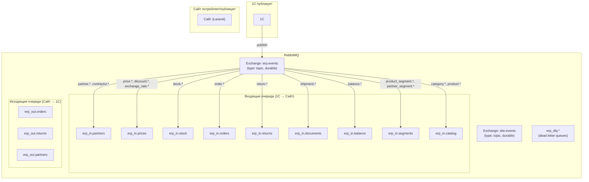

### Входящие очереди (1С → Сайт)

| Очередь | Routing keys | События | Обоснование |
|---|---|---|---|
| `erp_in.partners` | `partner.*`, `contractor.*` | `partner.created` 🆕 v4, `partner.deleted`, `contractor.created` 🆕 v4 | Партнёры и контрагенты |
| `erp_in.prices` | `price.*`, `discount.*`, `exchange_rate.*` | `price.updated`, `discount.created/updated/deleted`, `exchange_rate.updated` | Ценообразование |
| `erp_in.stock` | `stock.*` | `stock.updated` | Самая высокочастотная очередь |
| `erp_in.orders` | `order.*` | `order.created` 🆕 v3, `order.updated`, `order.deleted` | Заказы из 1С (в т.ч. от менеджера) |
| `erp_in.returns` | `return.*` | `return.updated`, `return.deleted` | Обновления возвратов из 1С |
| `erp_in.documents` | `shipment.*` | `shipment.created`, `shipment.updated`, `shipment.deleted` | Документооборот — реализации |
| `erp_in.balance` | `balance.*` | `balance.updated` | Баланс контрагентов |
| `erp_in.segments` | `product_segment.*`, `partner_segment.*` | `product_segment.created/updated/deleted`, `partner_segment.created/updated/deleted` | Сегменты для расчёта скидок |
| `erp_in.catalog` | `category.*`, `product.*` | `category.created/updated`, `product.created/updated` | Каталог и номенклатура из 1С |

### Исходящие очереди (Сайт → 1С)

| Очередь | Routing key | Описание |
|---|---|---|
| `erp_out.orders` | `order.created` | Новые заказы с сайта |
| `erp_out.returns` | `return.created` | Новые возвраты с сайта |
| `erp_out.partners` | `partner.created` | Новые активированные пользователи |

### Dead Letter Queues

У каждой входящей очереди есть свой DLQ для сообщений, не обработанных после всех попыток.

### Параметры воркеров

| Очередь | Воркеров | Tries | Backoff | Обоснование |
|---|---|---|---|---|
| `erp_in.partners` | 1 | 5 | 30 сек | Критично, но редко |
| `erp_in.prices` | 1–2 | 3 | 10 сек | Среднечастотная |
| `erp_in.stock` | 2–4 | 3 | 5 сек | Самая частая |
| `erp_in.orders` | 1–2 | 5 | 15 сек | Пользователь ждёт обновления |
| `erp_in.returns` | 1 | 3 | 15 сек | Низкочастотная |
| `erp_in.documents` | 1 | 3 | 30 сек | Нет срочности |
| `erp_in.balance` | 1 | 3 | 30 сек | Низкочастотная |
| `erp_in.segments` | 1 | 3 | 15 сек | Редко меняется |
| `erp_in.catalog` | 1 | 3 | 15 сек | Редко меняется |
| `erp_out.orders` | 1 | 5 | 10 сек | Исходящие — критично доставить |
| `erp_out.returns` | 1 | 5 | 10 сек | Исходящие — критично доставить |
| `erp_out.partners` | 1 | 5 | 30 сек | Исходящие — критично доставить |

### Формат конверта сообщения

Все сообщения передаются как **raw JSON**. Обязательные мета-поля:

```json
{
  "event": "partner.created",
  "message_id": "msg-550e8400-e29b-41d4-...",
  "...": "остальные поля зависят от типа события"
}
```

### Требования к идемпотентности

> [!IMPORTANT]
> Все обработчики входящих событий должны быть **идемпотентными**: повторная обработка одного и того же сообщения (по `message_id`) не должна приводить к дублированию данных.

---

## US-01: Активация и деактивация пользователей

**Как** сайт,
**я хочу** получать из 1С события о деактивации партнёров,
**чтобы** автоматически деактивировать учётные записи пользователей; активация происходит через Битрикс24.

### Схема обмена (v2)

> [!IMPORTANT]
> **v2 ИЗМЕНЕНИЕ:** Схема принципиально переработана. `partner.created` теперь публикует **Сайт → 1С** (ранее было 1С → Сайт). Активация пользователя происходит через webhook Битрикс24, а не через RabbitMQ.

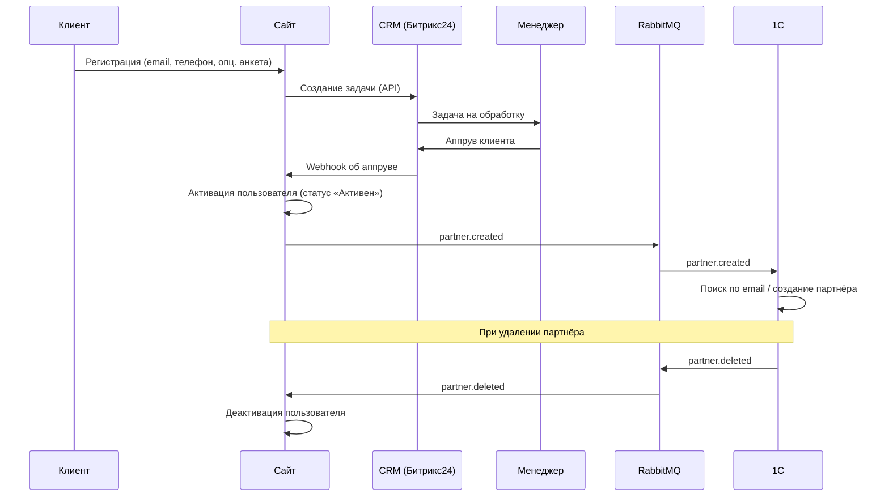

### Формат сообщений

**`partner.created`** (Сайт → 1С) | Шаблон: [`site-to-erp/partner.created.json`](rmq-templates/site-to-erp/partner.created.json)
```json
{
  "event": "partner.created",
  "message_id": "msg-partner-created-550e8400-...",
  "timestamp": "2026-03-17T12:00:00+03:00",
  "uuid": "550e8400-e29b-41d4-a716-446655440000",
  "login": "ivanov@example.com",
  "name": "Иванов Иван Иванович",
  "phone": "+77001234567",
  "email": "ivanov@example.com"
}
```

**`partner.created`** 🆕 v4 (1С → Сайт, первоначальная выгрузка / синхронизация) | Шаблон: [`erp-to-site/partner.created.json`](rmq-templates/erp-to-site/partner.created.json)
```json
{
  "event": "partner.created",
  "message_id": "msg-partner-erp-550e8400-...",
  "timestamp": "2026-03-20T10:00:00+03:00",
  "uuid": "550e8400-e29b-41d4-a716-446655440000",
  "login": "ivanov@example.com",
  "name": "Иванов Иван Иванович",
  "phone": "+77001234567",
  "email": "ivanov@example.com",
  "password": "a1b2c3d4"
}
```

> [!IMPORTANT]
> **v4:** Поле `password` — обязательное при выгрузке из 1С. Значение = `КонтрольнаяСумма(email)`. При первом входе пользователь обязан сменить пароль. Если у партнёра в 1С нет email — он **не выгружается** (пропускается).

**`partner.deleted`** (1С → Сайт) | Шаблон: [`erp-to-site/partner.deleted.json`](rmq-templates/erp-to-site/partner.deleted.json)
```json
{
  "event": "partner.deleted",
  "message_id": "msg-partner-del-550e8400-...",
  "uuid": "550e8400-e29b-41d4-a716-446655440000"
}
```

### Критерии приёмки

#### Регистрация через Битрикс24 (Сайт → 1С)
- [ ] При регистрации клиента на сайте в CRM (Битрикс24) автоматически создаётся задача для менеджера.
- [ ] Сайт ловит webhook из Битрикс24 при аппруве заявки и переводит пользователя в статус «Активен».
- [ ] Сайт публикует в RabbitMQ событие `partner.created` с данными партнёра (uuid, login, name, phone, email) через очередь `erp_out.partners`.
- [ ] 1С принимает событие `partner.created` из очереди `erp_out.partners`, находит партнёра по email; если не найден — создаёт нового с UUID от сайта.
- [ ] Анкета при регистрации — опциональная (может быть пропущена).
- [ ] В первой версии: один пользователь = одна компания (мультипользовательство — в следующем скопе).

#### 🆕 v4 Выгрузка партнёров (1С → Сайт)
- [ ] 1С публикует `partner.created` через exchange `erp.events` для первоначальной загрузки существующих партнёров на сайт.
- [ ] Партнёры без email **пропускаются** (login = email, без email выгрузка невозможна).
- [ ] В сообщении передаётся `password` = `КонтрольнаяСумма(email)` партнёра.
- [ ] Сайт при получении `partner.created` из `erp_in.partners` создаёт пользователя с указанным паролем.
- [ ] При первом входе пользователь **обязан сменить пароль**.

#### Деактивация
- [ ] Сайт принимает из шины RabbitMQ событие `partner.deleted` и переводит пользователя в статус «Не активен».

> [!WARNING]
> **Партнёр в 1С** = физическое лицо (контактное лицо). **Контрагент** = юридическое лицо (компания). Поиск партнёра при `partner.created` (Сайт → 1С) выполняется по полю `email` через контактную информацию (вид КИ: `EmailПартнера`).

---

## US-02: Синхронизация базовых цен

**Как** сайт,
**я хочу** получать из 1С события об изменении базовых цен,
**чтобы** отображать пользователям актуальную стоимость товаров.

### Схема обмена

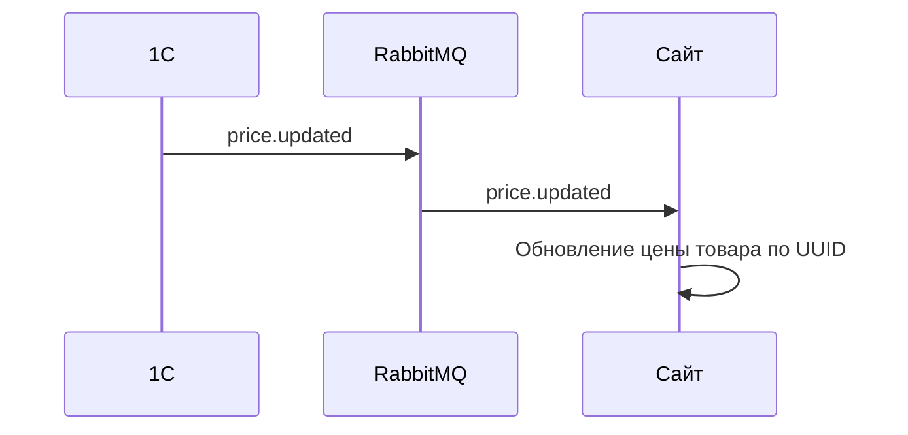

### Формат сообщений

**`price.updated`** (1С → Сайт) | Шаблон: [`erp-to-site/price.updated.json`](rmq-templates/erp-to-site/price.updated.json)
```json
{
  "event": "price.updated",
  "message_id": "msg-price-a1b2c3d4-...",
  "product_uuid": "a1b2c3d4-e5f6-7890-abcd-ef1234567890",
  "price": 12500.50
}
```

### Критерии приёмки

- [ ] Товары в 1С и на сайте связаны через единый UUID.
- [ ] Сайт принимает из шины RabbitMQ событие `price.updated`.
- [ ] Сайт находит товар по UUID и обновляет его базовую цену.
- [ ] Если товар с указанным UUID не найден, событие игнорируется без ошибки.
- [x] Изменение базовой цены на сайте **недоступно** для обычных пользователей; изменение доступно только через форму товара в админке. _(Примечание: в системе существует единственный уровень доступа в админку — admin, который является суперадмином. Критерий считается выполненным по архитектуре.)_
- [ ] Сайт не отправляет обновления цен в 1С.

---

## US-03: Синхронизация скидок

**Как** сайт,
**я хочу** получать из 1С данные о скидках,
**чтобы** формировать персональные цены в карточках товаров.

### Схема обмена

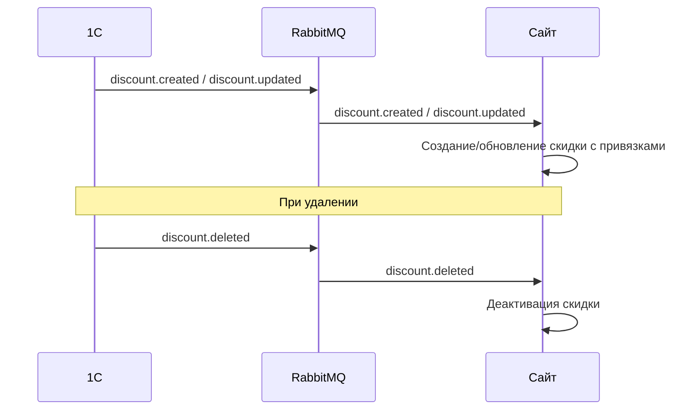

### Формат сообщений

**`discount.created` / `discount.updated`** (1С → Сайт) | Шаблоны: [`erp-to-site/discount.created.json`](rmq-templates/erp-to-site/discount.created.json), [`erp-to-site/discount.updated.json`](rmq-templates/erp-to-site/discount.updated.json)
```json
{
  "event": "discount.created",
  "message_id": "msg-discount-d1e2f3a4-...",
  "uuid": "d1e2f3a4-b5c6-7890-abcd-ef1234567890",
  "type": "agreement",
  "value": 10.00,
  "starts_at": "2026-01-01T00:00:00+03:00",
  "ends_at": "2026-12-31T23:59:59+03:00",
  "product_uuids": ["a1b2c3d4-..."],
  "partner_uuids": ["550e8400-..."],
  "product_segment_uuids": ["seg-prod-001-..."],
  "partner_segment_uuids": ["seg-part-001-..."]
}
```

> [!NOTE]
> `type`:
> - `"agreement"` — типовое соглашение (постоянная скидка для партнёра)
> - `"promotion"` — временная акция
>
> Поля `product_segment_uuids` и `partner_segment_uuids` — альтернатива перечислению UUID поштучно. Если заполнены сегменты, сайт разворачивает их в конкретные товары/партнёров по данным из US-11 и US-12.

**`discount.deleted`** (1С → Сайт) | Шаблон: [`erp-to-site/discount.deleted.json`](rmq-templates/erp-to-site/discount.deleted.json)
```json
{
  "event": "discount.deleted",
  "message_id": "msg-discount-del-d1e2f3a4-...",
  "uuid": "d1e2f3a4-b5c6-7890-abcd-ef1234567890"
}
```

### Критерии приёмки

- [x] Сайт принимает из шины RabbitMQ события `discount.created`, `discount.updated`, `discount.deleted`.
- [x] Сайт создаёт или обновляет скидку вместе с привязанными товарами и партнёрами.
- [x] При удалении скидки в 1С сайт деактивирует соответствующую скидку.
- [x] Персональные цены с учётом скидок корректно отображаются в карточке товара.
- [x] Тип `agreement` — типовое соглашение; `promotion` — временная акция.
- [x] Если по акции скидка больше, чем по соглашению — применяется акция.
- [x] Поддержка индивидуальных соглашений (скидка для отдельного партнёра на конкретные товары).

---

## US-04: Синхронизация курсов валют

**Как** сайт,
**я хочу** получать курсы валют из 1С,
**чтобы** ценообразование полностью совпадало с данными 1С.

### Схема обмена

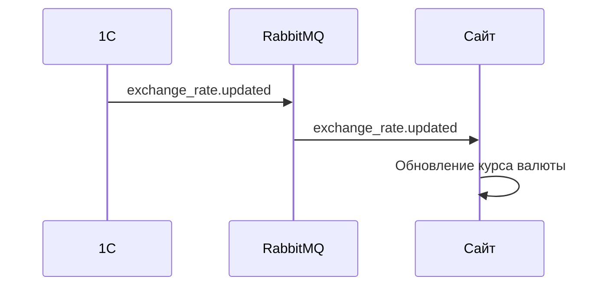

### Формат сообщений

**`exchange_rate.updated`** (1С → Сайт) | Шаблон: [`erp-to-site/exchange_rate.updated.json`](rmq-templates/erp-to-site/exchange_rate.updated.json)
```json
{
  "event": "exchange_rate.updated",
  "message_id": "msg-rate-kzt-20260317",
  "currency_code": "KZT",
  "official_rate": 5.40,
  "rate_coefficient": 1.01,
  "rate": 5.454,
  "base_currency_code": "RUB",
  "date": "2026-03-17"
}
```

| Поле | Тип | Описание |
|---|---|---|
| `official_rate` | number | Курс нацбанка |
| `rate_coefficient` | number | Поправочный коэффициент (устанавливается вручную в 1С) |
| `rate` | number | Итоговый курс для сайта (= official_rate × rate_coefficient) |

> [!NOTE]
> ✏️ v5 Поле `currency_code` содержит буквенный ISO 4217-код (`"KZT"`, `"BYN"`, `"RUB"`). Ранее могло передаваться числовое значение — это было ошибкой. Источник: поле **«Наименование»** справочника `Валюты` в 1С (не «Код»). Поиск валюты по коду при входящих сообщениях тоже выполняется по `Наименование`.
>
> Базовая валюта всегда `RUB`. Поддерживаемые валюты для выгрузки: `KZT` (тенге), `BYN` (белорусский рубль). Коэффициент нужен для компенсации потерь на конвертации в кризисные периоды.

### Критерии приёмки

- [ ] Все цены на товары хранятся в базовой валюте (`RUB`).
- [ ] Сайт принимает из шины RabbitMQ событие `exchange_rate.updated` и обновляет курс в своей базе данных.
- [ ] Сайт сохраняет официальный курс, поправочный коэффициент и итоговый курс.
- [ ] Сайт **не** обновляет курсы валют самостоятельно из сторонних источников.
- [ ] Единственным источником курсов валют является 1С.
- [ ] При повторном обновлении курса запись перезаписывается (без хранения истории).

---

## US-05: Синхронизация остатков

**Как** сайт,
**я хочу** получать из 1С данные об изменении свободных остатков,
**чтобы** показывать пользователям актуальное наличие товаров в их регионе.

### Схема обмена

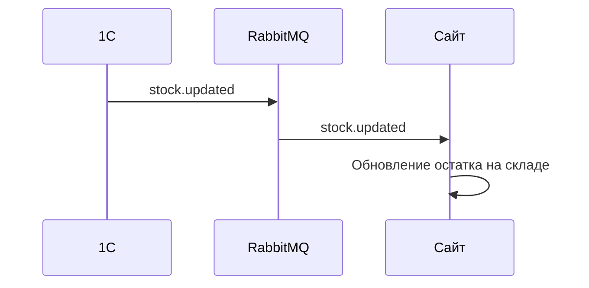

### Формат сообщений

**`stock.updated`** (1С → Сайт) | Шаблон: [`erp-to-site/stock.updated.json`](rmq-templates/erp-to-site/stock.updated.json)
```json
{
  "event": "stock.updated",
  "message_id": "msg-stock-a1b2c3d4-w1a2b3c4",
  "product_uuid": "a1b2c3d4-e5f6-7890-abcd-ef1234567890",
  "warehouse_uuid": "w1a2b3c4-d5e6-7890-abcd-ef1234567890",
  "quantity": 42
}
```

### Критерии приёмки

- [ ] Склады заводятся в админке сайта вручную с привязкой к UUID склада из 1С.
- [ ] Сайт принимает из шины RabbitMQ событие `stock.updated`.
- [ ] Сайт обновляет остаток товара на указанном складе.
- [ ] Пользователь привязан к региону; регион определяет группы складов:
  - **Склады для заказа** — суммарный остаток на основных складах региона пользователя отображается как «в наличии».
  - **Склады для предзаказа** — суммарный остаток на складах предзаказа региона пользователя отображается как «на предзаказе».
- [ ] 1С отправляет остатки по всем организациям (включая Елисеев, Пикадо) в разрезе складов.
- [ ] Сайт агрегирует остатки по регионам пользователя.
- [ ] Зарезервированный в 1С товар уменьшает доступный остаток (1С просто отправляет свободный остаток по складам).
- [ ] Клиент **не может** заказать больше, чем есть свободных остатков на доступных ему складах (в том числе на доступных складах предзаказа).

---

## US-06: Управление контрагентами

**Как** сайт,
**я хочу** получать данные о контрагентах из 1С и позволять пользователю создавать контрагентов в личном кабинете,
**чтобы** при оформлении заказа был выбран актуальный контрагент.

### ✏️ v4 Схема обмена (добавлена выгрузка 1С → Сайт)

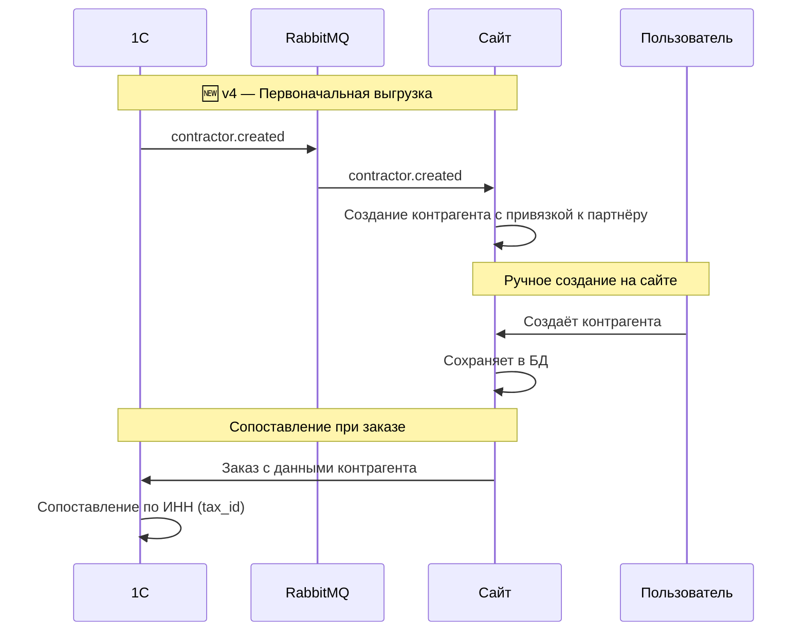

### 🆕 v4 Формат сообщений

**`contractor.created`** (1С → Сайт) | Шаблон: [`erp-to-site/contractor.created.json`](rmq-templates/erp-to-site/contractor.created.json)
```json
{
  "event": "contractor.created",
  "message_id": "msg-contractor-c1a2b3c4-...",
  "uuid": "c1a2b3c4-d5e6-7890-abcd-ef1234567890",
  "partner_uuid": "550e8400-e29b-41d4-a716-446655440000",
  "name": "ТОО Компания",
  "legal_name": "Товарищество с ограниченной ответственностью «Компания»",
  "tax_id": "1234567890",
  "tax_code": "620101",
  "registration_number": "12345-1234-ТОО",
  "okpo_code": "12345678",
  "country": "KZ",
  "legal_address": "г. Алматы, ул. Абая, 10, офис 5",
  "actual_address": "г. Алматы, ул. Абая, 10",
  "phone": "+77001234567",
  "email": "info@company.kz",
  "bank_accounts": [
    {
      "bank_name": "АО «Казкоммерцбанк»",
      "bank_bik": "KZKOKZKX",
      "correspondent_account": "30101810400000000225",
      "account_number": "KZ123456789012345678",
      "is_primary": true
    }
  ]
}
```

> [!NOTE]
> ✏️ v5 Добавлены поля: `tax_code` (КПП — код причины постановки на учёт), `okpo_code` (код ОКПО), `bank_accounts` (массив банковских счетов). Поле `country` — двухбуквенный ISO 3166-1 alpha-2 код страны регистрации (`"KZ"`, `"RU"`, `"BY"`). Все новые поля — nullable, при отсутствии значения в 1С передаются `null`. Закрыт открытый вопрос v4 #3.
>
> | Поле | Тип | Обязательность | Описание |
> |---|---|---|---|
> | `uuid` | string (UUID) | ✅ | UUID контрагента в 1С |
> | `partner_uuid` | string (UUID) \| null | ✅ | UUID партнёра-владельца на сайте |
> | `name` | string | ✅ | Краткое наименование |
> | `legal_name` | string | ✅ | Полное юридическое наименование |
> | `tax_id` | string | ✅ | ИНН |
> | `tax_code` | string \| null | — | КПП (актуально для РФ) |
> | `registration_number` | string \| null | — | Регистрационный номер (ОГРН, БИН и т.п.) |
> | `okpo_code` | string \| null | — | Код по ОКПО |
> | `country` | string \| null | — | ISO 3166-1 alpha-2 код страны регистрации |
> | `legal_address` | string \| null | — | Юридический адрес |
> | `actual_address` | string \| null | — | Фактический адрес |
> | `phone` | string \| null | — | Телефон |
> | `email` | string \| null | — | Email |
> | `bank_accounts` | array \| null | — | Массив банковских счетов (см. ниже) |
>
> **Структура `bank_accounts[]`:**
>
> | Поле | Тип | Описание |
> |---|---|---|
> | `bank_name` | string \| null | Наименование банка |
> | `bank_bik` | string \| null | БИК банка |
> | `correspondent_account` | string \| null | Корреспондентский счёт |
> | `account_number` | string | Номер счёта |
> | `is_primary` | boolean | Основной счёт |

> [!NOTE]
> Формат `contractor` идентичен блоку `contractor` в `order.created`, но передаётся как самостоятельное сообщение. Поле `partner_uuid` связывает контрагента с партнёром на сайте.

### Критерии приёмки

#### Создание на сайте
- [ ] Пользователь создаёт и редактирует контрагентов в личном кабинете.
- [ ] При действиях с контрагентом на сайте в 1С **ничего не отправляется**.
- [ ] Для оформления заказа пользователь обязан выбрать контрагента.

#### 🆕 v4 Выгрузка из 1С
- [ ] 1С публикует `contractor.created` через exchange `erp.events` для первоначальной загрузки контрагентов на сайт.
- [ ] Сайт принимает `contractor.created` из очереди `erp_in.partners` и создаёт контрагента с привязкой к партнёру по `partner_uuid`.
- [ ] ~~Для запуска: существующие ~150 партнёров предзаполняются в админке сайта вручную (или импортом).~~ ✏️ v4 Заменено автоматической выгрузкой из 1С.
- [ ] ✏️ v5 Сообщение `contractor.created` содержит поля `tax_code` (КПП), `okpo_code` (ОКПО), `country` (ISO alpha-2), `bank_accounts` (массив банковских счетов).
- [ ] ✏️ v5 При отсутствии значений в 1С поля `tax_code`, `okpo_code`, `country`, `bank_accounts` передаются как `null`.

#### Сопоставление в 1С
- [ ] Сопоставление контрагента в 1С происходит **по ИНН** (`tax_id`) при получении заказа.
- [ ] Если при получении заказа 1С не нашла контрагента по ИНН — 1С самостоятельно создаёт нового контрагента с данными из поля `contractor` заказа.

---

## US-07: Оформление и синхронизация заказов

**Как** сайт,
**я хочу** формировать заказы из корзины и обмениваться данными о заказах с 1С,
**чтобы** пользователь видел актуальный статус и состав своего заказа.

### ✏️ v3 Схема обмена (добавлен поток 1С → Сайт для заказов менеджера)

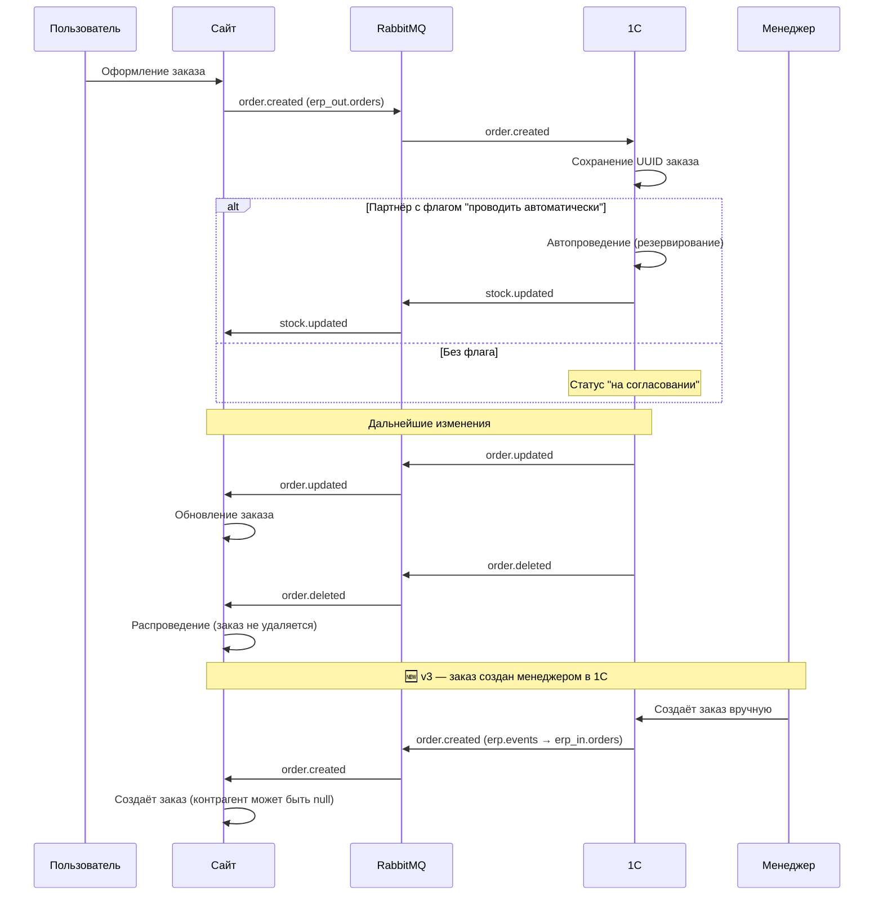

### Формат сообщений

**`order.created`** (Сайт → 1С) | Шаблон: [`site-to-erp/order.created.json`](rmq-templates/site-to-erp/order.created.json)
```json
{
  "event": "order.created",
  "message_id": "msg-order-created-site-o1a2b3c4-...",
  "uuid": "o1a2b3c4-d5e6-7890-abcd-ef1234567890",
  "number": "ORD-2026-0001",
  "date": "2026-03-17T10:30:00+03:00",
  "status": "pending",
  "type": "order",
  "partner_uuid": "550e8400-e29b-41d4-a716-446655440000",
  "warehouse_uuids": ["w1a2b3c4-...", "w2b3c4d5-..."],
  "timestamp": "2026-03-17T10:30:01+03:00",
  "contractor": {
    "country": "KZ",
    "name": "ТОО Компания",
    "legal_name": "Товарищество с ограниченной ответственностью «Компания»",
    "tax_id": "1234567890",
    "registration_number": "12345-1234-ТОО",
    "tax_code": "620101",
    "okpo_code": "12345678",
    "legal_address": "г. Алматы, ул. Абая, 10, офис 5",
    "actual_address": "г. Алматы, ул. Абая, 10",
    "phone": "+77001234567",
    "email": "info@company.kz",
    "latitude": 43.238,
    "longitude": 76.945,
    "bank_accounts": [
      {
        "bank_name": "АО «Казкоммерцбанк»",
        "bank_bik": "KZKOKZKX",
        "correspondent_account": "30101810400000000225",
        "account_number": "KZ123456789012345678",
        "is_primary": true
      }
    ]
  },
  "delivery_address": "г. Алматы, ул. Абая, 10",
  "currency_code": "KZT",
  "exchange_rate": 5.454,
  "rate_coefficient": 1.01,
  "items": [
    {
      "product_uuid": "a1b2c3d4-e5f6-7890-abcd-ef1234567890",
      "quantity": 5,
      "price": 3000.00
    }
  ]
}
```

**`order.created`** 🆕 v3 (1С → Сайт, когда менеджер создаёт заказ вручную) | Шаблон: [`erp-to-site/order.created.json`](rmq-templates/erp-to-site/order.created.json)

> Формат идентичен `order.created` от сайта. Routing key: `order.created`, очередь: `erp_in.orders`.

**`order.updated`** (1С → Сайт) | Шаблон: [`erp-to-site/order.updated.json`](rmq-templates/erp-to-site/order.updated.json)
```json
{
  "event": "order.updated",
  "message_id": "msg-order-upd-o1a2b3c4-...",
  "uuid": "o1a2b3c4-d5e6-7890-abcd-ef1234567890",
  "status": "confirmed",
  "items": [
    {
      "product_uuid": "a1b2c3d4-e5f6-7890-abcd-ef1234567890",
      "quantity": 4,
      "price": 1200.00
    }
  ]
}
```

> [!WARNING]
> Если передан массив `items` — он **полностью заменяет** текущие позиции заказа. Не передавайте `items`, если хотите обновить только статус.

**`order.deleted`** (1С → Сайт) | Шаблон: [`erp-to-site/order.deleted.json`](rmq-templates/erp-to-site/order.deleted.json)
```json
{
  "event": "order.deleted",
  "message_id": "msg-order-del-o1a2b3c4-...",
  "uuid": "o1a2b3c4-d5e6-7890-abcd-ef1234567890"
}
```

### Критерии приёмки

#### Создание заказа
- [ ] При оформлении корзины разделяется на два заказа (основной + предзаказ).
- [ ] Каждый заказ содержит: номер, дату, начальный статус, контрагента, адрес доставки, **массив UUID складов (`warehouse_uuids`)** и позиции. 1С сама выбирает склад для обеспечения.
- [ ] Заказ фиксируется в валюте пользователя с сохранением курса конверсии и поправочного коэффициента.
- [ ] После отправки заказа пользователь изменять его **не может**.

#### Автоматическое резервирование
- [ ] В 1С у партнёра есть флаг «проводить автоматически».
- [ ] Для партнёров с этим флагом заказ автоматически проводится (резервируется) при получении.
- [ ] Для остальных партнёров заказ остаётся в статусе «на согласовании» до ручного подтверждения менеджером.
- [ ] При резервировании 1С обновляет остатки → новые остатки отправляются на сайт.

#### Отправка в 1С
- [ ] При создании заказ получает UUID на сайте и отправляется в 1С через RabbitMQ (`order.created`).
- [ ] 1С обязана сохранить UUID заказа с сайта.
- [ ] ✏️ v5 1С **не присваивает** переданный `uuid` как ссылку нового документа — UUID генерирует платформа 1С. UUID с сайта сохраняется в реквизите документа «ИДЗаказаСайта» (или аналогичном) для связи.
- [ ] ✏️ v5 В 1С комментарий к заказу клиента автоматически заполняется сводкой из JSON: наименование партнёра, ИНН и наименование контрагента, код валюты, адрес доставки, исходный комментарий покупателя. Это помогает менеджерам быстро идентифицировать заказ без открытия формы.

#### Получение изменений из 1С
- [ ] Сайт принимает из шины RabbitMQ события `order.updated` и `order.deleted`.
- [ ] Обрабатываются: изменение статуса, изменение позиций, удаление и распроведение.
- [ ] Пользователь видит все изменения заказа в личном кабинете.

#### 🆕 v3 Заказы от менеджера (1С → Сайт)
- [ ] 1С публикует событие `order.created` (в exchange `erp.events`) при создании заказа менеджером вручную.
- [ ] Сайт принимает входящее `order.created` из очереди `erp_in.orders` и создаёт заказ.
- [ ] Если контрагент из `order.created` не найден на сайте — заказ всё равно создаётся (контрагент `null`), заказ не скипается.
- [ ] 1С использует формат, идентичный `order.created` от сайта (тот же шаблон).

#### Сворачивание заказов
- [ ] Заказы на сайте **никогда не удаляются и не сворачиваются** — они остаются как лог действий клиента.
- [ ] 1С может сворачивать несколько заказов в один мастер-заказ, но сайт его не получает.
- [ ] Связь между заказами и реализацией осуществляется через `order_uuid` в items реализации (US-09).

#### Фиксация валюты
- [ ] Заказ отображается в валюте пользователя по курсу на момент оформления.
- [ ] Стоимость заказа не пересчитывается при изменении курса валюты.

---

## US-08: Оформление и синхронизация возвратов

> [!WARNING]
> **✏️ v2: Отложено на следующий скоп.**

_(Исходное описание сохранено для справки. Реализация не планируется в текущем скопе. JSON-шаблоны созданы для будущего использования: [`site-to-erp/return.created.json`](rmq-templates/site-to-erp/return.created.json), [`erp-to-site/return.updated.json`](rmq-templates/erp-to-site/return.updated.json), [`erp-to-site/return.deleted.json`](rmq-templates/erp-to-site/return.deleted.json).)_

**Как** сайт,
**я хочу** позволить пользователю создать возврат и обмениваться данными о возвратах с 1С,
**чтобы** пользователь мог вернуть товар и отслеживать статус возврата.

---

## US-09: Отображение реализаций

**Как** сайт,
**я хочу** получать из 1С данные о реализациях,
**чтобы** пользователь мог просматривать отгрузки по своему контрагенту.

### Схема обмена

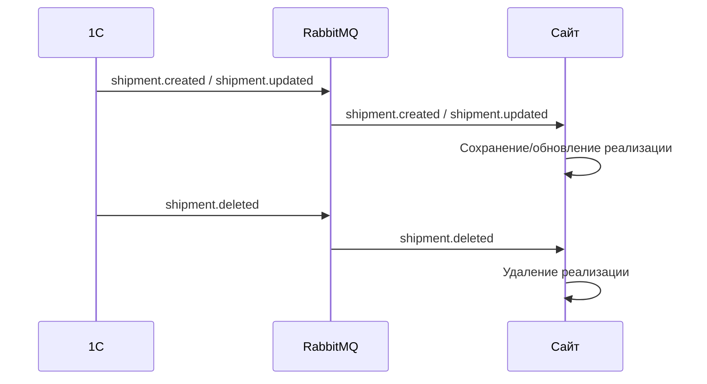

### ✏️ v3 Формат сообщений

> [!IMPORTANT]
> **v3 УТОЧНЕНИЕ:** `shipment.created` отправляется при **первом проведении** реализации, `shipment.updated` — при **перепроведении** или изменении. Поля идентичны.

**`shipment.created`** (1С → Сайт) | Шаблон: [`erp-to-site/shipment.created.json`](rmq-templates/erp-to-site/shipment.created.json)
```json
{
  "event": "shipment.created",
  "message_id": "msg-shipment-s1a2b3c4-...",
  "uuid": "s1a2b3c4-d5e6-7890-abcd-ef1234567890",
  "contractor_inn": "7710140679",
  "date": "2026-03-17",
  "status": "completed",
  "currency_code": "RUB",
  "items": [
    {
      "product_uuid": "a1b2c3d4-e5f6-7890-abcd-ef1234567890",
      "order_uuid": "o1a2b3c4-d5e6-7890-abcd-ef1234567890",
      "quantity": 10,
      "price": 500.00,
      "auto_discount_percent": 5.00,
      "manual_discount_percent": 5.00,
      "total": 4500.00,
      "vat_rate": 20
    }
  ]
}
```

**`shipment.updated`** (1С → Сайт) | Шаблон: [`erp-to-site/shipment.updated.json`](rmq-templates/erp-to-site/shipment.updated.json)

Формат аналогичен `shipment.created`.

**`shipment.deleted`** (1С → Сайт) | Шаблон: [`erp-to-site/shipment.deleted.json`](rmq-templates/erp-to-site/shipment.deleted.json)
```json
{
  "event": "shipment.deleted",
  "message_id": "msg-shipment-del-s1a2b3c4-...",
  "uuid": "s1a2b3c4-d5e6-7890-abcd-ef1234567890"
}
```

> [!NOTE]
> Поля `tracking_number` и `transport_company` **удалены в v2**.

### Критерии приёмки

- [ ] Сайт принимает из шины RabbitMQ события `shipment.created`, `shipment.updated`, `shipment.deleted`.
- [ ] Реализация содержит: контрагента (ИНН), дату, статус, валюту и позиции.
- [ ] Каждая позиция содержит: товар, ссылку на исходный заказ (`order_uuid`), количество, базовую цену, **% автоматической скидки**, **% ручной скидки**, **итоговую сумму**, **ставку НДС**.
- [ ] Одна реализация может быть создана по **нескольким заказам** (стандартная функция 1С).
- [ ] Сайт сохраняет реализацию и **связывает её с заказами клиента через `order_uuid`**.
- [ ] Пользователь видит реализации своего контрагента в личном кабинете.
- [ ] Расчёт задолженности ведётся **по реализациям**, а не по заказам.
- [ ] ✏️ v3 **1С отправляет `shipment.created` при первом проведении** (когда реализация проводится впервые); при перепроведении или изменении — `shipment.updated`.

> [!WARNING]
> Реализация может отличаться от заказа по составу и ценам (менеджер может добавить позиции или применить дополнительные скидки). Это нормальная бизнес-практика.

---

## US-10: Отображение баланса

**Как** сайт,
**я хочу** получать из 1С готовый баланс по контрагенту,
**чтобы** пользователь мог контролировать свою задолженность.

### Схема обмена

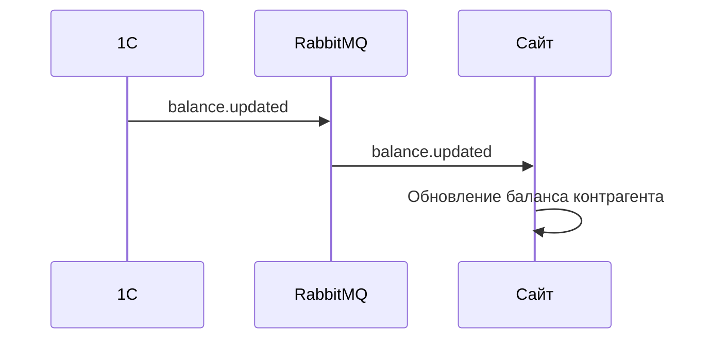

### Формат сообщений

**`balance.updated`** (1С → Сайт) | Шаблон: [`erp-to-site/balance.updated.json`](rmq-templates/erp-to-site/balance.updated.json)
```json
{
  "event": "balance.updated",
  "message_id": "msg-balance-550e8400-...",
  "partner_uuid": "550e8400-e29b-41d4-a716-446655440000",
  "updated_at": "2026-03-17T15:00:00+03:00",
  "contractors": [
    {
      "contractor_inn": "7710140679",
      "contractor_uuid": "c1a2b3c4-d5e6-7890-abcd-ef1234567890",
      "current_balance": -125000.00,
      "overdue_debt": 50000.00,
      "overdue_details": [
        {
          "shipment_uuid": "s1a2b3c4-d5e6-7890-abcd-ef1234567890",
          "amount": 30000.00,
          "due_date": "2026-02-15"
        }
      ]
    }
  ]
}
```

### Критерии приёмки

- [ ] Сайт не рассчитывает баланс самостоятельно — расчёт выполняется на стороне 1С.
- [ ] Сайт принимает из шины RabbitMQ событие `balance.updated`.
- [ ] Баланс передаётся **по контрагентам** (массив): у одного партнёра может быть несколько контрагентов.
- [ ] Каждый контрагент содержит: текущий баланс, просроченную задолженность, **детализацию просрочки по реализациям** (UUID реализации, сумма, дата оплаты).
- [ ] Баланс отображается пользователю в личном кабинете.

---

## US-11: Синхронизация сегментов номенклатуры

**Как** сайт,
**я хочу** получать из 1С сегменты номенклатуры,
**чтобы** использовать их для расчёта скидок и фильтрации товаров.

### Схема обмена

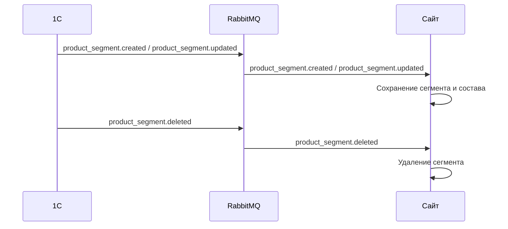

### Формат сообщений

**`product_segment.created` / `product_segment.updated`** (1С → Сайт) | Шаблон: [`erp-to-site/product_segment.created.json`](rmq-templates/erp-to-site/product_segment.created.json)
```json
{
  "event": "product_segment.created",
  "message_id": "msg-pseg-seg-prod-001-...",
  "uuid": "seg-prod-001-c3d4e5f6-a7b8-9012-cdef-123456789012",
  "name": "Лубриканты",
  "product_uuids": ["a1b2c3d4-...", "b2c3d4e5-...", "c3d4e5f6-..."]
}
```

**`product_segment.deleted`** (1С → Сайт) | Шаблон: [`erp-to-site/product_segment.deleted.json`](rmq-templates/erp-to-site/product_segment.deleted.json)
```json
{
  "event": "product_segment.deleted",
  "message_id": "msg-pseg-del-seg-prod-001-...",
  "uuid": "seg-prod-001-c3d4e5f6-a7b8-9012-cdef-123456789012"
}
```

### Критерии приёмки

- [ ] Сайт принимает события `product_segment.created`, `product_segment.updated`, `product_segment.deleted`.
- [ ] Один товар может входить в несколько сегментов (many-to-many).
- [ ] Сайт хранит сегменты и их состав в своей базе данных.
- [ ] При получении скидки с привязкой к сегменту — сайт разворачивает сегмент в конкретные товары.
- [ ] ✏️ v5 Публикация `product_segment.created` и `product_segment.updated` из 1С **отложена**: выполняется в фоновом задании после завершения транзакции записи сегмента. Это гарантирует, что при формировании сообщения состав сегмента уже сохранён в базе и запрос вернёт непустой результат. Удаление (`product_segment.deleted`) по-прежнему публикуется **синхронно**.

---

## US-12: Синхронизация сегментов партнёров

**Как** сайт,
**я хочу** получать из 1С сегменты партнёров,
**чтобы** использовать их для расчёта персональных скидок.

### Схема обмена

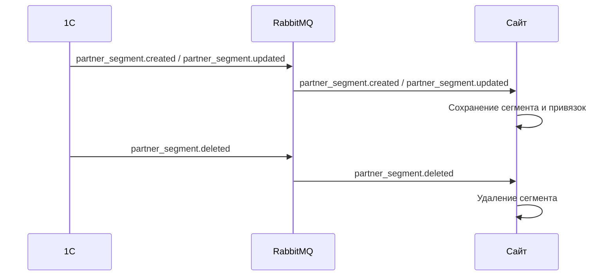

### Формат сообщений

**`partner_segment.created` / `partner_segment.updated`** (1С → Сайт) | Шаблон: [`erp-to-site/partner_segment.created.json`](rmq-templates/erp-to-site/partner_segment.created.json)
```json
{
  "event": "partner_segment.created",
  "message_id": "msg-partseg-seg-part-001-...",
  "uuid": "seg-part-001-d4e5f6a7-b8c9-0123-defa-234567890123",
  "name": "Уровень Голд",
  "partner_uuids": ["550e8400-...", "660f9511-..."]
}
```

**`partner_segment.deleted`** (1С → Сайт) | Шаблон: [`erp-to-site/partner_segment.deleted.json`](rmq-templates/erp-to-site/partner_segment.deleted.json)
```json
{
  "event": "partner_segment.deleted",
  "message_id": "msg-partseg-del-seg-part-001-...",
  "uuid": "seg-part-001-d4e5f6a7-b8c9-0123-defa-234567890123"
}
```

### Критерии приёмки

- [ ] Сайт принимает события `partner_segment.created`, `partner_segment.updated`, `partner_segment.deleted`.
- [ ] Сайт хранит сегменты и привязки партнёров.
- [ ] При получении скидки с привязкой к сегменту партнёров — сайт разворачивает сегмент в конкретных партнёров.
- [ ] ✏️ v5 Публикация `partner_segment.created` и `partner_segment.updated` из 1С **отложена**: выполняется в фоновом задании после завершения транзакции записи сегмента. Это гарантирует, что при формировании сообщения состав сегмента уже сохранён в базе. Удаление (`partner_segment.deleted`) по-прежнему публикуется **синхронно**.

---

## US-13: Синхронизация каталога товаров

**Как** сайт,
**я хочу** получать из 1С структуру каталога (виды номенклатуры, атрибуты),
**чтобы** категории, бренды и характеристики товаров на сайте соответствовали данным в 1С.

### Схема обмена

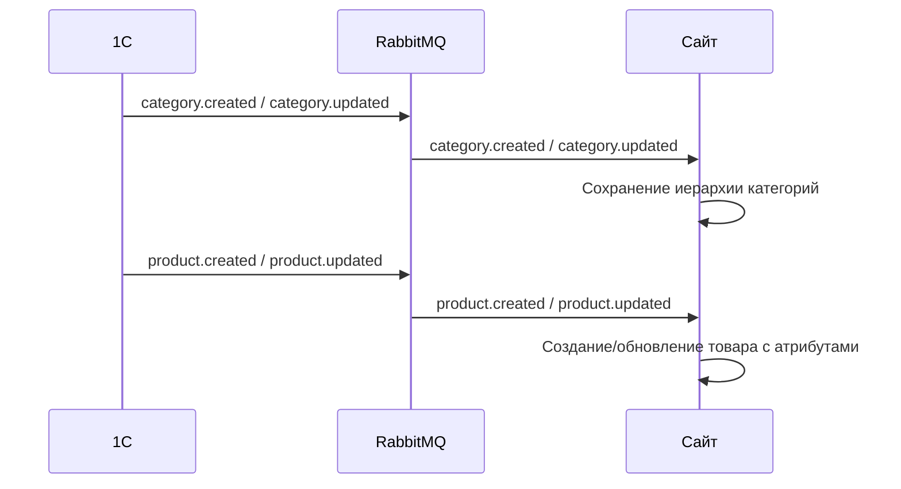

### ✏️ v3 Формат сообщений

**`category.created` / `category.updated`** (1С → Сайт) | Шаблон: [`erp-to-site/category.created.json`](rmq-templates/erp-to-site/category.created.json)
```json
{
  "event": "category.created",
  "message_id": "msg-cat-cat-001-...",
  "uuid": "cat-001-e5f6a7b8-c9d0-1234-efab-345678901234",
  "parent_uuid": null,
  "name": "Бельё и одежда",
  "is_group": true
}
```

**`product.created`** (1С → Сайт) | Шаблон: [`erp-to-site/product.created.json`](rmq-templates/erp-to-site/product.created.json)
```json
{
  "event": "product.created",
  "message_id": "msg-prod-a1b2c3d4-...",
  "uuid": "a1b2c3d4-e5f6-7890-abcd-ef1234567890",
  "name": "Вибро-яйцо XYZ",
  "code": "0T-123213",
  "sku": "AAS-123213",
  "description": "Описание товара...",
  "category_uuid": "cat-003-f6a7b8c9-...",
  "brand": {
    "uuid": "brand-001-a7b8c9d0-...",
    "name": "Jos"
  },
  "barcodes": ["4600000000001", "4600000000002"],
  "model": {
    "uuid": "model-001-b8c9d0e1-...",
    "name": "XYZ Standard"
  },
  "attributes": [
    {
      "property_uuid": "prop-001-b8c9d0e1-...",
      "property_label": "Цвет",
      "value_type": "string",
      "value_uuid": "val-col-001-c9d0e1f2-...",
      "value_label": "Розовый"
    },
    {
      "property_uuid": "prop-002-d0e1f2a3-...",
      "property_label": "Материал",
      "value_type": "string",
      "value_uuid": "val-mat-001-e1f2a3b4-...",
      "value_label": "Силикон"
    },
    {
      "property_uuid": "prop-003-f2a3b4c5-...",
      "property_label": "Вес",
      "value_type": "string",
      "value_uuid": null,
      "value_label": "150г"
    }
  ]
}
```

> [!IMPORTANT]
> **✏️ v3 ИЗМЕНЕНИЕ: Формат атрибутов**
>
> В v2 атрибуты были плоским объектом `{ "color": "розовый" }`. В v3 — **массив структур**:
>
> | Поле | Тип | Описание |
> |---|---|---|
> | `property_uuid` | string | UUID свойства в 1С |
> | `property_label` | string | Читаемое название свойства (для отображения) |
> | `value_type` | string | Тип значения (`"string"`, `"number"`, `"boolean"`, `"reference"`) |
> | `value_uuid` | string\|null | UUID значения в 1С (null для скалярных типов) |
> | `value_label` | string | Читаемое представление значения |
>
> Это позволяет сайту хранить значения как ссылки (для фильтрации и индексации) вместо строк.

> [!IMPORTANT]
> **✏️ v4 ИЗМЕНЕНИЕ: Поля `brand` и `model`**
>
> | Поле | Тип | Источник в 1С | Описание |
> |---|---|---|---|
> | `brand` | `{ uuid, name }` \| null | Реквизит «Марка» номенклатуры | ✏️ v4 Бренд товара (Jos, A-Toys, ToyFa и т.п.). В v3 было строкой из «Производитель». |
> | `model` | `{ uuid, name }` \| null | Настраиваемый доп. реквизит | ✏️ v4 Модель — для объединения вариантов товара (напр., цвета). Доп. реквизит задаётся в `Константы.НастройкиОбменаPecado`. |
>
> ✏️ v5 Настройка «Модель» в `НастройкиОбменаPecado` хранит **прямую ссылку** на элемент `ПВХ.ДополнительныеРеквизитыИСведения` (не строку-UUID). Форма `НастройкиОбменаPecado` содержит поле выбора с типом `ПВХСсылка.ДополнительныеРеквизитыИСведения`. При обновлении с v4 миграция выполняется автоматически при первом открытии настроек.
>
> Оба поля nullable. Если значение не заполнено — передаётся `null`.

**`product.updated`** 🆕 v3 (1С → Сайт, частичное обновление) | Шаблон: [`erp-to-site/product.updated.json`](rmq-templates/erp-to-site/product.updated.json)

> [!IMPORTANT]
> **✏️ v3 НОВОЕ ПОВЕДЕНИЕ:** `product.updated` отправляет **только изменённые поля** (частичное обновление). Сайт мержит полученные поля с существующими, не затирая незаполненные поля. Обязательны только `event`, `message_id`, `uuid`. Цена товара (`base_price`) **не обновляется** через `product.updated` — используйте `price.updated`.
>
> **✏️ v4 Мерж атрибутов:** Если в `product.updated` присутствует поле `attributes`, оно содержит **только изменённые** атрибуты. Сайт мержит их с существующими **по `property_uuid`**: обновляет совпадающие, добавляет новые, не трогает остальные. 1С сравнивает доп. реквизиты со снимком до записи и отправляет только дельту.

```json
{
  "event": "product.updated",
  "message_id": "msg-prod-upd-a1b2c3d4-...",
  "uuid": "a1b2c3d4-e5f6-7890-abcd-ef1234567890",
  "name": "Вибро-яйцо XYZ Pro",
  "attributes": [
    {
      "property_uuid": "prop-001-b8c9d0e1-...",
      "property_label": "Цвет",
      "value_type": "string",
      "value_uuid": "val-col-002-d0e1f2a3-...",
      "value_label": "Фиолетовый"
    }
  ]
}
```

### Критерии приёмки

- [ ] 1С отправляет иерархию видов номенклатуры (категорий) через RabbitMQ.
- [ ] Каждая категория содержит UUID, UUID родителя и наименование. Пустой `parent_uuid` = корневой элемент.
- [ ] Родительская категория должна быть создана **до** дочерней.
- [ ] 1С отправляет номенклатуру со всеми атрибутами.
- [ ] ✏️ v3 Атрибуты передаются как **массив структур** с `property_uuid`, `property_label`, `value_type`, `value_uuid`, `value_label`.
- [ ] Сайт сохраняет структуру каталога и привязывает товары к категориям.
- [ ] При появлении новых товаров/категорий в 1С — они автоматически появляются на сайте.
- [ ] 🆕 v3 `product.updated` выполняет **частичное обновление**: обновляет только переданные поля, остальные не затрагиваются.
- [ ] 🆕 v3 Цена (`base_price`) **не перезаписывается** через `product.created` или `product.updated` — только через `price.updated`.
- [ ] ✏️ v4 Поле `brand` — nullable объект `{ uuid, name }`. Источник — реквизит «Марка» номенклатуры (Jos, A-Toys, ToyFa и т.п.).
- [ ] ✏️ v4 Поле `model` — nullable объект `{ uuid, name }`. Источник — настраиваемый доп. реквизит, задаётся в `Константы.НастройкиОбменаPecado`.
- [ ] ✏️ v5 Настройка «Модель» в `НастройкиОбменаPecado` — тип `ПВХСсылка.ДополнительныеРеквизитыИСведения` (не строка). Форма позволяет выбрать доп. реквизит через стандартный элемент выбора.
- [ ] ✏️ v4 `attributes` в `product.updated` содержит **только изменённые** атрибуты. Сайт мержит по `property_uuid` (не полная замена).
- [ ] Таблицы размеров управляются только на сайте, 1С их не отправляет.

---

## 🆕 v4 Первоначальная выгрузка (Initial Data Load)

Перед запуском сайта необходимо провести полную выгрузку данных из 1С. Все процедуры реализованы в модуле `ОбменСайтPecado` и запускаются через обработку `ОтладкаОбменаPecado` или регламентные задания.

### Порядок выгрузки

> [!WARNING]
> Порядок важен — зависимые данные должны быть выгружены **после** тех, от которых они зависят.

| # | Процедура | Событие | Зависит от | US |
|---|---|---|---|---|
| 1 | `ВыгрузитьВсеКатегории()` | `category.created` | — | US-13 |
| 2 | `ВыгрузитьВсюНоменклатуру()` | `product.created` | Категории | US-13 |
| 3 | `ВыгрузитьВсеЦены()` | `price.updated` | Номенклатура | US-02 |
| 4 | `ВыгрузитьВсеОстатки()` | `stock.updated` | Номенклатура | US-05 |
| 5 | `ВыгрузитьВсеКурсыВалют()` | `exchange_rate.updated` | — | US-04 |
| 6 | `ВыгрузитьСегментыНоменклатуры()` | `product_segment.created` | Номенклатура | US-11 |
| 7 | `ВыгрузитьСегментыПартнеров()` | `partner_segment.created` | Партнёры | US-12 |
| 8 | `ВыгрузитьВсеСкидки()` | `discount.created` | Сегменты, Номенклатура, Партнёры | US-03 |
| 9 | `ВыгрузитьВсехПартнеров()` | `partner.created` | — | US-01 |
| 10 | `ВыгрузитьВсехКонтрагентов()` | `contractor.created` | Партнёры | US-06 |
| 11 | `ВыгрузитьВсеЗаказы()` | `order.created` | Партнёры, Номенклатура | US-07 |
| 12 | `ВыгрузитьВсеРеализации()` | `shipment.created` | Заказы | US-09 |
| 13 | `ВыгрузитьВсеБалансы()` | `balance.updated` | Контрагенты | US-10 |

### Критерии приёмки (Initial Data Load)

- [ ] Все процедуры выгрузки реализованы и доступны из обработки `ОтладкаОбменаPecado`.
- [ ] Выгрузка выполняется в правильном порядке (зависимости соблюдены).
- [ ] Партнёры без email пропускаются при выгрузке (см. US-01).
- [ ] При выгрузке партнёров передаётся пароль (`КонтрольнаяСумма(email)`).
- [ ] Контрагенты выгружаются с привязкой к `partner_uuid`.
- [ ] Выгрузка цен использует вид цен из `Константы.НастройкиОбменаPecado`.
- [ ] Выгрузка остатков учитывает свободные остатки по всем складам и организациям.
- [ ] Повторная выгрузка безопасна (идемпотентность: сайт обновляет существующие записи, а не дублирует).

### Настройки обмена

> [!NOTE]
> **🔧 v4:** Все настройки обмена хранятся в `Константы.НастройкиОбменаPecado` (тип `ХранилищеЗначения`). Управление — через общую форму `НастройкиОбменаPecado`.
>
> | Параметр | Тип | Описание |
> |---|---|---|
> | `Организация` | `СправочникСсылка.Организации` | Организация для фильтрации данных |
> | `ОсновнойВидЦен` | `СправочникСсылка.ВидыЦен` | Вид цен для выгрузки (`price.updated`) |
> | `КоэффициентKZT` | Число(5,2) | Поправочный коэффициент для тенге |
> | `КоэффициентBYN` | Число(5,2) | Поправочный коэффициент для белорусского рубля |
> | `Модель` ✏️ v5 | `ПВХСсылка.ДополнительныеРеквизитыИСведения` | Доп. реквизит номенклатуры «Модель» для поля `model` в `product.created`. ~~В v4 хранился как строка-UUID (`УИДДопРеквизитаМодель`).~~ |

---

## 🆕 v4 Открытые вопросы

| # | Вопрос | Статус | Ответственный |
|---|---|---|---|
| 1 | Группы атрибутов: нужны ли, и если да — как передавать? | Не уточнено | — |
| 2 | Точное количество воркеров для `price.updated` и `stock.updated` (текущая производительность низкая) | Требует проверки | — |
| ~~3~~ | ~~Формат банковских реквизитов в `contractor.created` — нужны ли `bank_accounts`?~~ | ✅ v5 Закрыт — `bank_accounts` включены в формат | — |
