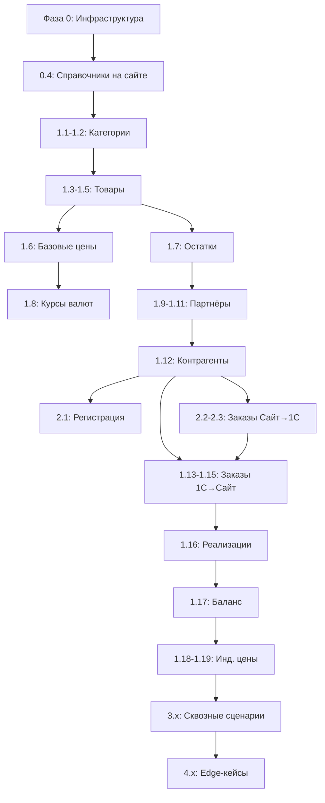

# План ручного тестирования интеграции 1С ↔ Сайт Pecado

**Версия:** 1.0  
**Дата:** 2026-04-09  
**На основе:** [ACCEPTANCE_CRITERIA_v11.md](file:///home/savosik/projects/pecado/docs/ACCEPTANCE_CRITERIA_v11.md)

---

## Условные обозначения

| Иконка | Значение |
|--------|----------|
| 🔵 **1С** | Действие выполняет 1С-ник (отправляет данные) |
| 🟢 **Сайт** | Действие выполняет разработчик сайта (отправляет данные) |
| 👁️ **Проверка** | Что смотрим и где |
| ⚠️ **Edge** | Граничная/нештатная ситуация |

---

## Фаза 0: Подготовка инфраструктуры

> [!IMPORTANT]
> Перед началом тестирования необходимо убедиться, что инфраструктура работает корректно.

### 0.1 Проверка RabbitMQ

| # | Проверка | Команда / действие | Ожидаемый результат |
|---|---|---|---|
| 0.1.1 | RabbitMQ доступен | Открыть Management UI (`http://<host>:15672`) | Интерфейс доступен, авторизация проходит |
| 0.1.2 | Exchange `erp.events` существует | RabbitMQ UI → Exchanges | `erp.events` (type: topic, durable) |
| 0.1.3 | Exchange `site.events` существует | RabbitMQ UI → Exchanges | `site.events` (type: topic, durable) |
| 0.1.4 | Все входящие очереди созданы | RabbitMQ UI → Queues | `erp_in.partners`, `erp_in.prices`, `erp_in.stock`, `erp_in.orders`, `erp_in.returns`, `erp_in.documents`, `erp_in.balance`, `erp_in.catalog` |
| 0.1.5 | Все исходящие очереди созданы | RabbitMQ UI → Queues | `erp_out.orders`, `erp_out.returns`, `erp_out.partners` |
| 0.1.6 | DLQ очереди созданы | RabbitMQ UI → Queues | `erp_dlq.partners`, `erp_dlq.prices`, `erp_dlq.stock`, `erp_dlq.orders`, `erp_dlq.returns`, `erp_dlq.balance` |
| 0.1.7 | Если чего-то нет — пересоздать | `docker exec pecado-app php artisan rabbitmq:setup` | Топология создана |

### 0.2 Проверка воркеров

| # | Проверка | Команда | Ожидаемый результат |
|---|---|---|---|
| 0.2.1 | Supervisor воркеры активны | `docker exec pecado-app supervisorctl status` | Все `erp-*-consumer` в статусе `RUNNING` |
| 0.2.2 | Если нет — перезапуск | `docker exec pecado-app supervisorctl restart all` | Все перешли в `RUNNING` |

### 0.3 Проверка MinIO (для индивидуальных цен)

| # | Проверка | Команда / действие |
|---|---|---|
| 0.3.1 | MinIO доступен | Открыть MinIO Console |
| 0.3.2 | Бакет `prices-exchange` существует | MinIO → Buckets |

### 0.4 Подготовка справочных данных на сайте (через админку)

> [!IMPORTANT]
> На dev-сервере есть только админ. Перед тестированием нужно создать минимальный набор справочных данных, которые **не приходят из 1С**, а создаются на сайте вручную.

| # | Что создать | Где | Зачем |
|---|---|---|---|
| 0.4.1 | **Регионы** (минимум 2: «Свердловская область», «Алматы») | Админка → Регионы | Для привязки складов и пользователей |
| 0.4.2 | **Склады** (минимум 2: основной + предзаказ) с `external_id` (UUID) | Админка → Склады | Для приёма остатков; UUID должен совпадать с тем, что отправит 1С |
| 0.4.3 | Привязать склады к регионам (`region_warehouse`) | Админка → Регионы → Склады | Определяет доступность товаров для пользователя |
| 0.4.4 | **Статусы клиентов** | Админка → Статусы клиентов | Для резолвинга `client_status` из `partner.created` |

**Статусы клиентов для создания:**

| Название | `external_id` |
|---|---|
| Silver | `silver` |
| Gold | `gold` |
| Diamond | `diamond` |
| Индивидуальный | `individual` |

> Запишите UUID складов — они понадобятся 1С-нику для формирования payload.

---

## Фаза 1: 1С шлёт → Сайт принимает

> Последовательность тестов соответствует порядку первоначальной выгрузки (зависимости сущностей).

---

### Тест 1.1 — Категории (`category.created`) — US-15

**Зависимости:** нет

🔵 **1С отправляет** два сообщения в `erp.events` с routing key `category.created`:

**Сообщение A — родительская категория:**

```json
{
  "event": "category.created",
  "message_id": "msg-test-cat-parent-001",
  "uuid": "cat-test-parent-001",
  "parent_uuid": null,
  "name": "Бельё и одежда",
  "is_group": true
}
```

**Сообщение B — дочерняя категория (отправляется ПОСЛЕ A):**

```json
{
  "event": "category.created",
  "message_id": "msg-test-cat-child-001",
  "uuid": "cat-test-child-001",
  "parent_uuid": "cat-test-parent-001",
  "name": "Нижнее бельё",
  "is_group": false
}
```

👁️ **Проверка (разработчик сайта):**

- [ ] В таблице `categories` появились 2 записи
- [ ] У дочерней категории `parent_id` указывает на родительскую
- [ ] `external_id` совпадает с `uuid` из payload
- [ ] В `erp_processed_messages` записаны оба `message_id`

---

### Тест 1.2 — Обновление категории (`category.updated`) — US-15

**Зависимости:** Тест 1.1

🔵 **1С отправляет** в `erp.events` с routing key `category.updated`:

```json
{
  "event": "category.updated",
  "message_id": "msg-test-cat-upd-001",
  "uuid": "cat-test-child-001",
  "name": "Нижнее бельё женское"
}
```

👁️ **Проверка:**

- [ ] Категория `cat-test-child-001` обновила `name` → «Нижнее бельё женское»
- [ ] `parent_id` НЕ изменился (частичное обновление)

---

### Тест 1.3 — Товары (`product.created`) — US-15

**Зависимости:** Тест 1.1 (категории должны существовать)

🔵 **1С отправляет** в `erp.events` с routing key `product.created`:

```json
{
  "event": "product.created",
  "message_id": "msg-test-prod-001",
  "uuid": "prod-test-001",
  "name": "Тестовый товар Pecado",
  "code": "0T-TEST-001",
  "sku": "TST-001",
  "description": "Описание тестового товара",
  "category_uuid": "cat-test-child-001",
  "hidden": false,
  "brand": {
    "uuid": "brand-test-001",
    "name": "TestBrand",
    "label": "TestBrand"
  },
  "barcodes": ["4600000000099"],
  "model": {
    "uuid": "model-test-001",
    "name": "Test Model X"
  },
  "attributes": [
    {
      "property_uuid": "prop-test-color-001",
      "property_label": "Цвет",
      "value_type": "reference",
      "value_uuid": "val-test-pink-001",
      "value_label": "Розовый"
    }
  ]
}
```

👁️ **Проверка:**

- [ ] В `products` появилась запись с `external_id = prod-test-001`
- [ ] `category_id` указывает на категорию `cat-test-child-001`
- [ ] Бренд создан/привязан в `brands` с `external_id = brand-test-001`
- [ ] Атрибут «Цвет» создан в `attributes` и значение «Розовый» в `attribute_values`
- [ ] `hidden = false` (товар видим)
- [ ] Товар доступен в каталоге на сайте (если авторизоваться)

---

### Тест 1.4 — Товар со скрытием (`product.created`, `hidden = true`) — US-15, US-17

**Зависимости:** Тест 1.1

🔵 **1С отправляет:**

```json
{
  "event": "product.created",
  "message_id": "msg-test-prod-hidden-001",
  "uuid": "prod-test-hidden-001",
  "name": "Скрытый тестер",
  "code": "0T-HIDDEN-001",
  "sku": "HID-001",
  "description": "",
  "category_uuid": "cat-test-child-001",
  "hidden": true,
  "brand": null,
  "barcodes": [],
  "model": null,
  "attributes": []
}
```

👁️ **Проверка:**

- [ ] Товар создан с `hidden = true`
- [ ] Товар **НЕ** отображается в каталоге на сайте
- [ ] Товар **НЕ** находится через поиск

---

### Тест 1.5 — Частичное обновление товара (`product.updated`) — US-15

**Зависимости:** Тест 1.3

🔵 **1С отправляет** с routing key `product.updated`:

```json
{
  "event": "product.updated",
  "message_id": "msg-test-prod-upd-001",
  "uuid": "prod-test-001",
  "name": "Тестовый товар Pecado (обновлён)",
  "attributes": [
    {
      "property_uuid": "prop-test-material-001",
      "property_label": "Материал",
      "value_type": "string",
      "value_uuid": null,
      "value_label": "Силикон"
    }
  ]
}
```

👁️ **Проверка:**

- [ ] `name` обновлён → «Тестовый товар Pecado (обновлён)»
- [ ] Атрибут «Цвет: Розовый» **сохранён** (мерж по `property_uuid`)
- [ ] **Добавлен** новый атрибут «Материал: Силикон»
- [ ] `sku`, `code`, `category_uuid` **НЕ изменились**

---

### Тест 1.6 — Базовые цены (`price.updated`) — US-03

**Зависимости:** Тест 1.3 (товар должен существовать)

🔵 **1С отправляет** с routing key `price.updated`:

```json
{
  "event": "price.updated",
  "message_id": "msg-test-price-001",
  "product_uuid": "prod-test-001",
  "price": 2500.00
}
```

👁️ **Проверка:**

- [ ] В товаре `prod-test-001` цена = 2500.00
- [ ] Цена отображается в каталоге на сайте

---

### Тест 1.7 — Остатки (`stock.updated`) — US-06

**Зависимости:** Тест 1.3 (товар) + Фаза 0.4.2 (склады заведены с UUID)

🔵 **1С отправляет** с routing key `stock.updated`:

```json
{
  "event": "stock.updated",
  "message_id": "msg-test-stock-001",
  "product_uuid": "prod-test-001",
  "warehouse_uuid": "<UUID основного склада из шага 0.4.2>",
  "quantity": 42
}
```

👁️ **Проверка:**

- [ ] В `product_warehouse` появилась запись: товар × склад, quantity = 42
- [ ] Товар отображается как «В наличии» для пользователя из соответствующего региона

---

### Тест 1.8 — Курсы валют (`exchange_rate.updated`) — US-05

**Зависимости:** нет

🔵 **1С отправляет** с routing key `exchange_rate.updated`:

```json
{
  "event": "exchange_rate.updated",
  "message_id": "msg-test-rate-kzt-001",
  "currency_code": "KZT",
  "official_rate": 5.40,
  "rate_coefficient": 1.01,
  "rate": 5.454,
  "base_currency_code": "RUB",
  "date": "2026-04-09"
}
```

👁️ **Проверка:**

- [ ] В таблице `exchange_rates` создана/обновлена запись для KZT
- [ ] Все три значения сохранены: `official_rate`, `rate_coefficient`, `rate`
- [ ] `base_currency_code = RUB`

---

### Тест 1.9 — Партнёры / пользователи (`partner.created`) — US-02

**Зависимости:** Фаза 0.4.4 (статусы клиентов заведены)

🔵 **1С отправляет** с routing key `partner.created`:

```json
{
  "event": "partner.created",
  "message_id": "msg-test-partner-001",
  "uuid": "partner-test-001",
  "login": "test-buyer@pecado.test",
  "name": "Тестов Тест Тестович",
  "phone": "+79001234567",
  "email": "test-buyer@pecado.test",
  "password": "a1b2c3d4",
  "city": "Екатеринбург",
  "region": "Свердловская область",
  "country": "RU",
  "currency": "RUB",
  "is_active": true,
  "client_status": "gold"
}
```

👁️ **Проверка:**

- [ ] В `users` создан пользователь с `erp_id = partner-test-001`
- [ ] `name` = «Тестов Тест Тестович»
- [ ] `email` = `test-buyer@pecado.test`
- [ ] `is_active = true`
- [ ] `client_status_id` указывает на запись ClientStatus с `external_id = gold`
- [ ] Пользователь может войти с паролем `a1b2c3d4`
- [ ] При первом входе пользователь **обязан сменить пароль** (флаг `must_change_password`)
- [ ] В ЛК отображается плашка статуса «Gold»

---

### Тест 1.10 — Обновление статуса партнёра (`partner.created` повторно) — US-02, US-18

**Зависимости:** Тест 1.9

🔵 **1С отправляет** повторный `partner.created` (тот же UUID, новый `client_status`):

```json
{
  "event": "partner.created",
  "message_id": "msg-test-partner-upd-001",
  "uuid": "partner-test-001",
  "login": "test-buyer@pecado.test",
  "name": "Тестов Тест Тестович",
  "phone": "+79001234567",
  "email": "test-buyer@pecado.test",
  "password": "a1b2c3d4",
  "city": "Екатеринбург",
  "region": "Свердловская область",
  "country": "RU",
  "currency": "RUB",
  "is_active": true,
  "client_status": "diamond"
}
```

👁️ **Проверка:**

- [ ] `client_status_id` обновился → указывает на `diamond`
- [ ] Пароль **НЕ** перезаписан (пользователь уже существует)
- [ ] В ЛК отображается плашка статуса «Diamond»

---

### Тест 1.11 — Деактивация партнёра (`partner.deleted`) — US-02

**Зависимости:** Тест 1.9

🔵 **1С отправляет** с routing key `partner.deleted`:

```json
{
  "event": "partner.deleted",
  "message_id": "msg-test-partner-del-001",
  "uuid": "partner-test-001"
}
```

👁️ **Проверка:**

- [ ] Пользователь переведён в статус `is_active = false`
- [ ] Пользователь **не может** авторизоваться
- [ ] Пользователь **не может** оформлять заказы

> ⚠️ **После этого теста активируйте пользователя обратно** (повторный `partner.created` с `is_active: true`) — он нужен для дальнейших тестов.

---

### Тест 1.12 — Контрагенты (`contractor.created`) — US-07

**Зависимости:** Тест 1.9 (партнёр должен существовать)

🔵 **1С отправляет** с routing key `contractor.created`:

```json
{
  "event": "contractor.created",
  "message_id": "msg-test-contractor-001",
  "uuid": "contractor-test-001",
  "partner_uuid": "partner-test-001",
  "name": "ООО «Тестовая Компания»",
  "legal_name": "Общество с ограниченной ответственностью «Тестовая Компания»",
  "tax_id": "7710999888",
  "tax_code": "771001001",
  "registration_number": "1027700999888",
  "okpo_code": "99887766",
  "country": "RU",
  "legal_address": "г. Москва, ул. Тестовая, 1",
  "actual_address": "г. Москва, ул. Тестовая, 1А",
  "phone": "+79009998877",
  "email": "info@testcompany.ru",
  "bank_accounts": [
    {
      "bank_name": "АО «Тест-Банк»",
      "bank_bik": "044525225",
      "correspondent_account": "30101810400000000225",
      "account_number": "40702810100000012345",
      "is_primary": true
    },
    {
      "bank_name": "ПАО «Второй Банк»",
      "bank_bik": "044525226",
      "correspondent_account": "30101810400000000226",
      "account_number": "40702810200000054321",
      "is_primary": false
    }
  ]
}
```

👁️ **Проверка:**

- [ ] В `companies` создана запись с `external_id = contractor-test-001`
- [ ] Контрагент привязан к пользователю `partner-test-001` (через `user_id`)
- [ ] `tax_id = 7710999888`, `legal_name` заполнено
- [ ] В `bank_accounts` создано 2 записи
- [ ] Первая запись имеет `is_primary = true`, вторая `is_primary = false`
- [ ] В ЛК пользователя контрагент отображается в разделе «Компании»

---

### Тест 1.13 — Заказ от менеджера (`order.created` 1С → Сайт) — US-08

**Зависимости:** Тест 1.3 (товар), Тест 1.9 (партнёр)

🔵 **1С отправляет** с routing key `order.created`:

```json
{
  "event": "order.created",
  "message_id": "msg-test-order-from-erp-001",
  "uuid": "order-test-erp-001",
  "number": "ЗП-000001",
  "date": "2026-04-09T10:00:00+03:00",
  "status": "confirmed",
  "type": "order",
  "partner_uuid": "partner-test-001",
  "warehouse_uuids": ["<UUID основного склада>"],
  "timestamp": "2026-04-09T10:00:01+03:00",
  "contractor": null,
  "delivery_address": "г. Екатеринбург, ул. Ленина, 10",
  "currency_code": "RUB",
  "exchange_rate": 1.0,
  "rate_coefficient": 1.0,
  "comment": "Заказ от менеджера",
  "items": [
    {
      "product_uuid": "prod-test-001",
      "quantity": 3,
      "base_price": 2500.00,
      "discount_percent": 15.00,
      "final_price": 2125.00
    }
  ]
}
```

👁️ **Проверка:**

- [ ] В `orders` создан заказ с `external_id = order-test-erp-001`
- [ ] Статус = `confirmed`
- [ ] Тип = `order`
- [ ] В `order_items` — 1 позиция с `base_price`, `discount_percent`, `final_price`
- [ ] Заказ привязан к пользователю `partner-test-001`
- [ ] Заказ отображается в ЛК пользователя

---

### Тест 1.14 — Обновление заказа (`order.updated`) — US-08

**Зависимости:** Тест 1.13

🔵 **1С отправляет** с routing key `order.updated`:

**A) Обновление только статуса:**

```json
{
  "event": "order.updated",
  "message_id": "msg-test-order-upd-status-001",
  "uuid": "order-test-erp-001",
  "status": "processing"
}
```

👁️ **Проверка:**

- [ ] Статус заказа обновлён → `processing`
- [ ] В `order_status_histories` появилась запись о смене статуса
- [ ] Позиции заказа **НЕ изменились** (items не передан)

**B) Обновление статуса + позиций (с изменением количества):**

```json
{
  "event": "order.updated",
  "message_id": "msg-test-order-upd-items-001",
  "uuid": "order-test-erp-001",
  "status": "processing",
  "items": [
    {
      "product_uuid": "prod-test-001",
      "quantity": 2,
      "base_price": 2500.00,
      "discount_percent": 20.00,
      "final_price": 2000.00
    }
  ]
}
```

👁️ **Проверка:**

- [ ] Позиции полностью пересозданы (старые удалены)
- [ ] quantity = 2 (было 3)
- [ ] discount_percent = 20.00 (было 15.00)
- [ ] final_price = 2000.00 (было 2125.00)
- [ ] В `order_change_logs` зафиксирован diff изменений (v11)
- [ ] В ЛК пользователь видит историю изменений заказа

---

### Тест 1.15 — Удаление заказа (`order.deleted`) — US-08

**Зависимости:** создать ещё один тестовый заказ для удаления

🔵 **1С отправляет** с routing key `order.deleted`:

```json
{
  "event": "order.deleted",
  "message_id": "msg-test-order-del-001",
  "uuid": "order-test-erp-001"
}
```

👁️ **Проверка:**

- [ ] Заказ помечен как `cancelled` (soft delete)
- [ ] Заказ **НЕ** отображается в активных заказах ЛК (или имеет статус «Отменён»)
- [ ] Запись **не удалена** физически из БД

---

### Тест 1.16 — Реализации (`shipment.created`) — US-10

**Зависимости:** Тест 1.12 (контрагент с ИНН), Тест 1.3 (товар), Тест 1.13 (заказ)

> Перед этим тестом пересоздайте заказ (или используйте новый), чтобы он был в активном состоянии.

🔵 **1С отправляет** с routing key `shipment.created`:

```json
{
  "event": "shipment.created",
  "message_id": "msg-test-shipment-001",
  "uuid": "shipment-test-001",
  "contractor_inn": "7710999888",
  "date": "2026-04-09",
  "status": "completed",
  "currency_code": "RUB",
  "items": [
    {
      "product_uuid": "prod-test-001",
      "order_uuid": "order-test-erp-001",
      "quantity": 2,
      "price": 2500.00,
      "auto_discount_percent": 15.00,
      "manual_discount_percent": 5.00,
      "total": 4000.00,
      "vat_rate": 20
    }
  ]
}
```

👁️ **Проверка:**

- [ ] В `shipments` создана запись с `external_id = shipment-test-001`
- [ ] Реализация привязана к контрагенту по `contractor_inn`
- [ ] В `shipment_items` — 1 позиция
- [ ] Позиция связана с заказом через `order_uuid`
- [ ] Реализация отображается в ЛК пользователя

---

### Тест 1.17 — Баланс (`balance.updated`) — US-11

**Зависимости:** Тест 1.9 (партнёр), Тест 1.12 (контрагент), Тест 1.16 (реализация)

🔵 **1С отправляет** с routing key `balance.updated`:

```json
{
  "event": "balance.updated",
  "message_id": "msg-test-balance-001",
  "partner_uuid": "partner-test-001",
  "updated_at": "2026-04-09T15:00:00",
  "contractors": [
    {
      "contractor_inn": "7710999888",
      "contractor_uuid": "contractor-test-001",
      "current_balance": -4000.00,
      "overdue_debt": 4000.00,
      "overdue_details": [
        {
          "shipment_uuid": "shipment-test-001",
          "amount": 4000.00,
          "due_date": "2026-03-15"
        }
      ]
    }
  ]
}
```

👁️ **Проверка:**

- [ ] Баланс обновлён для партнёра `partner-test-001`
- [ ] `current_balance = -4000.00`
- [ ] `overdue_debt = 4000.00`
- [ ] Просроченная задолженность детализирована по реализации
- [ ] В ЛК отображается баланс в разрезе контрагентов

---

### Тест 1.18 — Индивидуальные цены (`individual_prices.ready`) — US-14

**Зависимости:** Тест 1.3 (товар), Тест 1.9 (партнёр), Фаза 0.4.2 (склады), MinIO (Фаза 0.3)

#### Шаг A: Подготовка CSV файла

🔵 **1С создаёт** CSV файл и загружает в MinIO:

**Файл:** `prices-exchange/2026-04-09/partner_partner-test-001.csv`  
**Содержимое (без заголовка):**

```csv
prod-test-001,<UUID_основного_склада>,1800.00
```

#### Шаг B: Уведомление

🔵 **1С отправляет** с routing key `individual_prices.ready`:

```json
{
  "event": "individual_prices.ready",
  "message_id": "msg-test-indprice-001",
  "upload_type": "full",
  "partner_uuid": "partner-test-001",
  "file_url": "s3://prices-exchange/2026-04-09/partner_partner-test-001.csv",
  "records_count": 1,
  "timestamp": "2026-04-09T14:05:00+03:00"
}
```

👁️ **Проверка:**

- [ ] В `individual_prices` появилась запись для пользователя × товар × склад
- [ ] Цена = 1800.00
- [ ] CSV файл **удалён** из MinIO после обработки
- [ ] Авторизованный пользователь `test-buyer@pecado.test` видит цену 1800.00 (вместо базовой 2500.00) в каталоге

---

### Тест 1.19 — Дельта индивидуальных цен (`upload_type: "delta"`) — US-14, v9

**Зависимости:** Тест 1.18

#### Шаг A: Подготовка CSV с новой ценой

Загрузить в MinIO файл с одной строкой:

```csv
prod-test-001,<UUID_основного_склада>,1600.00
```

#### Шаг B: Уведомление с `upload_type: "delta"`

```json
{
  "event": "individual_prices.ready",
  "message_id": "msg-test-indprice-delta-001",
  "upload_type": "delta",
  "partner_uuid": "partner-test-001",
  "file_url": "s3://prices-exchange/2026-04-09/partner_partner-test-001-delta.csv",
  "records_count": 1,
  "timestamp": "2026-04-09T14:35:00+03:00"
}
```

👁️ **Проверка:**

- [ ] Цена **обновлена** (UPSERT) → 1600.00 (была 1800.00)
- [ ] Другие цены этого партнёра (если были) **НЕ удалены** (в отличие от full)

---

## Фаза 2: Сайт шлёт → 1С принимает

---

### Тест 2.1 — Регистрация пользователя (`partner.created` Сайт → 1С) — US-02

**Зависимости:** нет

🟢 **Разработчик сайта** регистрирует нового пользователя на сайте:

- Имя: `Петров Пётр Петрович`
- Email: `petrov-test@pecado.test`
- Телефон: `+79001112233`

👁️ **Проверка (1С-ник):**

- [ ] В очереди `erp_out.partners` появилось сообщение
- [ ] Payload содержит: `event: "partner.created"`, `uuid`, `login`, `name`, `phone`, `email`
- [ ] `uuid` — валидный UUID (сгенерирован сайтом)
- [ ] `login = email`
- [ ] 1С ищет партнёра по `email` (`EmailПартнера`)
- [ ] Если не найден — создаёт нового партнёра
- [ ] 1С **НЕ** использует `uuid` из payload как свой идентификатор — генерирует свой UUID платформой

---

### Тест 2.2 — Оформление заказа (`order.created` Сайт → 1С) — US-08

**Зависимости:** Тест 1.3 (товар), Тест 1.7 (остатки), Тест 1.9 (партнёр активирован), Тест 1.12 (контрагент)

🟢 **Разработчик сайта** авторизуется как `test-buyer@pecado.test` и оформляет заказ:

1. Добавить товар `prod-test-001` в корзину (2 шт.)
2. Выбрать контрагента «ООО Тестовая Компания»
3. Указать адрес доставки
4. Оформить заказ

👁️ **Проверка (1С-ник):**

- [ ] В очереди `erp_out.orders` появилось сообщение
- [ ] Payload содержит все обязательные поля: `event`, `uuid`, `status: "pending"`, `type: "order"`, `partner_uuid`, `items`
- [ ] `partner_uuid` = `erp_id` пользователя на сайте (= UUID из 1С)
- [ ] `contractor` содержит: `tax_id`, `legal_name`, `bank_accounts`
- [ ] `items[]` содержит для каждой позиции: `product_uuid`, `quantity`, `base_price`, `discount_percent`, `final_price`
- [ ] `currency_code`, `exchange_rate`, `rate_coefficient` заполнены
- [ ] 1С создаёт заказ, сопоставив контрагента по ИНН (`tax_id`)
- [ ] Комментарий в 1С содержит: номер заказа, тип, партнёр, контрагент, адрес
- [ ] Если склад из `warehouse_uuids` не найден — используется `ОсновнойСклад`

---

### Тест 2.3 — Оформление предзаказа (`order.created`, `type: "preorder"`) — US-08

**Зависимости:** аналогично Тесту 2.2

🟢 **Разработчик сайта** добавляет товар, который есть только на складе предзаказа:

1. Загрузить остатки: товар `prod-test-001` с `quantity > 0` только на склад предзаказа
2. Оформить заказ

👁️ **Проверка (1С-ник):**

- [ ] Payload содержит `type: "preorder"`
- [ ] `warehouse_uuids` содержит UUID склада предзаказа

---

### Тест 2.4 — Создание возврата (`return.created` Сайт → 1С) — US-09

> ⚠️ US-09 отложен на следующий скоп. Тест актуален, когда функционал будет реализован.

**Зависимости:** Тест 1.13 или 2.2 (заказ в статусе `completed`)

🟢 **Разработчик сайта** создаёт возврат через ЛК:

1. Авторизоваться как `test-buyer@pecado.test`
2. Перейти в заказ → Создать возврат
3. Выбрать товар, указать количество и причину

👁️ **Проверка (1С-ник):**

- [ ] В очереди `erp_out.returns` появилось сообщение
- [ ] Payload: `event: "return.created"`, `uuid`, `order_uuid`, `partner_uuid`, `items[]`
- [ ] `order_uuid` = UUID оригинального заказа
- [ ] `items[]` содержит `product_uuid`, `quantity`, `reason`

---

## Фаза 3: Двунаправленные (сквозные) сценарии

---

### Тест 3.1 — Полный жизненный цикл заказа

| Шаг | Кто | Действие | Проверка |
|-----|-----|----------|----------|
| 1 | 🟢 Сайт | Пользователь оформляет заказ | `order.created` в `erp_out.orders`, статус `pending` в БД |
| 2 | 🔵 1С | Получает заказ, подтверждает → `order.updated` со статусом `confirmed` | Статус на сайте → `confirmed`, запись в `order_status_histories` |
| 3 | 🔵 1С | Берёт в работу → `order.updated` со статусом `processing` | Статус → `processing` |
| 4 | 🔵 1С | Менеджер изменил позиции → `order.updated` с `items[]` | Позиции пересозданы, diff записан в `order_change_logs` |
| 5 | 🔵 1С | Создаёт реализацию → `shipment.created` | Реализация появляется в ЛК |
| 6 | 🔵 1С | Завершает заказ → `order.updated` со статусом `completed` | Статус → `completed` |
| 7 | 🔵 1С | Обновляет баланс → `balance.updated` | Баланс обновлён в ЛК |

👁️ **Итоговая проверка:**

- [ ] В `order_status_histories` записаны все переходы: `pending` → `confirmed` → `processing` → `completed`
- [ ] В `order_change_logs` зафиксированы изменения позиций
- [ ] Реализация привязана к заказу
- [ ] Баланс отражает задолженность

---

### Тест 3.2 — Жизненный цикл партнёра: создание → смена статуса → деактивация

| Шаг | Кто | Действие | Проверка |
|-----|-----|----------|----------|
| 1 | 🟢 Сайт | Регистрация пользователя | `partner.created` → `erp_out.partners` |
| 2 | 🔵 1С | Находит/создаёт партнёра, отправляет `partner.created` с `client_status: "silver"` | Пользователь обновлён, статус Silver |
| 3 | 🔵 1С | Повышение → `partner.created` с `client_status: "gold"` | Статус → Gold |
| 4 | 🔵 1С | Переводит на инд. → `partner.created` с `client_status: "individual"` | Статус → Индивидуальный |
| 5 | 🔵 1С | Убирает соглашение → `partner.created` с `client_status: null` | Статус сброшен, `client_status_id = null` |
| 6 | 🔵 1С | Деактивация → `partner.deleted` | `is_active = false` |

---

### Тест 3.3 — Цепочка: Реализация → Баланс

| Шаг | Кто | Действие | Проверка |
|-----|-----|----------|----------|
| 1 | 🔵 1С | `shipment.created` по контрагенту | Реализация появилась |
| 2 | 🔵 1С | `balance.updated` с `overdue_details` ссылающимся на `shipment_uuid` | Просрочка детализирована по реализации |
| 3 | 🔵 1С | `shipment.updated` (перепроведение — изменилась сумма) | Реализация обновлена |
| 4 | 🔵 1С | `balance.updated` с новой суммой | Баланс пересчитан |

---

## Фаза 4: Edge-кейсы и негативные тесты

---

### 4.1 — Идемпотентность (повторное сообщение)

🔵 **1С отправляет** то же самое сообщение из Теста 1.6 (тот же `message_id`):

```json
{
  "event": "price.updated",
  "message_id": "msg-test-price-001",
  "product_uuid": "prod-test-001",
  "price": 9999.00
}
```

👁️ **Проверка:**

- [ ] Цена **НЕ** обновлена (осталась 2500.00)
- [ ] В логах сообщение: «сообщение уже обработано (идемпотентность)»
- [ ] Сообщение удалено из очереди без ошибок

---

### 4.2 — Невалидный JSON

🔵 **1С отправляет** сломанный JSON:

```
{event: broken
```

👁️ **Проверка:**

- [ ] В логах: «невалидный JSON»
- [ ] Сообщение удалено из очереди (не зависает)
- [ ] Другие сообщения в очереди **продолжают** обрабатываться

---

### 4.3 — Несуществующий UUID товара в `price.updated`

🔵 **1С отправляет:**

```json
{
  "event": "price.updated",
  "message_id": "msg-test-price-missing-001",
  "product_uuid": "non-existent-product-uuid",
  "price": 1000.00
}
```

👁️ **Проверка:**

- [ ] Событие проигнорировано (товар не найден)
- [ ] В логах — предупреждение
- [ ] Ошибка **не** блокирует обработку других сообщений

---

### 4.4 — Несуществующий UUID склада в `stock.updated`

🔵 **1С отправляет:**

```json
{
  "event": "stock.updated",
  "message_id": "msg-test-stock-missing-wh-001",
  "product_uuid": "prod-test-001",
  "warehouse_uuid": "non-existent-warehouse-uuid",
  "quantity": 100
}
```

👁️ **Проверка:**

- [ ] Событие проигнорировано (склад не найден)
- [ ] Остатки товара **не** изменились
- [ ] В логах — предупреждение

---

### 4.5 — Дочерняя категория приходит раньше родительской

🔵 **1С отправляет** категорию с `parent_uuid`, для которого родитель ещё не заведён:

```json
{
  "event": "category.created",
  "message_id": "msg-test-cat-orphan-001",
  "uuid": "cat-orphan-child-001",
  "parent_uuid": "cat-non-existent-parent",
  "name": "Сирота-категория",
  "is_group": false
}
```

👁️ **Проверка:**

- [ ] Определить поведение: категория создана без родителя? Ушла в DLQ? Отклонена?
- [ ] Зафиксировать фактическое поведение для документации

---

### 4.6 — Отправка `partner.created` с неизвестным `client_status`

🔵 **1С отправляет:**

```json
{
  "event": "partner.created",
  "message_id": "msg-test-partner-unknown-status-001",
  "uuid": "partner-test-001",
  "login": "test-buyer@pecado.test",
  "name": "Тестов Тест Тестович",
  "phone": "+79001234567",
  "email": "test-buyer@pecado.test",
  "password": "a1b2c3d4",
  "city": "Екатеринбург",
  "region": "Свердловская область",
  "country": "RU",
  "currency": "RUB",
  "is_active": true,
  "client_status": "platinum"
}
```

👁️ **Проверка:**

- [ ] `ClientStatus` с `external_id = "platinum"` **не найден**
- [ ] В логах — предупреждение (warning)
- [ ] `client_status_id` пользователя **НЕ изменён** (остался предыдущий)
- [ ] Пользователь в остальном обновлён корректно (name, phone и т.д.)

---

### 4.7 — Партнёр без email

🔵 **1С пытается выгрузить** партнёра без email:

👁️ **Проверка (на стороне 1С):**

- [ ] Партнёр **пропущен** при выгрузке
- [ ] Сообщение **НЕ** отправлено в RabbitMQ

---

### 4.8 — Заказ с несуществующим складом

🟢 **Разработчик** оформляет заказ с `warehouse_uuids`, которых нет в 1С:

👁️ **Проверка (1С-ник):**

- [ ] 1С использует `ОсновнойСклад` из настроек обмена

---

### 4.9 — Заказ с несуществующим контрагентом (по ИНН)

🟢 **Разработчик** создаёт нового контрагента на сайте (ИНН, которого нет в 1С) и оформляет заказ:

👁️ **Проверка (1С-ник):**

- [ ] 1С получает `order.created` с контрагентом
- [ ] 1С по ИНН не находит контрагента
- [ ] 1С **автоматически создаёт** нового контрагента из данных payload
- [ ] Заказ создан успешно

---

### 4.10 — `order.updated` для несуществующего заказа

🔵 **1С отправляет** `order.updated` для UUID заказа, которого нет на сайте:

```json
{
  "event": "order.updated",
  "message_id": "msg-test-order-upd-missing-001",
  "uuid": "non-existent-order-uuid",
  "status": "confirmed"
}
```

👁️ **Проверка:**

- [ ] Событие не вызывает ошибку
- [ ] В логах — предупреждение
- [ ] Воркер продолжает работать

---

### 4.11 — Повторная полная выгрузка (идемпотентность Initial Load)

🔵 **1С выполняет** `ВыгрузитьВсюНоменклатуру()` повторно (все товары снова):

👁️ **Проверка:**

- [ ] Данные **обновлены** (не продублированы)
- [ ] Количество записей в `products` не увеличилось
- [ ] `external_id` остаётся уникальным — UPSERT поведение

---

### 4.12 — DLQ (Dead Letter Queue)

Искусственно вызвать ошибку обработки (например, временно уронить БД на время отправки сообщения):

👁️ **Проверка:**

- [ ] Сообщение ретраится указанное количество раз (tries)
- [ ] После исчерпания попыток сообщение перемещается в DLQ (`erp_dlq.*`)
- [ ] DLQ сообщение доступно для ручной инспекции в RabbitMQ UI
- [ ] Остальные сообщения в основной очереди **не блокированы**

---

### 4.13 — `stock.updated` с quantity = 0

🔵 **1С отправляет:**

```json
{
  "event": "stock.updated",
  "message_id": "msg-test-stock-zero-001",
  "product_uuid": "prod-test-001",
  "warehouse_uuid": "<UUID_основного_склада>",
  "quantity": 0
}
```

👁️ **Проверка:**

- [ ] Остаток обновлён → 0
- [ ] Товар отображается как «Нет в наличии»
- [ ] Пользователь **не может** добавить товар в корзину (или количество ограничено)

---

### 4.14 — `shipment.created` с позициями из нескольких заказов

🔵 **1С отправляет** реализацию, включающую товары из двух разных заказов:

```json
{
  "event": "shipment.created",
  "message_id": "msg-test-shipment-multi-001",
  "uuid": "shipment-test-multi-001",
  "contractor_inn": "7710999888",
  "date": "2026-04-09",
  "status": "completed",
  "currency_code": "RUB",
  "items": [
    {
      "product_uuid": "prod-test-001",
      "order_uuid": "order-A-uuid",
      "quantity": 5,
      "price": 2500.00,
      "auto_discount_percent": 10,
      "manual_discount_percent": 0,
      "total": 11250.00,
      "vat_rate": 20
    },
    {
      "product_uuid": "prod-test-001",
      "order_uuid": "order-B-uuid",
      "quantity": 3,
      "price": 2500.00,
      "auto_discount_percent": 15,
      "manual_discount_percent": 0,
      "total": 6375.00,
      "vat_rate": 20
    }
  ]
}
```

👁️ **Проверка:**

- [ ] Одна реализация содержит позиции из **двух разных заказов**
- [ ] Каждая позиция привязана к своему заказу через `order_uuid`

---

### 4.15 — Полная vs дельта индивидуальных цен

**Сценарий:** У партнёра есть 2 цены (товар A и товар B). Приходит дельта только по товару A.

👁️ **Проверка:**

- [ ] **delta**: Обновлена только цена товара A. Цена товара B **не тронута**
- [ ] **full**: Если бы `upload_type: "full"` — цена товара B была бы **удалена** (DELETE + INSERT)

---

## Чек-лист итоговой проверки

| Категория | Всего тестов | Критичность |
|---|---|---|
| Фаза 0: Инфраструктура | 11 | 🔴 Блокер |
| Фаза 1: 1С → Сайт | 19 | 🔴 Блокер |
| Фаза 2: Сайт → 1С | 4 | 🔴 Блокер |
| Фаза 3: Сквозные сценарии | 3 | 🟡 Высокий |
| Фаза 4: Edge-кейсы | 15 | 🟡 Высокий |
| **Итого** | **52** | |

---

## Рекомендуемый порядок тестирования



> [!TIP]
> При обнаружении проблем — **не пропускайте тест**, а фиксируйте баг и переходите к следующему. Зависимые тесты можно выполнить после исправления.
