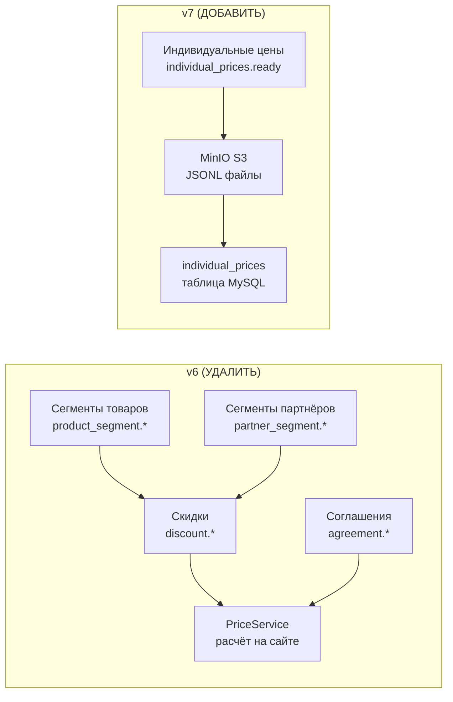

# План миграции v6.0 → v7.0

**Дата:** 2026-03-27  
**Суть:** Отказ от зеркалирования логики скидок 1С на сайте. Переход на модель «готовых индивидуальных цен», рассчитанных в 1С и переданных через MinIO.

---

## Обзор изменений



---

## Фаза 1: Удаление (что убрать)

### 1.1. RabbitMQ — топология

**Файл:** [SetupRabbitMQTopology.php](file:///home/savosik/projects/pecado/app/Console/Commands/SetupRabbitMQTopology.php)

- Очередь `erp_in.segments` — **удалить полностью**
- Из `erp_in.prices` убрать routing keys: `discount.*`, `agreement.*`
- Добавить routing key: `individual_prices.*`

### 1.2. ERP-хендлеры — удалить 9 файлов

| Файл | Событие |
|---|---|
| `HandleDiscountCreated.php` | `discount.created` |
| `HandleDiscountUpdated.php` | `discount.updated` |
| `HandleDiscountDeleted.php` | `discount.deleted` |
| `HandleAgreementCreated.php` | `agreement.created` |
| `HandleAgreementUpdated.php` | `agreement.updated` |
| `HandleAgreementDeleted.php` | `agreement.deleted` |
| `HandleProductSegmentCreated.php` | `product_segment.created` |
| `HandleProductSegmentUpdated.php` | `product_segment.updated` |
| `HandleProductSegmentDeleted.php` | `product_segment.deleted` |
| `HandlePartnerSegmentCreated.php` | `partner_segment.created` |
| `HandlePartnerSegmentUpdated.php` | `partner_segment.updated` |
| `HandlePartnerSegmentDeleted.php` | `partner_segment.deleted` |

**Также обновить:** [ErpIncomingJob.php](file:///home/savosik/projects/pecado/app/Queue/Jobs/ErpIncomingJob.php) — убрать маршрутизацию на удалённые хендлеры.

### 1.3. Модели — удалить

| Модель | Таблица |
|---|---|
| `Discount.php` | `discounts` |
| `AgreementDiscount.php` | `agreement_discounts` |
| `Agreement.php` | `agreements` |
| `ProductSegment.php` | `product_segments` |
| `PartnerSegment.php` | `partner_segments` |

### 1.4. Админ-контроллеры — удалить

- `DiscountController.php`
- `AgreementController.php`
- `ProductSegmentController.php`
- `PartnerSegmentController.php`

Удалить соответствующие маршруты и Inertia-страницы.

### 1.5. Сервисы — рефакторинг

**[PriceService.php](file:///home/savosik/projects/pecado/app/Services/Pricing/PriceService.php)** — удалить логику расчёта скидок/соглашений. Заменить на простой `JOIN` к таблице `individual_prices`.

### 1.6. Миграция БД — удаление таблиц

> ⚠️ На dev сервере есть данные → создать **новую** миграцию!

Создать миграцию `drop_v6_discount_tables`:
```
DROP TABLE: discount_partner_segment
DROP TABLE: discount_product_segment
DROP TABLE: discount_product
DROP TABLE: discount_user
DROP TABLE: agreement_discounts
DROP TABLE: discounts
DROP TABLE: agreements
DROP TABLE: product_segments
DROP TABLE: partner_segments
DROP TABLE: product_segment_product (pivot, если есть)
DROP TABLE: partner_segment_user (pivot, если есть)
```

---

## Фаза 2: Добавление (что создать)

### 2.1. Новая таблица `individual_prices`

Миграция `create_individual_prices_table`:

```sql
CREATE TABLE individual_prices (
    partner_uuid CHAR(36) NOT NULL,
    product_uuid CHAR(36) NOT NULL,
    warehouse_uuid CHAR(36) NOT NULL,
    price DECIMAL(10,2) NOT NULL,
    updated_at TIMESTAMP DEFAULT CURRENT_TIMESTAMP ON UPDATE CURRENT_TIMESTAMP,
    PRIMARY KEY (partner_uuid, product_uuid, warehouse_uuid),
    INDEX idx_partner (partner_uuid),
    INDEX idx_product (product_uuid)
) ENGINE=InnoDB;
```

### 2.2. Новый ERP-хендлер

`HandleIndividualPricesReady.php`:
1. Принимает `individual_prices.ready` из RabbitMQ
2. Скачивает JSONL из MinIO по `file_url`
3. Потоковое чтение (генераторы PHP)
4. Батч-вставка `INSERT ... ON DUPLICATE KEY UPDATE` по 2000–5000 строк
5. При `upload_type: "full"` — полная замена данных

### 2.3. Laravel S3-диск для MinIO

Добавить в `config/filesystems.php` диск `prices-exchange`:
```php
'prices-exchange' => [
    'driver' => 's3',
    'key' => env('PRICES_S3_ACCESS_KEY', 'sail'),
    'secret' => env('PRICES_S3_SECRET_KEY', 'password'),
    'region' => env('PRICES_S3_REGION', 'us-east-1'),
    'bucket' => env('PRICES_S3_BUCKET', 'prices-exchange'),
    'url' => env('PRICES_S3_URL'),
    'endpoint' => env('PRICES_S3_ENDPOINT', 'http://minio:9000'),
    'use_path_style_endpoint' => true,
],
```

### 2.4. Artisan-команда очистки дампов

`app:clean-price-dumps` — удаление файлов из MinIO старше 3 дней. Запуск ежедневно в 04:00 (в `Kernel.php` / `routes/console.php`).

### 2.5. Модель `IndividualPrice`

Модель для таблицы `individual_prices` с композитным PK.

---

## Фаза 3: Модификация (что изменить)

### 3.1. Таблица `order_items` — новые колонки

Миграция `add_price_breakdown_to_order_items`:

```diff
  Текущие колонки: price, quantity, subtotal
+ base_price    DECIMAL(10,2) NULLABLE
+ discount_percent DECIMAL(5,2) DEFAULT 0
+ final_price   DECIMAL(10,2) NULLABLE
```

> `price` → оставить для обратной совместимости, `final_price` = новая основная цена.

### 3.2. Заказы — отправка в 1С

**Обновить:** формирование JSON в `order.created` (Сайт → 1С):
- Вместо `price` в `items[]` → отправлять `base_price`, `discount_percent`, `final_price`

### 3.3. Заказы — приём из 1С

**Обновить:** `HandleOrderCreated.php`, `HandleOrderUpdated.php`:
- Парсить новые поля `base_price`, `discount_percent`, `final_price` из `items[]`

### 3.4. Отображение цен — все поверхности

Для авторизованного пользователя **везде** показывать три элемента:

- **~~Базовая цена~~** (зачёркнутая) — из `products.price`
- **Индивидуальная цена** — из `individual_prices.price` (JOIN по `partner_uuid` + `product_uuid` + `warehouse_uuid`)
- **Бейдж скидки** — `−X%`, вычисляется как `round((1 - individual / base) × 100)`

Если у пользователя **нет** индивидуальной цены — показывать только базовую (без зачёркивания и бейджа).

**Поверхности, которые нужно обновить:**

| Где | Что обновить |
|---|---|
| Каталог (листинг) | Карточка товара — цена с бейджем скидки |
| Страница товара | Блок цены — ~~базовая~~ + индивидуальная + % |
| Поиск | Результаты — аналогично каталогу |
| Избранное | Карточка товара |
| Корзина | Цена за единицу + итого с учётом индивидуальной цены |
| Чекаут | Итоговая сумма по индивидуальным ценам |
| Заказы пользователя | История — `base_price`, `discount_percent`, `final_price` из `order_items` |
| Реализации | Детализация реализации |
| Экспорт товаров | Поля `DiscountPercentageField`, `DiscountedPriceField` |
| Главная страница | Блоки товаров (хиты, новинки) |

**Контроллеры для обновления:**
- `CatalogApiController.php` — JSON-ответ каталога
- `ProductController.php` — страница товара
- `SearchController.php` — результаты поиска
- `FavoriteController.php` — избранное
- `CartController.php` / `CartService.php` — корзина + пересчёт итогов
- `CheckoutController.php` / `CheckoutService.php` — оформление заказа
- `HomeController.php` — главная страница

**Бэкенд:** `PriceService` должен предоставлять метод вида:
```php
getPrice(User $user, Product $product, Warehouse $warehouse): PriceResult
// PriceResult: { base_price, individual_price, discount_percent, has_discount }
```

---

## Фаза 4: Инфраструктура

### 4.1. MinIO

✅ Бакет `prices-exchange` **уже создан** на dev сервере.  
✅ Выделенный пользователь `erp1c_prices` создан с ограниченным доступом.

### 4.2. `.env` — новые переменные

```env
PRICES_S3_ACCESS_KEY=erp1c_prices
PRICES_S3_SECRET_KEY=Xe9k4Qm7RvBn3TpL2w
PRICES_S3_BUCKET=prices-exchange
PRICES_S3_ENDPOINT=http://minio:9000
```

> Laravel использует внутренний Docker-адрес `http://minio:9000`.  
> 1С использует адрес из локальной сети `http://10.2.2.100:9000`.

---

## Порядок выполнения

| # | Задача | Фаза | Зависимости |
|---|---|---|---|
| 1 | Миграция: `create_individual_prices_table` | 2.1 | — |
| 2 | Миграция: `add_price_breakdown_to_order_items` | 3.1 | — |
| 3 | S3 диск `prices-exchange` в `filesystems.php` + `.env` | 2.3, 4.2 | — |
| 4 | Модель `IndividualPrice` | 2.5 | #1 |
| 5 | Хендлер `HandleIndividualPricesReady` | 2.2 | #1, #3, #4 |
| 6 | Artisan `app:clean-price-dumps` | 2.4 | #3 |
| 7 | Обновить `SetupRabbitMQTopology` | 1.1 | — |
| 8 | Обновить `ErpIncomingJob` — добавить новый хендлер, убрать старые | 1.2 | #5 |
| 9 | Обновить заказы (отправка + приём) — `base_price` / `discount_percent` / `final_price` | 3.2, 3.3 | #2 |
| 10 | Обновить `PriceService` — JOIN к `individual_prices` | 1.5, 3.4 | #4 |
| 11 | Удалить модели, хендлеры, контроллеры, страницы (скидки, сегменты, соглашения) | 1.2–1.4 | #8, #10 |
| 12 | Миграция: `drop_v6_discount_tables` | 1.6 | #11 |
| 13 | Деплой + тест | — | Всё |

---

## Риски

| Риск | Митигация |
|---|---|
| Потеря данных о скидках | На dev сервере данных нет (сброшены). Для prod — отдельный план |
| 40М записей в `individual_prices` | Потоковое чтение + батч-вставка; тест на dev с реальным объёмом |
| Downtime при переходе | Развёртывание по задачам 1–6 без удаления старого → тест → задачи 7–12 |
