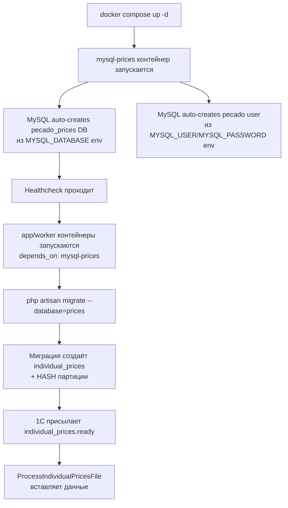

# Вынос individual_prices в отдельную БД с партиционированием

**Приоритет:** высокий
**Исполнитель:** -
**Создано:** 2026-04-15

## Проблема

Таблица `individual_prices` содержала 8M записей и растёт линейно с каждым партнёром.
При попытке массового удаления через админку (`DELETE FROM individual_prices`) сервер упал —
все PHP-FPM воркеры зависли, что вызвало 504 для всего сайта.

Текущие проблемы:
- **Бэкапы**: основная БД раздута из-за `individual_prices` (90% данных — цены)
- **TRUNCATE** на 8M записей занимает ~2 минуты (пересоздание InnoDB tablespace)
- **DELETE по partner_id** на миллионах строк — медленная операция (~30 секунд)
- **Риск**: падение prices-таблицы блокирует весь сайт

## Архитектурное решение

### 1. Отдельный MySQL-контейнер (`pecado-mysql-prices`)

Полностью изолированная БД для индивидуальных цен:
- Собственный `docker volume` — независимый от основной БД
- Независимые бэкапы (или вообще без бэкапов — данные регенерируются из 1С)
- Падение `mysql-prices` → сайт работает на базовых ценах (graceful degradation)

### 2. HASH-партиционирование по `partner_id`

```sql
CREATE TABLE individual_prices (
    partner_id   BIGINT UNSIGNED NOT NULL,
    product_id   BIGINT UNSIGNED NOT NULL,
    warehouse_id BIGINT UNSIGNED NOT NULL,
    price        DECIMAL(15,2)   NOT NULL,
    updated_at   TIMESTAMP DEFAULT CURRENT_TIMESTAMP ON UPDATE CURRENT_TIMESTAMP,
    PRIMARY KEY (partner_id, product_id, warehouse_id)
) PARTITION BY HASH(partner_id) PARTITIONS 64;
```

Преимущества:
- `WHERE partner_id = ?` → сканирует 1 партицию (а не все 8M строк)
- `ALTER TABLE ... TRUNCATE PARTITION` — мгновенная очистка данных партнёра
- `DELETE WHERE partner_id = ?` → работает в рамках одной партиции — на порядок быстрее
- Мгновенный TRUNCATE всей таблицы (64 маленьких файла вместо одного гигантского)

### 3. Стратегия индексов и обеспечение быстродействия

#### Индексы с учётом партиционирования

MySQL 8.0 требует, чтобы **все уникальные/PRIMARY ключи** включали колонку партиционирования.
Текущий PK `(partner_id, product_id, warehouse_id)` уже включает `partner_id` — это идеально.

```
PRIMARY KEY (partner_id, product_id, warehouse_id)  -- PK = уникальность + кластеризация
INDEX idx_partner (partner_id)                       -- для WHERE partner_id = ? (быстрый)
INDEX idx_product (product_id)                       -- для WHERE product_id = ? (cross-partition)
```

**Как работают индексы с HASH-партициями:**

| Запрос | Поведение | Скорость |
|---|---|---|
| `WHERE partner_id = 42` | Partition pruning → only 1 of 64 partitions scanned | ⚡ O(1) выбор партиции → index scan |
| `WHERE partner_id = 42 AND product_id = 100` | Partition pruning + PK lookup | ⚡⚡ Мгновенно (PK point lookup) |
| `WHERE product_id = 100` (без partner_id) | ALL 64 partitions scanned, каждая по idx_product | ⚠️ Медленнее — cross-partition. Допустимо для админки |
| `DELETE WHERE partner_id = 42` | 1 партиция → bulk delete | ⚡ В 64x быстрее чем без партиций |
| `TRUNCATE TABLE` | Удаление 64 маленьких .ibd файлов | ⚡⚡ Мгновенно (< 1 сек) |
| `COUNT(*)` (вся таблица) | 64 партиции параллельно | ⚠️ Минуты на 8M+ → кешировать |

> **Вывод**: для всех основных use-cases (показ цен пользователю, импорт, удаление партнёра)
> `partner_id` ВСЕГДА присутствует в WHERE — partition pruning работает идеально.
> Единственный «медленный» сценарий — `COUNT(*)` всей таблицы в админке, его нужно кешировать.

#### Оптимизация `COUNT(*)` для админки

Вместо `SELECT COUNT(*) FROM individual_prices` (который сканирует все 64 партиции):

```php
// Быстрая оценка через information_schema (не точная, но мгновенная)
$approxCount = DB::connection('prices')
    ->select("SELECT TABLE_ROWS FROM information_schema.TABLES 
              WHERE TABLE_SCHEMA = 'pecado_prices' AND TABLE_NAME = 'individual_prices'")[0]->TABLE_ROWS;

// Или кешировать точный COUNT на 5 минут
$count = Cache::remember('individual_prices_count', 300, function () {
    return DB::connection('prices')->table('individual_prices')->count();
});
```

#### Не добавлять лишние индексы

- `warehouse_id` отдельный индекс **НЕ нужен** — запросы по складу всегда идут совместно с partner_id
- `updated_at` индекс **НЕ нужен** — сортировка по дате не является частым use-case
- Composite `(partner_id, warehouse_id)` **НЕ нужен** — PK уже покрывает

### 4. Конфигурация MySQL для prices-контейнера

#### Кастомный `my.cnf` для write-heavy нагрузки

Prices DB — это преимущественно **write-heavy** (массовый INSERT из 1С) + **read по partner_id**.
Настройки отличаются от основной БД:

**Файл:** `docker/mysql-prices/my.cnf`

```ini
[mysqld]
# === Storage Engine ===
default-storage-engine          = InnoDB
innodb_file_per_table           = ON

# === Buffer Pool ===
# Prices DB содержит одну таблицу — выделяем меньше RAM чем основной БД
# Для dev: 256M, для production: 1G-2G (зависит от объёма данных)
innodb_buffer_pool_size         = 256M
innodb_buffer_pool_instances    = 1

# === Write Performance (batch INSERT оптимизации) ===
# Увеличенный log file для длинных транзакций (5000-row batches)
innodb_log_file_size            = 256M
innodb_log_buffer_size          = 64M
# Снижаем durability ради скорости — данные восстанавливаются из 1С
# 0 = flush раз в секунду (а не при каждом commit)
innodb_flush_log_at_trx_commit  = 0
innodb_flush_method             = O_DIRECT

# === Concurrency ===
# Один воркер пишет цены, остальные — читают. Мало конкурентных writers.
innodb_write_io_threads         = 4
innodb_read_io_threads          = 4

# === Temp Tables (для ALTER TABLE PARTITION) ===
tmp_table_size                  = 64M
max_heap_table_size             = 64M

# === Connections ===
max_connections                 = 50
wait_timeout                    = 300
interactive_timeout             = 300

# === Disable Binary Log (не нужен для prices — нет replica) ===
skip-log-bin

# === Character Set ===
character-set-server            = utf8mb4
collation-server                = utf8mb4_unicode_ci
```

**Ключевые отличия от основной БД:**

| Параметр | Основная БД | Prices DB | Почему |
|---|---|---|---|
| `innodb_buffer_pool_size` | 1G+ | 256M | Одна таблица — меньше данных в памяти |
| `innodb_flush_log_at_trx_commit` | 1 (safe) | 0 (fast) | Данные восстанавливаются из 1С |
| `skip-log-bin` | Нет | Да | Нет replica, нет PITR — binlog не нужен |
| `max_connections` | 150+ | 50 | Только app + worker, нет пользовательских сессий |

#### Монтирование конфига в docker-compose.yml

```yaml
mysql-prices:
  image: mysql:8.0
  container_name: pecado-mysql-prices
  restart: unless-stopped
  environment:
    MYSQL_DATABASE: pecado_prices
    MYSQL_ROOT_PASSWORD: secret
    MYSQL_USER: pecado
    MYSQL_PASSWORD: secret
  ports:
    - "3309:3306"
  volumes:
    - mysql-prices-data:/var/lib/mysql
    - ./docker/mysql-prices/my.cnf:/etc/mysql/conf.d/custom.cnf:ro   # ← кастомный конфиг
  networks:
    - pecado-network
  healthcheck:
    test: ["CMD", "mysqladmin", "ping", "-h", "localhost", "-u", "root", "-psecret"]
    interval: 10s
    timeout: 5s
    retries: 5
    start_period: 30s
```

### 5. Развёртывание на чистом сервере (from scratch)

При деплое на абсолютно новый сервер должно работать **автоматически** через `docker compose up`.

#### Порядок инициализации



#### Что происходит при `docker compose up` на чистом сервере

1. **MySQL-контейнер** стартует, видит пустой volume → инициализирует БД:
   - Создаёт БД `pecado_prices` (из `MYSQL_DATABASE`)
   - Создаёт пользователя `pecado` с паролем `secret` (из `MYSQL_USER` / `MYSQL_PASSWORD`)
   - Применяет `my.cnf` из volume mount
   - Healthcheck ждёт готовности (до 30 секунд start_period)

2. **App-контейнер** стартует ПОСЛЕ прохождения healthcheck mysql-prices.

3. **CI/CD pipeline** выполняет миграции:
   ```bash
   # Основная БД
   php artisan migrate --force
   # Prices БД — отдельная команда
   php artisan migrate --database=prices --force
   ```

4. **Таблица создаётся** с партициями:
   - Laravel миграция создаёт schema
   - RAW SQL `ALTER TABLE ... PARTITION BY HASH(partner_id) PARTITIONS 64`
   - На чистом сервере таблица пустая — партиции создаются мгновенно

5. **Данные появятся** автоматически при первом `individual_prices.ready` из 1С.

#### Файлы, которые обеспечивают автоматический bootstrap

| Файл | Роль |
|---|---|
| `docker-compose.yml` | Определяет контейнер, volume, сеть, healthcheck |
| `docker/mysql-prices/my.cnf` | Кастомные настройки MySQL |
| `.env` / `.env.example` | `DB_PRICES_*` переменные для Laravel |
| `config/database.php` | Соединение `prices` |
| `database/migrations/..._create_individual_prices_on_prices_db.php` | Schema + партиции |
| `.github/workflows/deploy-dev.yml` | `migrate --database=prices` |

> **Принцип**: ни одного ручного шага. `docker compose up` + `php artisan migrate` = полностью рабочая prices DB.

---

## Детальный план реализации

### Фаза 1: Инфраструктура Docker

#### 1.1. Добавить контейнер `mysql-prices` в `docker-compose.yml`

**Файл:** `docker-compose.yml`

```yaml
mysql-prices:
  image: mysql:8.0
  container_name: pecado-mysql-prices
  restart: unless-stopped
  environment:
    MYSQL_DATABASE: pecado_prices
    MYSQL_ROOT_PASSWORD: secret
    MYSQL_USER: pecado
    MYSQL_PASSWORD: secret
  ports:
    - "3309:3306"
  volumes:
    - mysql-prices-data:/var/lib/mysql
  networks:
    - pecado-network
```

Добавить volume:
```yaml
volumes:
  mysql-prices-data:
```

Добавить `depends_on: mysql-prices` для `app` и `worker`.

#### 1.2. Обновить `app` и `worker` — зависимости

```yaml
app:
  depends_on:
    - mysql
    - mysql-prices    # ← новое
    - meilisearch
    - rabbitmq
    - redis

worker:
  depends_on:
    - app
    - mysql
    - mysql-prices    # ← новое
    - rabbitmq
    - redis
```

---

### Фаза 2: Конфигурация Laravel

#### 2.1. Добавить соединение `prices` в `config/database.php`

**Файл:** `config/database.php`

```php
'prices' => [
    'driver' => 'mysql',
    'host' => env('DB_PRICES_HOST', env('DB_HOST', '127.0.0.1')),
    'port' => env('DB_PRICES_PORT', env('DB_PORT', '3306')),
    'database' => env('DB_PRICES_DATABASE', 'pecado_prices'),
    'username' => env('DB_PRICES_USERNAME', env('DB_USERNAME', 'root')),
    'password' => env('DB_PRICES_PASSWORD', env('DB_PASSWORD', '')),
    'unix_socket' => env('DB_SOCKET', ''),
    'charset' => 'utf8mb4',
    'collation' => 'utf8mb4_unicode_ci',
    'prefix' => '',
    'prefix_indexes' => true,
    'strict' => true,
    'engine' => null,
    'options' => extension_loaded('pdo_mysql') ? array_filter([
        (PHP_VERSION_ID >= 80500 ? \Pdo\Mysql::ATTR_SSL_CA : \PDO::MYSQL_ATTR_SSL_CA) => env('MYSQL_ATTR_SSL_CA'),
    ]) : [],
],
```

#### 2.2. Обновить `.env` и `.env.example`

```env
# Individual Prices Database (отдельный контейнер)
DB_PRICES_HOST=mysql-prices
DB_PRICES_PORT=3306
DB_PRICES_DATABASE=pecado_prices
DB_PRICES_USERNAME=pecado
DB_PRICES_PASSWORD=secret
```

---

### Фаза 3: Миграция таблицы

#### 3.1. Создать миграцию для отдельной БД

**Файл:** `database/migrations/2026_04_16_000001_create_individual_prices_on_prices_db.php`

> **ВАЖНО**: Миграция должна запускаться с `--database=prices`.
> В deploy-dev.yml нужно добавить отдельную команду миграции для prices-соединения.

```php
return new class extends Migration
{
    // Указываем соединение для миграции
    protected $connection = 'prices';

    public function up(): void
    {
        Schema::connection('prices')->create('individual_prices', function (Blueprint $table) {
            $table->unsignedBigInteger('partner_id');
            $table->unsignedBigInteger('product_id');
            $table->unsignedBigInteger('warehouse_id');
            $table->decimal('price', 15, 2);
            $table->timestamp('updated_at')->useCurrent()->useCurrentOnUpdate();

            $table->primary(['partner_id', 'product_id', 'warehouse_id'], 'individual_prices_pk');
            $table->index('partner_id', 'idx_individual_prices_partner');
            $table->index('product_id', 'idx_individual_prices_product');
        });

        // Добавляем HASH-партиции через RAW SQL
        // Laravel Schema Builder не поддерживает партиции нативно
        DB::connection('prices')->statement(
            'ALTER TABLE individual_prices PARTITION BY HASH(partner_id) PARTITIONS 64'
        );
    }

    public function down(): void
    {
        Schema::connection('prices')->dropIfExists('individual_prices');
    }
};
```

#### 3.2. Удалить таблицу из основной БД (только после подтверждения работы)

**Файл:** `database/migrations/2026_04_16_000002_drop_individual_prices_from_main_db.php`

```php
// Удаляем individual_prices из основной БД ТОЛЬКО после перехода на prices-соединение
// Эта миграция запускается в последнюю очередь,
// после проверки что все запросы идут в prices DB
Schema::dropIfExists('individual_prices');
```

---

### Фаза 4: Модель и сервисы

#### 4.1. Обновить модель `IndividualPrice`

**Файл:** `app/Models/IndividualPrice.php`

```php
class IndividualPrice extends Model
{
    // Указываем соединение с отдельной БД
    protected $connection = 'prices';

    public $incrementing = false;
    public $timestamps = false;
    protected $table = 'individual_prices';
    // ...
}
```

> **ВАЖНО**: После установки `$connection = 'prices'`, ALL Eloquent-запросы
> (включая admin CRUD, PriceService, ProductQueryService) автоматически
> пойдут в отдельную БД — без изменений кода вызывающих мест.

#### 4.2. Обновить `ProcessIndividualPricesFile` — raw SQL запросы

**Файл:** `app/Jobs/ProcessIndividualPricesFile.php`

Все вызовы `DB::table('individual_prices')` и `DB::statement(...)` нужно заменить
на `DB::connection('prices')->table(...)` и `DB::connection('prices')->statement(...)`:

Затрагиваемые методы:
- `processFullFile()` — строки 177-180, 190-192: `DB::table('individual_prices')->where(...)->delete()`
- `insertBatch()` — строка 319: `DB::statement($sql)`
- `upsertBatch()` — строка 344: `DB::statement($sql)`

#### 4.3. Обновить `ProductQueryService::loadIndividualPriceMap()`

**Файл:** `app/Services/Product/ProductQueryService.php`

Строка 201: `DB::table('individual_prices')` → `DB::connection('prices')->table('individual_prices')`

#### 4.4. Обновить `PriceService::getPriceResult()`

Этот сервис использует Eloquent (`IndividualPrice::where(...)`) — после обновления модели
(`$connection = 'prices'`) изменений в PriceService не нужно.

#### 4.5. Обновить `IndividualPriceController`

**Файл:** `app/Http/Controllers/Admin/IndividualPriceController.php`

Строка 126: `IndividualPrice::upsert(...)` — работает через Eloquent, автоматически.

Строки 22, 148, 189, 210, 321 — все через `IndividualPrice::...` — работают автоматически.

**Внимание**: метод `index()` вычисляет `stats` (COUNT, COUNT DISTINCT и т.д.) — после выноса
в отдельную БД, JOIN с users/products станет невозможен напрямую. Нужно:
- Статистику считать raw-запросом к prices DB
- Для отображения имён партнёров/товаров — подгружать отдельно из основной БД

#### 4.6. Обновить `BulkDeleteController` registry

**Файл:** `app/Http/Controllers/Admin/BulkDeleteController.php`

Запись `individual-prices` в registry остаётся как есть.
`BulkDeleteJob` использует `Model::query()->...` — модель сама знает свой `$connection`.
Для `truncate` метода — `DB::table($table)->truncate()` нужно обновить на
`DB::connection('prices')->table($table)->truncate()`.

---

### Фаза 5: Graceful Degradation

#### 5.1. Обёртка для отказоустойчивости

**Новый файл:** `app/Services/Pricing/IndividualPriceProxy.php`

```php
class IndividualPriceProxy
{
    /**
     * Попытаться получить индивидуальную цену.
     * При недоступности prices DB — возвращает null (базовая цена).
     */
    public static function findPrice(int $partnerId, int $productId, ?int $warehouseId = null): ?IndividualPrice
    {
        try {
            return IndividualPrice::findPrice($partnerId, $productId, $warehouseId);
        } catch (\Illuminate\Database\QueryException $e) {
            Log::warning('IndividualPriceProxy: prices DB недоступна', [
                'error' => $e->getMessage(),
            ]);
            return null;
        }
    }

    /**
     * Загрузить карту индивидуальных цен.
     * При недоступности prices DB — возвращает пустую коллекцию.
     */
    public static function loadPriceMap(int $userId, array $productIds): Collection
    {
        try {
            return DB::connection('prices')
                ->table('individual_prices')
                ->where('partner_id', $userId)
                ->whereIn('product_id', $productIds)
                ->select('product_id', 'price')
                ->get()
                ->mapWithKeys(fn ($row) => [(int) $row->product_id => (float) $row->price]);
        } catch (\Illuminate\Database\QueryException $e) {
            Log::warning('IndividualPriceProxy: prices DB недоступна при загрузке карты цен');
            return collect();
        }
    }
}
```

#### 5.2. Обновить `PriceService` и `ProductQueryService`

Заменить прямые обращения к `IndividualPrice` и `DB::table('individual_prices')` на
вызовы через `IndividualPriceProxy` для автоматического fallback на базовые цены.

---

### Фаза 6: CI/CD и деплой

#### 6.1. Обновить `deploy-dev.yml`

Добавить шаг миграции для prices DB:

```yaml
echo "==> [3.5/7] Миграция prices DB..."
sg docker -c 'docker compose exec -T app php artisan migrate --database=prices --force'
```

#### 6.2. Обновить CI тесты

В GitHub Actions добавить второй MySQL-сервис для тестов:

```yaml
services:
  mysql:
    image: mysql:8.0
    env:
      MYSQL_DATABASE: pecado_test
      # ...

  mysql-prices:
    image: mysql:8.0
    env:
      MYSQL_DATABASE: pecado_prices_test
      MYSQL_ROOT_PASSWORD: secret
      MYSQL_USER: pecado
      MYSQL_PASSWORD: secret
    ports:
      - "3307:3306"
    options: >-
      --health-cmd="mysqladmin ping"
      --health-interval=10s
      --health-timeout=5s
      --health-retries=3
```

В `.env` для тестов:
```env
DB_PRICES_HOST=127.0.0.1
DB_PRICES_PORT=3307
DB_PRICES_DATABASE=pecado_prices_test
DB_PRICES_USERNAME=pecado
DB_PRICES_PASSWORD=secret
```

#### 6.3. Обновить `docker-compose.yml` на dev-сервере

Добавить контейнер `mysql-prices` и запустить:
```bash
docker compose up -d mysql-prices
```

---

### Фаза 7: Миграция данных (бесшовная)

#### 7.1. План перехода (zero downtime)

Порядок действий на dev-сервере:

1. **Деплой кода** с новым `docker-compose.yml` + соединением `prices`  
   → НО модель `IndividualPrice` ещё указывает на `$connection = 'mysql'`
2. **Запуск контейнера** `mysql-prices`
3. **Запуск миграции** `php artisan migrate --database=prices`
4. **Миграция данных** (если есть):
   ```sql
   -- На основной БД (pecado-mysql):
   SELECT * FROM individual_prices INTO OUTFILE '/tmp/prices.csv' ...;
   -- На prices БД (pecado-mysql-prices):
   LOAD DATA INFILE '/tmp/prices.csv' INTO TABLE individual_prices ...;
   ```
   > Но таблица сейчас пустая (мы её truncate'нули), так что этот шаг скорее всего не нужен.
5. **Переключение модели** на `$connection = 'prices'`
6. **Деплой переключения** → все запросы идут в отдельную БД
7. **Верификация** — страница `/admin/individual-prices` работает
8. **Удаление таблицы** из основной БД (`drop_individual_prices_from_main_db` миграция)

#### 7.2. Rollback план

Если что-то пошло не так:
1. Вернуть `$connection` в модели на `mysql` (или убрать)
2. Таблица в основной БД всё ещё существует (шаг 8 не выполнен)
3. Деплой rollback → всё работает как раньше

---

### Фаза 8: Тестирование

#### 8.1. Unit/Feature тесты

- [ ] `ProductQueryScopesTest::test_scope_in_sale_filters_products_with_individual_prices` — обновить для работы с `prices` соединением
- [ ] Добавить тест graceful degradation: при недоступной prices DB — PriceService возвращает базовую цену
- [ ] Тест `ProcessIndividualPricesFile` — batch insert в prices DB

#### 8.2. Интеграционные тесты (ручные)

- [ ] Отправить `individual_prices.ready` через RabbitMQ → цены появились в prices DB
- [ ] Открыть `/admin/individual-prices` → данные отображаются корректно
- [ ] Создать/редактировать/удалить цену через админку
- [ ] Зайти под пользователем с индивидуальными ценами → каталог показывает их
- [ ] Остановить `mysql-prices` контейнер → сайт работает на базовых ценах
- [ ] Запустить `mysql-prices` → индивидуальные цены снова доступны
- [ ] Нажать «Удалить все» в админке → TRUNCATE TABLE выполняется мгновенно

---

## Затрагиваемые файлы

| Файл | Изменение |
|---|---|
| `docker-compose.yml` | [MODIFY] Добавить `mysql-prices` контейнер и volume |
| `config/database.php` | [MODIFY] Добавить `prices` соединение |
| `.env` / `.env.example` | [MODIFY] Добавить `DB_PRICES_*` переменные |
| `app/Models/IndividualPrice.php` | [MODIFY] `$connection = 'prices'` |
| `app/Jobs/ProcessIndividualPricesFile.php` | [MODIFY] `DB::connection('prices')->...` |
| `app/Services/Product/ProductQueryService.php` | [MODIFY] `DB::connection('prices')->...` |
| `app/Services/Pricing/IndividualPriceProxy.php` | [NEW] Graceful degradation proxy |
| `app/Services/Pricing/PriceService.php` | [MODIFY] Использовать proxy |
| `app/Http/Controllers/Admin/IndividualPriceController.php` | [MODIFY] Stats без JOIN |
| `app/Jobs/BulkDeleteJob.php` | [MODIFY] `DB::connection('prices')->...` |
| `database/migrations/..._create_individual_prices_on_prices_db.php` | [NEW] Таблица + партиции |
| `database/migrations/..._drop_individual_prices_from_main_db.php` | [NEW] Очистка основной БД |
| `.github/workflows/deploy-dev.yml` | [MODIFY] Добавить миграцию prices DB |
| `tests/Feature/ProductQueryScopesTest.php` | [MODIFY] Поддержка prices соединения |

## Риски и митигации

| Риск | Митигация |
|---|---|
| JOIN между основной БД и prices невозможен | Подгружать связанные данные отдельными запросами; индивидуальные цены не имеют FK constraints |
| Партиционирование не поддерживается в тестах (SQLite) | CI уже использует MySQL; локально тоже MySQL в Docker |
| Контейнер `mysql-prices` не запускается | Graceful degradation через `IndividualPriceProxy` |
| Миграции prices DB забывают запустить | Добавить health-check в deploy pipeline |

## Критерии готовности

- [ ] Контейнер `pecado-mysql-prices` запущен и стабилен
- [ ] Таблица `individual_prices` партиционирована (64 партиции по HASH)
- [ ] Все CRUD операции с ценами работают через отдельную БД
- [ ] ERP импорт (`individual_prices.ready`) пишет в отдельную БД
- [ ] Каталог показывает индивидуальные цены через отдельную БД
- [ ] При остановке `mysql-prices` сайт показывает базовые цены (нет 500 ошибок)
- [ ] `TRUNCATE TABLE` в Admin выполняется < 1 секунды
- [ ] `DELETE WHERE partner_id = ?` выполняется < 1 секунды на любом количестве записей
- [ ] Бэкап основной БД не содержит данных индивидуальных цен
- [ ] CI/CD пайплайн проходит (тесты, деплой)
- [ ] Документация обновлена
