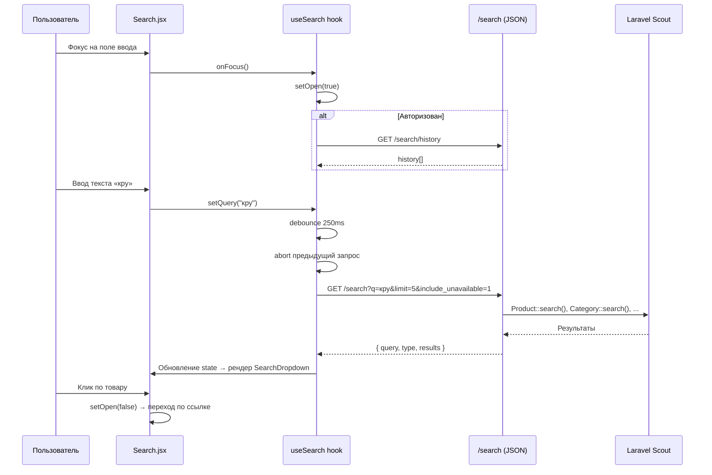

# Техническое задание: Поиск в шапке сайта

**Проект**: Pecado  
**Стек**: Laravel 12 + Inertia 2 + React 19 + Tailwind 4 + MySQL  
**Дата**: 2026-02-16  
**Основание**: Анализ [reference-проекта](../reference/)

---

## 1. Цель

Разработать глобальный поиск в шапке сайта с живым выпадающим дропдауном, голосовым вводом и историей поиска. Поиск должен охватывать товары, бренды, категории, статьи и новости. Это основной инструмент быстрого доступа к контенту для пользователя.

---

## 2. Текущее состояние проекта

### 2.1 Что уже есть

| Компонент | Статус | Детали |
|-----------|--------|--------|
| Модель `Product` | ✅ Есть | С `ProductQueryScopes`, медиа, `ProductResource` |
| Модель `Category` | ✅ Есть | Nested set (Kalnoy), `slug` |
| Модель `Brand` | ✅ Есть | `slug`, `is_active` |
| Модель `Content` (статьи/новости) | ✅ Есть | `type`, `published_at`, `slug` |
| Шапка сайта (`Header.jsx`) | ✅ Есть | Компонент `Search` пока заглушка или отсутствует |
| Каталог товаров | ✅ Есть | Фильтрация, фасеты, API |

### 2.2 Что нужно создать

| Компонент | Статус |
|-----------|--------|
| `SearchController` (backend) | 🔴 Нет |
| `SearchHistory` модель + миграция | 🔴 Нет |
| `SearchRequest` (Form Request) | 🔴 Нет |
| Полнотекстовый поиск (Laravel Scout) | 🔴 Нет |
| Компонент `Search.jsx` (frontend) | 🔴 Нет |
| Хук `useSearch.js` | 🔴 Нет |
| Компонент `SearchDropdown.jsx` | 🔴 Нет |
| Голосовой поиск (`useSpeechRecognition.js`) | 🔴 Нет |
| Страница результатов `Search/Index.jsx` | 🔴 Нет |

---

## 3. Маршрутизация

### 3.1 Web-маршруты

```
GET  /search                          → SearchController@index
```

Рендерит Inertia-страницу `User/Search/Index` при обычном запросе. Возвращает JSON при `Accept: application/json`.

### 3.2 API-маршруты

```
GET  /api/search/suggestions          → SearchController@suggestions
GET  /search/history                  → SearchController@history         [auth]
DELETE /search/history                → SearchController@clearHistory    [auth]
DELETE /search/history/{history}      → SearchController@deleteHistory   [auth]
```

---

## 4. API контракты

### 4.1 `GET /search` (JSON-режим)

**Параметры запроса**:

| Параметр | Тип | Обязательный | Описание |
|----------|-----|------|-----------|
| `q` | string | да (min: 2) | Поисковый запрос |
| `type` | enum | нет | `all` (default), `products`, `categories`, `brands`, `articles` |
| `limit` | integer | нет | Кол-во результатов (1–50) |
| `include_unavailable` | boolean | нет | Включить товары не в наличии |

**Ответ** (200):

```json
{
    "query": "кру",
    "type": "all",
    "results": {
        "products": [
            {
                "id": 1,
                "name": "Кружевное бельё",
                "slug": "kruzhevnoe-bele",
                "price": 1200.00,
                "available_quantity": 5,
                "is_preorder": false,
                "image_url": "https://…/thumb.jpg",
                "brand": { "id": 1, "name": "Lelo", "slug": "lelo" },
                "category": { "id": 5, "name": "Бельё", "slug": "bele" }
            }
        ],
        "categories": [
            { "id": 5, "name": "Бельё", "slug": "bele" }
        ],
        "brands": [
            { "id": 1, "name": "Lelo", "slug": "lelo" }
        ],
        "articles": [
            {
                "id": 10,
                "title": "Как выбрать бельё",
                "slug": "kak-vybrat-bele",
                "excerpt": "Советы по выбору...",
                "image_url": "https://…/thumb.jpg",
                "published_at": "15.02.2026",
                "type": "article",
                "type_label": "Статья"
            }
        ],
        "news": [
            {
                "id": 20,
                "title": "Новая коллекция",
                "slug": "novaya-kollekciya",
                "excerpt": "Представляем...",
                "published_at": "14.02.2026",
                "type": "news",
                "type_label": "Новость"
            }
        ]
    }
}
```

**Лимиты по умолчанию**: products — 10, categories — 5, brands — 5, articles/news — 5.

### 4.2 `GET /api/search/suggestions`

Быстрые подсказки — только товары, лимит 8.

| Параметр | Тип | Описание |
|----------|-----|----------|
| `q` | string (min: 2) | Поисковый запрос |

**Ответ**:

```json
[
    { "id": 1, "name": "Кружевное бельё", "slug": "kruzhevnoe-bele", "price": 1200.00, "image_url": "https://…" }
]
```

### 4.3 `GET /search/history` (auth)

Возвращает последние 20 записей истории пользователя.

```json
{
    "history": [
        { "id": 1, "query": "кружево", "created_at": "2026-02-16T14:00:00Z" }
    ]
}
```

### 4.4 `DELETE /search/history` (auth)

Очищает всю историю. Ответ: `{ "message": "История поиска очищена" }`.

### 4.5 `DELETE /search/history/{id}` (auth)

Удаляет одну запись. Проверяет принадлежность (`user_id`). Ответ: `{ "message": "Запись удалена" }`.

---

## 5. Изменения БД

### 5.1 Новая таблица `search_histories`

```sql
CREATE TABLE search_histories (
    id BIGINT UNSIGNED AUTO_INCREMENT PRIMARY KEY,
    user_id BIGINT UNSIGNED NOT NULL,
    query VARCHAR(255) NOT NULL,
    results_count INT UNSIGNED DEFAULT 0,
    ip_address VARCHAR(45) NULL,
    created_at TIMESTAMP NULL,
    updated_at TIMESTAMP NULL,
    FOREIGN KEY (user_id) REFERENCES users(id) ON DELETE CASCADE
);
```

### 5.2 Полнотекстовый поиск

Настроить Laravel Scout для моделей:
- `Product` — поиск по `name`, `sku`, `barcode`
- `Category` — поиск по `name`
- `Brand` — поиск по `name`
- `Content` — поиск по `title`, `excerpt`

> [!IMPORTANT]
> Драйвер Scout определить на этапе реализации — `meilisearch`, `algolia` или `database`. Для MVP подойдёт `database` driver.

---

## 6. Backend-архитектура

### 6.1 Файловая структура

```
app/
├── Http/
│   ├── Controllers/User/
│   │   └── SearchController.php         (НОВЫЙ)
│   └── Requests/User/
│       └── SearchRequest.php            (НОВЫЙ)
├── Models/
│   └── SearchHistory.php                (НОВЫЙ)
└── (Scout настройки в существующих моделях)
```

### 6.2 `SearchController`

| Метод | Описание |
|-------|----------|
| `index(Request)` | Основной поиск по всем сущностям. JSON при `Accept: application/json`, Inertia при обычном запросе |
| `suggestions(Request)` | Быстрые подсказки (только товары, 8 шт) |
| `history(Request)` | Получить историю (auth) |
| `clearHistory(Request)` | Очистить всю историю (auth) |
| `deleteHistory(Request, SearchHistory)` | Удалить одну запись (auth, проверка owner) |

**Логика метода `index`:**
1. Валидация `q` (min 2 символа), `type`, `limit`
2. Если авторизован → сохранить запрос в `search_histories`
3. Поиск по типам через Scout (`Model::search($query)`)
4. Для товаров: фильтрация по наличию (если не `include_unavailable`)
5. Для брендов: фильтрация `is_active`
6. Для контента: разделение на articles и news
7. Возврат JSON / Inertia

### 6.3 `SearchRequest`

```php
public function rules(): array
{
    return [
        'q'     => ['required', 'string', 'min:2', 'max:255'],
        'type'  => ['sometimes', 'in:all,products,categories,brands,articles'],
        'limit' => ['nullable', 'integer', 'min:1', 'max:50'],
        'include_unavailable' => ['sometimes', 'boolean'],
    ];
}
```

### 6.4 `SearchHistory` — модель

```php
class SearchHistory extends Model
{
    protected $fillable = ['user_id', 'query', 'results_count', 'ip_address'];

    public function user(): BelongsTo
    {
        return $this->belongsTo(User::class);
    }
}
```

---

## 7. Frontend-архитектура

### 7.1 Компонентное дерево

```
Header.jsx
└── Search.jsx                         ← Главный компонент поиска
    ├── useSearch(user)                 ← Хук состояния и API
    ├── useSpeechRecognition()          ← Хук голосового ввода
    └── SearchDropdown.jsx             ← Выпадающий дропдаун
        ├── SearchSection.jsx          ← Секция (заголовок + контент)
        └── ProductListItem.jsx        ← Компактная карточка товара (уже есть)
```

### 7.2 Расположение файлов

```
resources/js/
├── shared/
│   ├── Search.jsx                     (НОВЫЙ)
│   ├── useSearch.js                   (НОВЫЙ)
│   ├── useSpeechRecognition.js        (НОВЫЙ)
│   ├── SearchDropdown.jsx             (НОВЫЙ)
│   └── SearchSection.jsx             (НОВЫЙ)
└── Pages/User/Search/
    └── Index.jsx                      (НОВЫЙ)
```

---

## 8. Компоненты — детальное описание

### 8.1 `Search.jsx`

Рендерит:
1. **Скрытый `<label>`** для accessibility
2. **Иконка лупы** слева (decorative)
3. **`<Input type="search">`** — основное поле
4. **Кнопка микрофона** справа (условно, если поддерживается)
5. **`<SearchDropdown>`** — дропдаун под полем

Поведение:
- `onFocus` → открыть дропдаун, загрузить историю (если авторизован)
- `onChange` → обновить `query` в хуке
- При открытом дропдауне на мобильном: основной инпут скрывается (`hidden sm:block`)

### 8.2 `useSearch(user)` — хук

**Состояние**:

| Поле | Тип | Описание |
|------|-----|----------|
| `query` | string | Текст запроса |
| `loading` | boolean | Идёт загрузка |
| `open` | boolean | Дропдаун открыт |
| `results` | object | `{ products, brands, categories, articles, news }` |
| `productsCount` | number | Общее кол-во товаров |
| `history` | array | Записи истории поиска |
| `error` | string\|null | Текст ошибки |
| `isSmall` | boolean | Мобильный экран (< 640px) |
| `includeUnavailable` | boolean | Показывать недоступные |
| `hasResults` | boolean (computed) | Есть ли хотя бы 1 результат |

**Механизмы**:

| # | Механизм | Описание |
|---|----------|----------|
| 1 | **Debounce 250ms** | Запрос отправляется через 250мс после последнего нажатия |
| 2 | **AbortController** | Каждый новый запрос отменяет предыдущий |
| 3 | **Минимум 2 символа** | При < 2 символах — сброс результатов |
| 4 | **Клик вне** | `mousedown` listener закрывает дропдаун |
| 5 | **Блокировка скролла** | `overflow: hidden` при открытом дропдауне |
| 6 | **Медиа-запрос** | `(max-width: 639px)` для определения мобильного режима |
| 7 | **window.__searchOpen** | Глобальный флаг для внешних компонентов |

**API запрос**: `GET /search?q={query}&limit=5&include_unavailable=1`, Header: `Accept: application/json`.

> [!IMPORTANT]
> Фронтенд всегда запрашивает `include_unavailable=1` — фильтрация по наличию происходит на клиенте через чекбокс «Включая отсутствующие».

### 8.3 `SearchDropdown.jsx`

**Условие показа**: `open AND (isSmall OR loading OR error OR query.length > 0 OR history.length > 0)`

**Состояния**:

| # | Условие | Отображение |
|---|---------|-------------|
| 1 | Пустой запрос + есть история | **«Недавние запросы»**: заголовок + кнопка «Очистить всё», список записей с иконкой 🕐 и кнопкой × |
| 2 | Запрос < 2 символов | «Введите минимум 2 символа» |
| 3 | Загрузка | «Поиск…» |
| 4 | Ошибка | Красный текст ошибки |
| 5 | Есть результаты | Секции по типам (см. таблицу ниже) |
| 6 | Нет результатов | «Ничего не найдено» |

**Секции результатов** (показываются условно):

| Секция | Компонент | Действие при клике |
|--------|-----------|-------------------|
| Товары | `ProductListItem` (compact) + чекбокс «Включая отсутствующие» | Переход на `/products/{slug}` |
| Бренды | Список ссылок | → `/brands/{slug}` |
| Категории | Список ссылок | → `/products?category_id={id}&include_descendants=1` |
| Статьи | Список ссылок | → `/articles/{slug}` |
| Новости | Список ссылок | → `/news/{slug}` |

**Мобильный режим** (< 640px):
- Полноэкранный overlay (`fixed inset-0`) с полупрозрачным фоном
- Собственный инпут поиска + кнопка «Закрыть»
- Скроллируемый контент (`max-h: calc(100vh - 48px)`)

**Десктопный режим** (≥ 640px):
- Абсолютно позиционированный блок под инпутом
- `max-height: 384px` (24rem), с прокруткой
- Рамка, тень, скругление

### 8.4 `SearchSection.jsx`

Простой presentation-компонент:
- Принимает `title` (заголовок секции), `action` (кнопка справа), `children`
- Рендерит секцию с заголовком uppercase и содержимым

### 8.5 `useSpeechRecognition(options)` — хук голосового ввода

**Технология**: Web Speech API (`SpeechRecognition` / `webkitSpeechRecognition`)

**Конфигурация**:
- `continuous: false` — одна фраза
- `interimResults: false` — только финальный результат
- `maxAlternatives: 1`
- `lang` — из локали (`ru-RU` / `en-US`)

**Возвращает**:

| Поле | Тип | Описание |
|------|-----|----------|
| `isListening` | boolean | Идёт запись |
| `isSupported` | boolean | Поддерживается ли API |
| `startListening` | function | Начать запись |
| `stopListening` | function | Остановить |
| `toggleListening` | function | Переключить (с throttle 300мс) |

**UX кнопки микрофона**:
- Запись — красная иконка `mdi:microphone` с пульсацией
- Ошибка — оранжевая иконка (3 сек)
- Нормально — серая `mdi:microphone-outline`
- Не поддерживается — полупрозрачная `mdi:microphone-off`

### 8.6 `Search/Index.jsx` — Страница результатов

**URL**: `/search?q={query}`

Полная страница с секциями результатов:
- **Товары** — сетка 1/2/3 колонки, name + price
- **Категории** — flex-wrap бейджи
- **Бренды** — flex-wrap бейджи
- **Статьи** — список, title + excerpt
- **Нет результатов** — `NotFound` компонент (иконка лупы + текст)

---

## 9. SEO

- `<title>`: «Поиск: {query} — Pecado»
- `<meta description>`: динамическая
- Canonical URL из запроса
- Structured data: BreadcrumbList (Главная → Поиск)

---

## 10. Мобильная версия

| Аспект | Реализация |
|--------|------------|
| Дропдаун | Полноэкранный overlay с собственным инпутом |
| Блокировка скролла | `overflow: hidden` на `html`/`body` |
| Закрытие | Кнопка × вверху |
| Основной инпут | Скрывается при открытом дропдауне |
| Breakpoint | 640px (Tailwind `sm:`) |

---

## 11. Оптимизация

| # | Что | Как |
|---|-----|-----|
| 1 | **AbortController** | Отмена предыдущего запроса при новом вводе |
| 2 | **Debounce 250ms** | Задержка перед отправкой запроса |
| 3 | **Laravel Scout** | Полнотекстовый индекс вместо `LIKE` |
| 4 | **Лимиты** | 10 товаров, 5 категорий, 5 брендов, 5 статей |
| 5 | **Клиентская фильтрация** | Наличие фильтруется на клиенте (1 запрос для всех) |
| 6 | **Ленивая загрузка истории** | Загружается только при фокусе на пустое поле |

---

## 12. Критерии приёмки

### 12.1 Функциональные

- [ ] При вводе ≥ 2 символов появляется дропдаун с результатами
- [ ] Результаты разделены на секции: товары, бренды, категории, статьи, новости
- [ ] Клик по результату → переход на соответствующую страницу
- [ ] Клик вне дропдауна → закрытие
- [ ] Чекбокс «Включая отсутствующие» фильтрует товары
- [ ] При фокусе на пустое поле → показ истории (авторизованные)
- [ ] Удаление записей истории по одной и всех сразу
- [ ] Голосовой ввод вставляет распознанный текст в поле
- [ ] Страница `/search?q=...` показывает полные результаты
- [ ] Все надписи интерфейса на русском языке

### 12.2 Нефункциональные

- [ ] Мобильный полноэкранный overlay корректен
- [ ] Нет race conditions (AbortController)
- [ ] Debounce 250ms работает
- [ ] Блокировка скролла при открытом дропдауне
- [ ] Время ответа API < 300ms
- [ ] Корректная работа при отсутствии поддержки Web Speech API

---

## 13. Диаграмма потока данных


